# Claude Codeによるほぼ全自動ソフトウェア開発マニュアル

> **対象バージョン:** Claude Code (2026年2月時点最新 — Opus 4.6 / Sonnet 4.6 対応)
> **前提条件:** Claude Pro/Team/Enterprise サブスクリプション、またはAnthropic APIアカウント
> **本マニュアルの位置づけ:** Claude Codeの公式機能に基づき構成しているが、Agent Teams等の実験的機能を含む。最新の仕様は公式ドキュメント (https://code.claude.com/docs/en/overview) を必ず参照すること。

---

## 目次

**第1部: 概念と準備**

- [第1章 概要と基本思想](#第1章-概要と基本思想)
  - 1.1 本マニュアルの目的
  - 1.2 全体アーキテクチャ
  - 1.3 前提となるClaude Codeの主要機能
- [第2章 環境構築](#第2章-環境構築)
  - 2.1 Claude Code のインストール
  - 2.2 VS Code 拡張機能
  - 2.3 Agent Teams の有効化
  - 2.4 MCP サーバーの設定
  - 2.5 推奨プロジェクト構造（完全版）

**第2部: プロジェクト設定**

- [第3章 CLAUDE.md の設計](#第3章-claudemd-の設計プロジェクトの頭脳)
  - 3.1 CLAUDE.md テンプレート
  - 3.2 CLAUDE.md 設計のポイント
- [第4章 エージェント定義](#第4章-エージェント定義)
  - 4.1 エージェント定義の基本構造
  - 4.2 コアエージェント（srs-writer / architect / security-reviewer / test-engineer / review-agent / progress-monitor）
  - 4.3 プロセス管理エージェント（change-manager / risk-manager / license-checker）
- [第5章 カスタムコマンド定義](#第5章-カスタムコマンド定義)
  - 5.1 全自動開発開始コマンド（full-auto-dev）
  - 5.2 進捗確認コマンド（check-progress）
  - 5.3 ふりかえりコマンド（retrospective）

**第3部: プロセス管理フレームワーク**

- [第6章 プロセス管理フレームワーク](#第6章-プロセス管理フレームワーク)
  - 6.1 プロセス区分の概要
  - 6.2 必須プロセス（全プロジェクト共通）
  - 6.3 推奨プロセス（中規模以上）
  - 6.4 条件付きプロセスの判断基準と判断時期

**第4部: 開発ワークフロー**

- [第7章 ほぼ全自動開発のワークフロー](#第7章-ほぼ全自動開発のワークフロー)
  - 7.1 開発フェーズの全体像
  - 7.2 Phase 0: 条件付きプロセス評価（必須）
  - 7.3 Phase 1: 企画 — コンセプトからANMS仕様書 Ch1-2 作成
  - 7.4 Phase 2: 設計 — ANMS仕様書 Ch3-6 詳細化・セキュリティ・WBS
  - 7.5 Phase 3: 実装 — 並列開発とテスト
  - 7.6 Phase 4: テスト — 統合テスト・性能テスト・品質監視
  - 7.7 Phase 5: 納品 — デプロイメント・最終レポート・受入テスト

**第5部: 品質管理**

- [第8章 品質管理フレームワーク](#第8章-品質管理フレームワーク)
  - 8.1 段階的レビューゲート
  - 8.2 レビュー観点（R1〜R6）
  - 8.3 品質基準テーブル

**第6部: 運用・自動化**

- [第9章 ヘッドレスモードとCI/CD連携](#第9章-ヘッドレスモードとcicd連携)
  - 9.1 ヘッドレスモードの基本
  - 9.2 GitHub Actions との連携

**第7部: デプロイメントと可観測性**

- [第10章 デプロイメントと可観測性](#第10章-デプロイメントと可観測性)
  - 10.1 デプロイメントプロセス
  - 10.2 可観測性（Observability）設計
  - 10.3 本番リリースチェックリスト

**第8部: 参考資料**

- [第11章 トラブルシューティング](#第11章-トラブルシューティング)
  - 11.1 よくある問題と対処法
  - 11.2 コスト管理のガイドライン
- [第12章 ベストプラクティスと注意事項](#第12章-ベストプラクティスと注意事項)
  - 12.1 ベストプラクティス
  - 12.2 注意事項と制約
- [第13章 実践チュートリアル](#第13章-実践チュートリアルほぼ全自動でwebアプリを開発する)
  - 13.1〜13.6 タスク管理Webアプリの開発手順

**付録**

- [付録A: エージェント間コミュニケーション図](#付録a-エージェント間コミュニケーション図)
- [付録B: 進捗管理データのスキーマ](#付録b-進捗管理データのスキーマ)
- [付録C: クイックリファレンス](#付録c-クイックリファレンス)

---

# 第1部: 概念と準備

## 第1章 概要と基本思想

### 1.1 本マニュアルの目的

本マニュアルは、Claude Codeを活用してソフトウェア開発プロセスをほぼ全自動化するための実践的手順書である。「ほぼ全自動」とは、人間（ユーザー）が関与する作業を以下の3つの重要業務に限定し、それ以外のすべての工程をClaude Codeおよびそのサブエージェント群に委任するアプローチを指す。

**ユーザーが担当する業務（3つのみ）:**

1. SWの必要性やコンセプトの提示（何を作りたいか）
2. SW開発に必要な重要な判断（分岐点での意思決定）
3. 最終的なSWの受入テスト（完成物の確認と承認）

**Claude Codeが担当する業務（それ以外すべて）:**

- 開発計画立案（WBS/ガントチャート）、要員(AI)管理、リソース管理、進捗管理
- ANMS形式の仕様書作成（Ch1-2: Foundation・Requirements）、セキュリティ設計、仕様書詳細化（Ch3-6: Architecture・Specification・Test Strategy・Design Principles）
- SW実装、モジュール単体テスト、結合テスト、システムテスト、性能テスト
- テスト消化曲線の監視、バグカーブの監視
- ボトルネック/弱点領域へのリソース/人員(AI)追加
- 各成果物の段階的レビュー（SW工学原則・並行性・パフォーマンス観点を含む）
- 変更管理・リスク管理・ライセンス確認・監査記録管理
- APIドキュメント生成、SAST/SCAセキュリティスキャン
- コンテナビルド・IaC構成・デプロイメント・スモークテスト
- 可観測性（ログ・メトリクス・アラート）設定の確認
- その他AIに可能なすべての業務

### 1.2 全体アーキテクチャ

**全自動開発の全体像:**

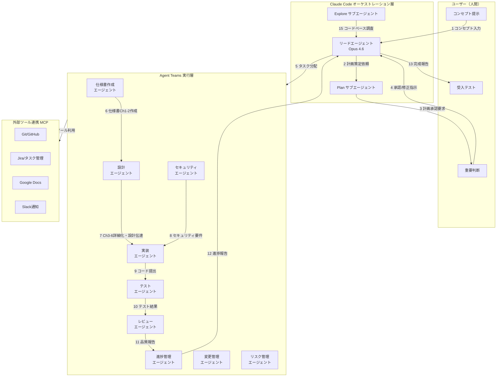

この図はほぼ全自動開発における情報の流れを示す。ユーザーは最初のコンセプト提示(1)、計画承認などの重要判断(3-4)、最終受入テスト(13)の3箇所でのみ関与し、それ以外はClaude Codeのリードエージェントが全工程を統括する。

### 1.3 前提となるClaude Codeの主要機能

| 機能                         | 説明                                                 | 利用場面                      |
| ---------------------------- | ---------------------------------------------------- | ----------------------------- |
| サブエージェント             | 独立コンテキストで専門タスクを実行する子エージェント | 個別の開発タスク実行          |
| Agent Teams（実験的）        | 複数エージェントが相互通信しながら並列作業           | 大規模並列開発                |
| Plan サブエージェント        | 計画立案に特化した組み込みエージェント               | WBS作成、開発計画             |
| Explore サブエージェント     | コードベース調査に特化した組み込みエージェント       | 既存コード理解                |
| ヘッドレスモード (`-p`)      | 対話なしでバッチ実行                                 | CI/CD連携、自動化パイプライン |
| CLAUDE.md                    | プロジェクトルートの設定ファイル                     | プロジェクト固有ルール定義    |
| MCP (Model Context Protocol) | 外部ツール/サービス連携                              | Git、Jira、Slack等との統合    |
| チェックポイント             | コード状態の自動保存と巻き戻し                       | 安全な試行錯誤                |
| Git Worktree (`--worktree`)  | 独立ブランチでの並列作業                             | 機能別並列開発                |
| スキル (`.claude/skills/`)   | 再利用可能なドメイン知識パッケージ                   | チーム間ノウハウ共有          |

> **注意:** Agent Teams は実験的機能であり、環境変数 `CLAUDE_CODE_EXPERIMENTAL_AGENT_TEAMS=1` の設定が必要である。安定性や仕様は将来変更される可能性がある。

---

## 第2章 環境構築

### 2.1 Claude Code のインストール

Claude Codeはターミナルで動作するエージェント型コーディングツールである。以下のいずれかの方法でインストールする。

**macOS (Homebrew):**

```bash
brew install claude-code
```

**Windows (WinGet):**

```bash
winget install Anthropic.ClaudeCode
```

**ネイティブインストール（macOS/Linux/Windows）:**

公式ドキュメント (https://code.claude.com/docs/en/overview) に記載のネイティブインストーラを使用する。ネイティブインストールはバックグラウンドで自動更新される。

> **注意:** npmによるインストール (`npm install -g @anthropic-ai/claude-code`) は非推奨となっている。上記のいずれかの方法を使用すること。

**インストール後の初回起動:**

```bash
cd /path/to/your/project
claude
```

初回起動時にログインを求められる。Claude Pro/Team/Enterpriseのアカウント、またはAnthropic ConsoleのAPIキーで認証する。

### 2.2 VS Code 拡張機能（推奨）

VS Code拡張機能を使用すると、インラインdiff表示、計画レビュー、会話履歴がIDE内で利用可能になる。

1. VS Code の拡張機能マーケットプレイスで「Claude Code」を検索しインストール
2. コマンドパレット (Cmd+Shift+P / Ctrl+Shift+P) で「Claude Code: Open in New Tab」を選択

### 2.3 Agent Teams の有効化

Agent Teamsは実験的機能であるため、明示的に有効化する必要がある。

```bash
export CLAUDE_CODE_EXPERIMENTAL_AGENT_TEAMS=1
```

永続化する場合はシェルの設定ファイル（`.bashrc`, `.zshrc` 等）に追記する。

### 2.4 MCP サーバーの設定

プロジェクトルートに `.mcp.json` を作成し、外部ツール連携を定義する。

**MCP設定ファイル (.mcp.json):**

```json
{
  "mcpServers": {
    "github": {
      "type": "url",
      "url": "https://mcp.github.com/sse"
    },
    "slack": {
      "type": "url",
      "url": "https://mcp.slack.com/sse"
    }
  }
}
```

利用するMCPサーバーはプロジェクトの技術スタックに応じて選定する。MCPエコシステムには1,000以上のコミュニティサーバーが存在し、Jira、Google Drive、Sentry、Puppeteer（ビジュアルテスト）等との連携が可能である。設定可能なサーバーの一覧は https://github.com/modelcontextprotocol/servers を参照のこと。

### 2.5 推奨プロジェクト構造（完全版）

**プロジェクトディレクトリ構成:**

```text
project_root/
  CLAUDE.md                       ... プロジェクト設定（最重要）
  .mcp.json                       ... MCP サーバー設定
  spec.md                         ... 作りたいもの（ユーザーが3問に回答）
  anms-template/                  ... ANMS テンプレート（日英）
    anms-spec-template.md         ... テンプレ正本（JA）
    anms-spec-template-en.md      ... テンプレ EN
    anms-essay.md                 ... 論文正本（JA）
    anms-essay-en.md              ... 論文 EN
  spec/                           ... AIが生成する正式仕様書（ANMS形式）
  .claude/
    agents/                       ... カスタムエージェント定義
      srs-writer.md               ... ANMS仕様書作成（Ch1-2）エージェント
      architect.md                ... ANMS仕様書詳細化（Ch3-6）エージェント
      security-reviewer.md        ... セキュリティ設計エージェント
      test-engineer.md            ... テストエンジニアエージェント
      review-agent.md             ... レビューエージェント（SW工学原則・並行性・性能）
      progress-monitor.md         ... 進捗管理エージェント
      change-manager.md           ... 変更管理エージェント（必須）
      risk-manager.md             ... リスク管理エージェント（必須）
      license-checker.md          ... ライセンス確認エージェント（必須）
    commands/                     ... カスタムスラッシュコマンド
      full-auto-dev.md            ... 全自動開発開始（Phase 0〜5）
      check-progress.md           ... 進捗確認
      retrospective.md            ... ふりかえり・再発防止（推奨）
    settings.json                 ... プロジェクト設定
  docs/
    api/                          ... APIドキュメント（OpenAPI仕様）
    security/                     ... セキュリティ設計書
    test-plans/                   ... テスト計画書
    performance/                  ... 性能テスト結果
    observability/                ... 可観測性設計書
    progress/                     ... 進捗レポート・WBS・コスト管理
    reviews/                      ... レビュー報告（review-agent出力）
    change-log/                   ... 変更要求・変更管理台帳（必須）
    risk/                         ... リスク台帳・リスクレポート（必須）
    decisions/                    ... 重要判断の意思決定記録（必須）
    defects/                      ... 障害票（必須）
    traceability/                 ... 要件↔設計↔テストのトレーサビリティ（必須）
    license/                      ... ライセンスレポート（必須）
    release/                      ... リリース判定チェックリスト（推奨）
    improvement/                  ... ふりかえり・プロセス改善記録（推奨）
    archive/                      ... 廃止文書（推奨）
    legal/                        ... 法規・特許調査記録（条件付き）
    safety/                       ... 機能安全分析文書（条件付き）
  src/                            ... ソースコード
  tests/                          ... テストコード
  infra/                          ... IaC（Terraform/Pulumi等）
  .github/
    workflows/                    ... GitHub Actions ワークフロー
```

この構成はClaude Codeが自動的に認識・活用する規約に基づいている。特に `CLAUDE.md` はセッション開始時に自動読み込みされるため、プロジェクトのルール定義において最重要のファイルである。

---

# 第2部: プロジェクト設定

## 第3章 CLAUDE.md の設計（プロジェクトの頭脳）

`CLAUDE.md` はプロジェクトルートに配置するMarkdownファイルで、Claude Codeがセッション開始時に自動的に読み込む。ほぼ全自動開発においては、このファイルがプロジェクト全体の「頭脳」となる。

**重要:** CLAUDE.md はユーザーが手動で記入するのではなく、**Phase 0 で AI が spec.md を基に提案**する。ユーザーは提案内容を確認・承認するだけでよい。以下のテンプレートは AI が提案を生成する際の雛形である。

### 3.1 CLAUDE.md テンプレート

**CLAUDE.md テンプレート:**

```markdown
# プロジェクト: [プロジェクト名]

## プロジェクト概要

[ユーザーが提示するコンセプトをここに記載]

## 開発方針

- 本プロジェクトはほぼ全自動開発で進行する
- ユーザーへの確認は重要判断のみに限定する
- 軽微な技術的判断はClaude Codeが自律的に行う
- 仕様書は spec/ 配下に ANMS 形式で作成する
- すべての成果物はdocs/配下にMarkdownで出力する
- コードはsrc/配下、テストはtests/配下、IaCはinfra/配下に配置する

## 技術スタック

- 言語: [例: TypeScript]
- フレームワーク: [例: Next.js 15]
- データベース: [例: PostgreSQL]
- テストフレームワーク: [例: Vitest]
- 性能テスト: [例: k6]
- コンテナ: [例: Docker / docker-compose]
- IaC: [例: Terraform]
- CI/CD: [例: GitHub Actions]
- 可観測性: [例: OpenTelemetry + Grafana]

## ブランチ戦略

- メインブランチ: main（直接コミット禁止）
- 開発ブランチ: develop（統合ブランチ）
- 機能ブランチ: feature/{issue番号}-{説明}（develop から分岐）
- バグ修正ブランチ: fix/{issue番号}-{説明}
- リリースブランチ: release/v{バージョン}（develop から分岐）
- PRマージ: develop → main は review-agent PASS 後にのみ許可
- Agent Teams の並列実装: git worktree を使用し、各エージェントは専用ブランチで作業

## コーディング規約

- [プロジェクト固有のルール]
- ESLint設定に従う
- すべての公開関数にJSDocコメントを付与する
- エラーハンドリングは明示的に行う
- 構造化ログ（JSON形式）を使用する（console.logは禁止）

## セキュリティ要件

- OWASP Top 10 への対策を必須とする
- 認証にはJWTを使用する
- 入力値は必ずバリデーションする
- SQLインジェクション対策としてパラメタライズドクエリを使用する
- SAST: CodeQL（GitHub Actions で自動実行）
- SCA: npm audit / Snyk（依存関係追加時に必ず実行）
- シークレットスキャン: git-secrets または truffleHog（コミット前フック）

## テスト方針

- カバレッジ目標: 80%以上
- 単体テスト: すべてのビジネスロジック（合格率95%以上）
- 結合テスト: API エンドポイント（合格率100%）
- E2Eテスト: 主要ユーザーフロー
- 性能テスト: 非機能要件の数値目標をk6で検証

## APIドキュメント

- OpenAPI 3.0形式で docs/api/ に出力する
- architect エージェントがANMS仕様書 Ch3 詳細化と同時に生成する
- 実装完了後 test-engineer がエンドポイントとの整合性を検証する

## 可観測性要件

- ログ: 構造化JSON形式、INFO/WARN/ERROR の3レベル
- メトリクス: RED（Rate/Error/Duration）メトリクスを全APIに計装
- トレーシング: OpenTelemetryでリクエスト追跡
- アラート: エラーレート1%超、P99レイテンシがSLA超過でアラート

## Agent Teams 設定

Agent Teamsで作業する場合、以下のロール定義を使用する:

- **SRS Agent**: spec/ に ANMS 形式の仕様書（Ch1-2: Foundation・Requirements）を作成。ユーザーコンセプトを構造化する
- **Architect Agent**: spec/ の ANMS 仕様書 Ch3-6 を詳細化。docs/api/ にOpenAPI仕様を生成する
- **Security Agent**: docs/security/ にセキュリティ設計を作成。実装コードの脆弱性レビューを行う
- **Implementation Agent**: src/ 配下にコードを実装する。設計文書に従う
- **Test Agent**: tests/ 配下にテストを作成・実行する。カバレッジレポートを生成する
- **Review Agent**: docs/reviews/ にレビュー報告を出力する。R1〜R6の観点（SW工学原則・並行性・パフォーマンス）でレビューし、Critical/High指摘がゼロになるまで次フェーズへの移行をブロックする
- **PM Agent**: docs/progress/ に進捗レポートを出力する。WBS/バグカーブ/コストを管理する

## 重要判断の基準

以下の場合はユーザーに確認を求めること:

- アーキテクチャに関する根本的な選択
- 外部サービス/APIの選定
- セキュリティモデルの重大な変更
- 予算やスケジュールに影響する判断
- 要件の曖昧さにより複数の解釈が可能な場合
- リスクスコア6以上のリスクが発生した場合
- コスト予算の80%に到達した場合
- 変更要求の影響度がHighの場合

以下の場合はClaude Codeが自律的に判断してよい:

- ライブラリの具体的なバージョン選定
- コードのリファクタリング方針
- テストケースの設計
- ドキュメントの構成
- バグ修正の方法

## 必須プロセス設定（第6章参照）

- 変更管理: 仕様書承認後の変更はchange-managerエージェント経由で処理する
- リスク管理: Phase 1完了時にリスク台帳を作成し、各フェーズ開始時に更新する
- トレーサビリティ: 要件ID→設計ID→テストIDの対応をdocs/traceability/に記録する
- 問題管理: バグはdocs/defects/に障害票として記録し、根本原因分析を行う
- ライセンス管理: 依存ライブラリ追加時にlicense-checkerエージェントを実行する
- 監査記録: 重要判断はdocs/decisions/に記録する
- コスト管理: APIトークン消費をdocs/progress/cost-log.jsonに記録する

## 条件付きプロセス（Phase 0で判断、第6章6.4参照）

# 以下は該当する条件が存在する場合のみ有効化する

# 法規調査: [有効/無効] - 理由: [記載]

# 特許調査: [有効/無効] - 理由: [記載]

# 技術動向調査: [有効/無効] - 理由: [記載]

# 機能安全(HARA/FMEA): [有効/無効] - 理由: [記載]

# アクセシビリティ(WCAG 2.1): [有効/無効] - 理由: [記載]
```

このテンプレートはバージョン管理にコミットし、チーム全員が共有する。

### 3.2 CLAUDE.md 設計のポイント

1. **具体性**: 曖昧な指示は避け、具体的なルールを記述する
2. **判断基準の明確化**: ユーザーに聞くべきケースとAIが判断してよいケースを明示する
3. **Agent Teams ロール定義**: 各エージェントの責任範囲とファイル境界を明確にする（ファイル競合を防止する）
4. **ブランチ戦略の明記**: 並列開発時のブランチ命名・マージルールを定義する
5. **バージョン管理**: CLAUDE.md自体をGitで管理し、プロジェクトの進行に応じて更新する
6. **ふりかえりによる継続改善**: retrospectiveコマンド実行後、発見した再発防止策を追記する

---

## 第4章 エージェント定義

`.claude/agents/` ディレクトリにMarkdownファイルとしてサブエージェントを定義する。各ファイルはYAMLフロントマターとシステムプロンプトで構成される。

### 4.1 エージェント定義の基本構造

**エージェント定義の基本構造:**

```markdown
---
name: agent-name
description: このエージェントが呼び出される条件の説明
tools:
  - Read
  - Write
  - Edit
  - Bash
  - Glob
  - Grep
model: sonnet
---

あなたは[役割]の専門家です。

## 責任範囲

- [具体的な責任1]
- [具体的な責任2]

## 制約

- [守るべきルール]

## 出力形式

- [期待される出力の形式]
```

`model` フィールドは `opus`（高品質・高コスト）、`sonnet`（バランス）、`haiku`（高速・低コスト）、または `inherit`（親セッションと同じモデル）を指定できる。

---

### 4.2 コアエージェント

#### 4.2.1 ANMS仕様書作成エージェント

**srs-writer.md:**

```markdown
---
name: srs-writer
description: ユーザーのコンセプトからANMS形式の仕様書（Ch1-2）を作成する
tools:
  - Read
  - Write
  - Edit
  - Glob
  - Grep
model: opus
---

あなたはソフトウェア要求仕様の専門家です。
ANMS (AI-Native Minimal Spec) 形式の仕様書を spec/ に作成します。

## 作業手順
1. anms-template/anms-spec-template.md を読み込み、ANMS の章構成と記法を理解する
2. spec.md およびユーザーのコンセプト記述を読み込む
3. spec.mdのバリデーション: 「何を作りたいか」「それはどうしてか」が記載されているか確認する。不足項目はリードエージェントに報告しユーザーへの対話補完を求める
4. ANMS Chapter 1 (Foundation) を作成する
   - Background, Issues, Goals, Approach, Scope, Constraints, Limitations, Glossary, Notation
5. ANMS Chapter 2 (Requirements) を作成する
   - 機能要件を EARS 構文で記述する（Ubiquitous / Event-driven / State-driven / Unwanted Behavior / Optional Feature / Complex）
   - 非機能要件を EARS 構文 + 数式で記述する
   - すべての要件にID（FR-xxx, NFR-xxx）を付与する
6. spec/[project-name]-spec.md として出力する

## ANMS仕様書の構成（Ch1-2 を本エージェントが作成）
1. Chapter 1: Foundation（基本事項）— 9節構成
2. Chapter 2: Requirements（要求）— EARS構文による機能要求・非機能要求
3. Chapter 3: Architecture（アーキテクチャ）— architect エージェントが詳細化
4. Chapter 4: Specification（仕様）— architect エージェントが詳細化
5. Chapter 5: Test Strategy（テスト戦略）— architect エージェントが詳細化
6. Chapter 6: Design Principles Compliance — architect エージェントが詳細化

## 出力規則
- ANMS テンプレート（anms-template/anms-spec-template.md）の章構成に従う
- すべての要件にID（例: FR-001, NFR-001）を付与する
- EARS 構文の shall は Chapter 1.9 Notation に定義する SHALL と同義
- 曖昧な表現（「適切に」「十分に」等）を排除する
- テスト可能な形式で記述する
- Ch3-6 はスケルトン（見出しのみ）を配置し、architect エージェントに引き継ぐ
```

#### 4.2.2 アーキテクトエージェント

**architect.md:**

```markdown
---
name: architect
description: ANMS仕様書のCh3-6を詳細化し、OpenAPI仕様・データモデル・マイグレーション戦略を設計する
tools:
  - Read
  - Write
  - Edit
  - Glob
  - Grep
model: opus
---

あなたはソフトウェアアーキテクトです。
spec/ の ANMS 仕様書 Ch3-6 を詳細化し、OpenAPI 3.0仕様を docs/api/ に作成します。

## 作業手順
1. spec/ の ANMS 仕様書を読み込む（Ch1-2 は srs-writer が作成済み）
2. anms-template/anms-spec-template.md を参照し、Ch3-6 の記法を確認する
3. Chapter 3: Architecture を詳細化する
   - 3.1 Architecture Concept: アーキテクチャ方式と凡例の定義
   - 3.2 Components: コンポーネント図（レイヤー色分け必須）
   - 3.3 File Structure: ディレクトリ構成
   - 3.4 Domain Model: クラス図（レイヤー色分け必須）、ER図、状態遷移図
   - 3.5 Behavior: シーケンス図、アクティビティ図
   - 3.6 Decisions: ADR（Architecture Decision Records）
4. Chapter 4: Specification を詳細化する
   - 4.1 Scenarios: Gherkin形式のUAT受入基準。各シナリオに (traces: FR-xxx) を付記
   - 4.2以降: プロジェクトに応じてセクション候補から取捨選択
5. Chapter 5: Test Strategy を定義する
   - テストマトリクス（テストレベル別の方針・ツール・合格基準）
6. Chapter 6: Design Principles Compliance のチェック項目を設定する
7. OpenAPI 3.0仕様を docs/api/openapi.yaml に出力する
8. マイグレーション戦略を定義する（該当する場合）
9. 要件IDから設計要素へのトレーサビリティを確保する

## Mermaid図の規則
- コンポーネント図・クラス図はアーキテクチャレイヤーに基づく色分けを必須とする
- デフォルト凡例: Clean Architecture 4層（Entity=#FF8C00, UseCase=#FFD700, Adapter=#90EE90, Framework=#87CEEB）
- 他のアーキテクチャを採用する場合は 3.1 に独自凡例を定義する

## OpenAPI仕様の出力規則
- バージョン: 3.0.x
- すべてのエンドポイントにsummary・description・requestBody・responsesを記述する
- エラーレスポンスは 400/401/403/404/422/500 を最低限定義する
- セキュリティスキーマ（JWT Bearer等）を定義する

## マイグレーション規則
- マイグレーションファイルは infra/migrations/ に連番で配置する
- 各マイグレーションはロールバック手順を必ず記述する
- 本番データへの非可逆操作（DROP COLUMN等）はユーザーに確認を求める

## 出力規則
- ANMS仕様書は同一ファイル（spec/[project-name]-spec.md）内を更新する
- すべての設計要素にIDを付与し、Ch2 の要件IDにトレース可能にする
```

#### 4.2.3 セキュリティ設計エージェント

**security-reviewer.md:**

```markdown
---
name: security-reviewer
description: セキュリティ設計と脆弱性レビューを行う
tools:
  - Read
  - Grep
  - Glob
  - Write
  - Edit
  - Bash
model: opus
---

あなたはセキュリティエンジニアです。
OWASP Top 10およびCWE/SANS Top 25に基づくセキュリティ設計とレビューを行います。

## 作業内容
1. spec/ の ANMS 仕様書 Ch2 非機能要件からセキュリティ要件を抽出する
2. 脅威モデリング(STRIDE)を実施する
3. セキュリティアーキテクチャを設計する
4. 実装コードの脆弱性を手動でスキャンする
5. 以下のツールが利用可能な場合は自動スキャンを実行する:
   - SCA: `npm audit --json` または `pip-audit`（既知脆弱性の依存関係検出）
   - シークレットスキャン: `git log --diff-filter=A --name-only HEAD~10..HEAD` で新規ファイルを確認
6. セキュリティテストケースを定義する

## 出力
- docs/security/threat-model.md（脅威モデル）
- docs/security/security-architecture.md（セキュリティ設計）
- docs/security/vulnerability-report.md（脆弱性レポート）

## チェック項目
- 認証/認可の適切な実装
- 入力バリデーション
- SQLインジェクション対策
- XSS対策
- CSRF対策
- 機密データの暗号化
- セキュアな通信(HTTPS)
- 依存パッケージの既知の脆弱性（SCAスキャン結果を含む）
- シークレットのハードコーディングがないこと
- セキュリティヘッダー（CSP, HSTS, X-Frame-Options等）

## 重要: 人間による最終確認
重要なシステムでは、AIによるセキュリティレビューは補助であり、
人間のセキュリティ専門家による最終確認を推奨する。
その旨をレポートに必ず記載すること。
```

#### 4.2.4 テストエンジニアエージェント

**test-engineer.md:**

```markdown
---
name: test-engineer
description: テストの作成と実行、カバレッジ計測、性能テストを行う
tools:
  - Read
  - Write
  - Edit
  - Bash
  - Glob
  - Grep
model: sonnet
---

あなたはテストエンジニアです。
包括的なテスト戦略の策定からテスト実行、結果分析までを担当します。

## 作業手順
1. spec/ の ANMS 仕様書からテスト計画を作成する
2. 単体テストを作成・実行する
3. 結合テストを作成・実行する
4. システムテスト（可能な範囲）を作成・実行する
5. 性能テストシナリオを作成し、k6等のツールで実行する（非機能要件の数値目標を検証）
6. OpenAPI仕様（docs/api/openapi.yaml）とAPIエンドポイントの整合性を検証する
7. カバレッジレポートを生成する
8. テスト消化曲線データを更新する
9. バグ発見時はバグレポートを作成する

## テスト命名規約
- describe: テスト対象のモジュール/関数名
- it/test: 「should + 期待動作」形式

## 性能テスト規約
- 性能テストシナリオは tests/performance/ に配置する
- 目標値はANMS仕様書 Ch2 の非機能要件（NFR）から取得する
- 結果レポートは docs/performance/perf-report-{日付}.md に出力する

## 出力
- tests/ 配下にテストコード
- tests/performance/ 配下に性能テストシナリオ
- docs/test-plans/test-plan.md（テスト計画）
- docs/performance/perf-report-{日付}.md（性能テスト結果）
- docs/progress/test-progress.json（テスト消化データ）
- docs/progress/bug-report.json（バグデータ）
```

#### 4.2.5 レビューエージェント

**review-agent.md:**

```markdown
---
name: review-agent
description: 仕様書・設計書・実装コードの品質をSW工学原則・並行性・パフォーマンス観点でレビューし、重大度付きの指摘を出力する
tools:
  - Read
  - Write
  - Grep
  - Glob
  - Bash
model: opus
---

あなたはソフトウェア品質レビューの専門家です。
成果物の種類（ANMS仕様書 / コード）に応じた観点でレビューを実施し、
重大度（Critical / High / Medium / Low）付きの指摘を構造化して出力します。

## レビュー対象と適用観点

| 対象 | 適用するレビュー観点 |
|------|-------------------|
| ANMS仕様書 Ch1-2（Foundation・Requirements） | R1: 要件品質 |
| ANMS仕様書 Ch3-4（Architecture・Specification）・設計文書 | R2: 設計原則, R4: 並行性・状態遷移（設計）, R5: パフォーマンス（設計） |
| 実装コード | R2: 設計原則, R3: コーディング品質, R4: 並行性・状態遷移（実装）, R5: パフォーマンス（実装） |
| テストコード | R6: テスト品質 |

## R1: 要件品質（ANMS Ch1-2 対象）

- 要件IDの付与・テスト可能性・矛盾の有無
- 非機能要件の数値化・ユースケースの異常系定義
- 用語の一貫性・曖昧表現の排除
- アクセシビリティ要件（WCAG 2.1 AA）の記載確認（Webアプリの場合）

## R2: SW設計原則（ANMS Ch3-4・コード対象）

SOLID: SRP, OCP, LSP, ISP, DIP の各原則への準拠
その他: DRY, KISS, YAGNI, SoC, SLAP, LOD, CQS, POLA, PIE, CA, Naming
（各原則の詳細チェック項目は第8章8.2節を参照）

## R3: コーディング品質

- エラーハンドリングの完全性（外部I/Oのエラー捕捉、握りつぶしの排除）
- 入力バリデーション・防御的プログラミング

## R4: 並行性・状態遷移

- デッドロック（リソース取得順序・長時間ロック保持・DBトランザクション内の外部呼び出し）
- レースコンディション（Check-Then-Act・共有状態の競合・DB Read-Modify-Write・Promise.allの競合）
- グリッジ（複数フィールドの非原子更新・状態遷移中間状態の外部観測可能性）

## R5: パフォーマンス

- アルゴリズム計算量（O(n²)以上の適用箇所・ループ不変式の漏れ）
- N+1クエリ・SELECT \*・バルク操作漏れ・長時間トランザクション
- メモリリーク・EventListener解除漏れ・大量データの一括ロード
- 不要な直列await・overfetching・不要な再レンダリング

## R6: テスト品質

- テスト独立性・境界値・異常系・エッジケースの網羅
- フレーキーテスト・過剰モック・要件カバレッジとのトレーサビリティ
- 性能テストシナリオがNFRの数値目標を網羅しているか

## 重大度の定義

| 重大度 | 定義 | 対応 |
|--------|------|------|
| Critical | データ破損・停止・セキュリティ侵害・デッドロック・レースコンディション | 即時修正・移行ブロック |
| High | 機能誤動作・重大な性能劣化・保守性著しい低下 | 同フェーズ内で修正 |
| Medium | 設計原則違反・テスト不足・軽微な性能問題 | 修正推奨 |
| Low | 命名改善・コメント不足・リファクタリング提案 | 記録のみ |

## 合格基準（次フェーズへの移行条件）

- Critical: 0件（必須）
- High: 0件（必須）
- Medium: 件数をユーザーに報告し対応方針を承認

## 実行タイミングと失敗時の戻り先

| タイミング | 対象 | 観点 | FAIL時の戻り先 |
|-----------|------|------|--------------|
| Phase 1 完了後（仕様書承認前） | ANMS Ch1-2 | R1 | ANMS Ch1-2 修正（Phase 1へ戻る） |
| Phase 2 完了後（実装開始前） | ANMS Ch3-4・設計 | R2, R4, R5（設計レベル） | ANMS Ch3-4 修正（Phase 2へ戻る） |
| 各モジュール実装完了後 | 実装コード | R2, R3, R4, R5（実装レベル） | コード修正（Phase 3内で修正） |
| Phase 4 テスト完了後 | テストコード | R6 | テスト修正（Phase 4内で修正） |
| Phase 5 最終レポート前 | 全成果物 | R1〜R6 全観点 | 失敗観点に応じた該当フェーズへ戻る |

## 最終レビューFAIL時のルーティング

最終レビュー（Phase 5）でFAILした場合、指摘の観点に応じて以下の戻り先を報告する:

- R1指摘（要件品質）: ANMS Ch1-2 修正が必要 → Phase 1相当の作業
- R2/R4/R5指摘（設計レベル）: ANMS Ch3-4 修正が必要 → Phase 2相当の作業
- R3/R5指摘（実装レベル）: コード修正が必要 → Phase 3相当の作業
- R6指摘（テスト品質）: テスト修正が必要 → Phase 4相当の作業

## 出力

docs/reviews/review-{対象}-{日付}.md に、指摘事項（箇所・問題・影響・修正案）と
合格基準照合結果・総合判定（PASS/FAIL）・FAIL時の推奨戻り先を出力する。
```

#### 4.2.6 進捗管理エージェント

**progress-monitor.md:**

```markdown
---
name: progress-monitor
description: 開発進捗の監視、WBS管理、品質メトリクスの追跡を行う
tools:
  - Read
  - Write
  - Edit
  - Bash
  - Glob
  - Grep
model: sonnet
---

あなたはプロジェクトマネージャーです。
開発進捗の追跡、品質メトリクスの監視、ボトルネックの特定を行います。

## 管理対象

1. WBS（作業分解構造）の作成と更新
2. ガントチャート（Mermaid形式）の生成
3. テスト消化曲線の可視化と監視
4. バグカーブ（発見/修正の累積曲線）の可視化と監視
5. カバレッジ推移の追跡
6. コスト（APIトークン消費）の追跡
7. ボトルネック領域の特定と報告
8. エージェント応答監視（タイムアウト・循環待機の検知）

## 進捗データ形式

docs/progress/ に以下のファイルを管理する:

- wbs.md（WBS/ガントチャート）
- test-progress.json（テスト消化データ）
- bug-curve.json（バグ発見/修正データ）
- cost-log.json（APIコスト追跡）
- status-report.md（最新状況レポート）

## 異常検知（リードエージェントに報告する条件）

- テスト消化率が計画比70%未満
- バグ発見率が急増（前日比200%超）
- バグ修正率がバグ発見率を下回り乖離が拡大
- カバレッジが目標値を10%以上下回る
- コスト予算の80%到達
- エージェントから30分以上応答がない（タイムアウト）
- 同一エージェント間で相互待機が発生している疑い（循環待機）

## エージェント循環待機の検知

以下の条件が重なる場合、リードエージェントに即時報告してエージェントを強制再起動する:

- 複数エージェントが同時に「他エージェントの完了待ち」状態にある
- 30分以上進捗データが更新されていない
- リードエージェントへの報告が途絶えている
```

---

### 4.3 プロセス管理エージェント

#### 4.3.1 変更管理エージェント

**change-manager.md:**

```markdown
---
name: change-manager
description: 要件・設計の変更要求を受け付け、影響分析と記録を行う
tools:
  - Read
  - Write
  - Edit
  - Glob
  - Grep
model: sonnet
---

あなたは変更管理担当です。ANMS仕様書承認後に発生するすべての変更を管理します。

## 作業手順

1. 変更要求を docs/change-log/CR-{番号}.md として記録する
2. 影響範囲を分析する（ANMS仕様書/テスト/スケジュールへの影響）
3. 影響分析結果をユーザーに提示し、承認/却下を求める
4. 承認された変更は docs/change-log/change-log.md に追記する
5. 却下された変更は理由とともに記録する

## 変更要求票の必須記載項目

- CR番号・日付・変更要求の起因（バグ/要件追加/仕様変更）
- 変更内容の説明
- 影響するドキュメントとコードファイル
- 工数・スケジュールへの影響見積
- 承認/却下の記録と理由

## 判断基準

- 影響度High（複数モジュールにわたる変更、スケジュール1日以上の影響）: 必ずユーザーに確認
- 影響度Medium（単一モジュール内、スケジュール影響なし）: リードエージェントが判断し記録
- 影響度Low（コメント・ドキュメントのみ）: 自律的に実施し記録
```

#### 4.3.2 リスク管理エージェント

**risk-manager.md:**

```markdown
---
name: risk-manager
description: プロジェクトリスクの特定、評価、監視、軽減策の管理を行う
tools:
  - Read
  - Write
  - Edit
  - Glob
  - Grep
model: sonnet
---

あなたはリスクマネージャーです。プロジェクト全体のリスクを管理します。

## 作業手順

1. Phase 1 完了時にリスクを特定する（技術・外部・プロセスリスクを列挙）
2. 発生確率・影響度でリスクスコアを算出する（スコア = 発生確率(1-3) × 影響度(1-3)）
3. スコア6以上のリスクについて軽減策を定義しユーザーに報告する
4. 各フェーズ開始時にリスク台帳を更新する
5. 新規リスク発生時は即座にリードエージェントに報告する

## リスク評価マトリクス

- スコア 1-2: 許容（記録のみ）
- スコア 3-5: 注視（軽減策を定義し監視）
- スコア 6-9: 対応必要（ユーザーに報告し承認を求める）

## 出力

- docs/risk/risk-register.json（リスク台帳）
- docs/risk/risk-report.md（リスク状況レポート）
```

#### 4.3.3 ライセンス確認エージェント

**license-checker.md:**

```markdown
---
name: license-checker
description: OSSライセンスの互換性確認と帰属表示の管理を行う
tools:
  - Read
  - Write
  - Bash
  - Glob
model: haiku
---

あなたはライセンス管理担当です。

## 作業手順

1. package.json / requirements.txt / go.mod 等から依存ライブラリを抽出する
2. 各ライブラリのライセンスを確認する
3. プロダクトのライセンスポリシーとの互換性を評価する
4. 帰属表示が必要なライブラリを特定する
5. docs/license/license-report.md を生成する

## ライセンス判定基準

- MIT / BSD / Apache 2.0: 商用利用可、帰属表示必要 → 許可
- LGPL: 動的リンクなら商用利用可 → 条件付き許可
- GPL v2/v3: コードをGPLで公開しない限り使用不可 → ユーザーに報告
- AGPL: ネットワーク経由でもソース公開義務あり → ユーザーに報告

## 実行タイミング

- 新しい依存ライブラリを追加する都度
- Phase 5（納品前）の最終確認時
```

---

## 第5章 カスタムコマンド定義

頻繁に使用するワークフローをスラッシュコマンドとして定義しておくと、ワンコマンドで複雑な処理を起動できる。

### 5.1 全自動開発開始コマンド

**.claude/commands/full-auto-dev.md:**

```markdown
spec.mdを読み込み、ほぼ全自動ソフトウェア開発を開始してください。

以下のフェーズを順次実行します:

## Phase 0: 条件付きプロセスの評価（必須・仕様書作成前に実行）
0a. spec.md を読み込む
0b. spec.mdのバリデーション: 以下の必須項目が記載されているか確認する
    - 何を作りたいか（What）、それはどうしてか（Why）
    → 不足項目がある場合: ユーザーに対話で補完してから次へ進む
0b2. spec.md の内容を基に CLAUDE.md を提案する（プロジェクト名、技術スタック、コーディング規約、セキュリティ方針、ブランチ戦略など）
    → ユーザーの承認後に CLAUDE.md を配置する
0c. 機能安全の要否を評価する（人命・インフラへの影響、安全規格準拠）
    → 該当する場合: 即座にユーザーに確認を求め、安全要件を確定してから次へ進む
0d. 法規調査の要否を評価する（個人情報・医療・金融・通信・EU市場・公共）
    → 該当する場合: CLAUDE.mdに追記し、仕様書の非機能要件に規制要件を含める
0e. 特許調査の要否を評価する（新規アルゴリズム・AIモデル・商用販売）
    → 該当する場合: WBSのPhase 2開始前に特許調査タスクを追加する
0f. 技術動向調査の要否を評価する（6ヶ月超・急変技術領域・EOL近接）
    → 該当する場合: 各フェーズ開始時に技術動向確認ステップをWBSに追加する
0g. アクセシビリティ（WCAG 2.1）の要否を評価する（Webアプリ・EU市場向け等）
    → 該当する場合: CLAUDE.mdに追記し、仕様書のNFRにアクセシビリティ要件を含める
0h. 評価結果をユーザーに報告し、条件付きプロセスの追加について確認を求める

## Phase 1: 企画
1. spec.md を解析する
2. anms-template/anms-spec-template.md を参照し、ANMS形式の仕様書を spec/[project-name]-spec.md に作成する（Ch1-2: Foundation・Requirements）
3. Ch3-6 のスケルトン（見出しのみ）を同一ファイルに配置する
4. 仕様書の概要をユーザーに報告し承認を求める
5. review-agentで仕様書 Ch1-2 の品質レビュー（R1観点）を実施し、PASS後に次へ進む

## Phase 2: 設計（仕様書 Ch1-2 承認後）
6. spec/ の ANMS 仕様書 Ch3 (Architecture) を詳細化する
7. spec/ の ANMS 仕様書 Ch4 (Specification) を Gherkin で詳細化する
8. spec/ の ANMS 仕様書 Ch5 (Test Strategy) を定義する
9. spec/ の ANMS 仕様書 Ch6 (Design Principles Compliance) を設定する
10. docs/api/openapi.yaml にOpenAPI 3.0仕様を生成する
11. docs/security/ にセキュリティ設計を作成する
12. docs/observability/observability-design.md に可観測性設計（ログ・メトリクス・トレーシング・アラート）を作成する
13. docs/progress/wbs.md にWBSとガントチャートを作成する
14. risk-managerでリスク台帳を作成する
15. review-agentで仕様書 Ch3-4・設計の品質レビュー（R2/R4/R5観点）を実施し、PASS後に次へ進む

## Phase 3: 実装
16. ANMS仕様書に基づきsrc/にコードを実装する（Git worktreeで並列実装）
17. 可観測性設計に基づき構造化ログ・メトリクス計装・トレーシングをコードに組み込む
18. tests/に単体テストを作成・実行する
19. review-agentで実装コードのレビュー（R2/R3/R4/R5観点）を実施し、PASS後に次へ進む
20. security-reviewerでSCAスキャン（npm audit等）を実行し、Critical/High脆弱性がゼロか確認する
21. license-checkerでライセンス確認を実施する

## Phase 4: テスト
22. 結合テストを作成・実行する
23. システムテストを可能な範囲で作成・実行する
24. 性能テストをANMS仕様書 Ch2 のNFR数値目標に基づき実行し、結果をdocs/performance/に記録する
25. テスト消化曲線とバグカーブを更新する
26. review-agentでテストコードのレビュー（R6観点）を実施する
27. 品質基準を評価する

## Phase 5: 納品
28. review-agentで全成果物の最終レビュー（R1〜R6全観点）を実施する
    → FAILした場合: 指摘の観点に応じた該当フェーズへ戻り修正する
29. コンテナイメージをビルドし、infra/のIaC構成を確認する
30. デプロイメントを実行し、スモークテストで基本動作を確認する
31. 監視・アラート設定が可観測性設計と一致しているか確認する
32. ロールバック手順を確認・文書化する
33. docs/progress/final-report.md に最終レポートを作成する
34. 受入テスト手順書を作成する
35. ユーザーに完了報告する

各フェーズ完了時に進捗を報告してください。
重要な判断が必要な場合はユーザーに確認を求めてください。
軽微な技術的判断は自律的に行ってください。
```

使用方法:

```bash
claude
> /project:full-auto-dev
```

### 5.2 進捗確認コマンド

**.claude/commands/check-progress.md:**

```markdown
現在の開発進捗を確認し、以下を報告してください:

1. docs/progress/ 配下の最新データを読み込む
2. WBSの進捗率を算出する
3. テスト消化曲線の現在値を報告する
4. バグカーブの現在値を報告する
5. カバレッジの現在値を報告する
6. コスト消費の現在値を報告する
7. ボトルネックがあれば特定する
8. 次に実行すべきアクションを提案する
```

### 5.3 ふりかえりコマンド

**.claude/commands/retrospective.md:**

```markdown
以下のふりかえりを実施してください:

1. docs/defects/ の障害票をすべて読み込む
2. 繰り返し発生しているバグパターンを特定する
3. 根本原因を分析する（CMMI CARプロセス）
4. CLAUDE.mdのコーディング規約・チェック項目に再発防止策を追記する
5. 関連するエージェント定義（.claude/agents/）を更新する
6. docs/improvement/retrospective-{今日の日付}.md に分析結果を記録する

## 再発防止策の記録形式

- バグパターン: [パターンの説明]
- 根本原因: [Why-Why分析の結果]
- 対策: [CLAUDE.mdまたはエージェント定義への追記内容]
- 効果確認方法: [次フェーズでの確認方法]
```

---

# 第3部: プロセス管理フレームワーク

## 第6章 プロセス管理フレームワーク

本章ではISO/IEC 12207、CMMI、PMBOKを参照し、プロジェクトの性質に応じて適用すべきプロセスを整理する。**プロジェクト開始前（Phase 0）に本章を参照し、適用するプロセスを決定すること。**

### 6.1 プロセス区分の概要

| 区分         | 説明                                                                       |
| ------------ | -------------------------------------------------------------------------- |
| **必須**     | プロジェクト規模・種別を問わず、すべてのプロジェクトで実施する             |
| **推奨**     | 中規模以上（目安：開発期間1ヶ月超、または独立モジュール3つ以上）で実施する |
| **条件付き** | 6.4節に定める判断基準に該当する場合のみ実施する                            |

---

### 6.2 必須プロセス（全プロジェクト共通）

#### 6.2.1 変更管理（Change Management）

**参照標準:** CMMI-CM, PMBOK 統合管理, ISO/IEC 12207

ANMS仕様書承認後に発生するすべての要件・設計変更を制御するプロセス。

**変更管理フロー:**

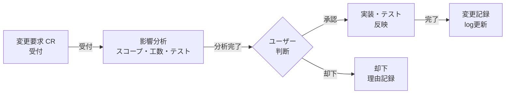

**担当エージェント:** change-manager（第4章4.3.1参照）

**出力:** `docs/change-log/CR-{番号}.md`（変更要求票）、`docs/change-log/change-log.md`（変更管理台帳）

#### 6.2.2 リスク管理（Risk Management）

**参照標準:** CMMI-RSKM, PMBOK リスク管理

**リスク評価マトリクス:**

| 発生確率 / 影響度 | Low (1) | Medium (2) | High (3)   |
| ----------------- | ------- | ---------- | ---------- |
| **High (3)**      | 3 注視  | 6 対応必要 | 9 即対応   |
| **Medium (2)**    | 2 許容  | 4 注視     | 6 対応必要 |
| **Low (1)**       | 1 許容  | 2 許容     | 3 注視     |

スコア6以上はリードエージェントがユーザーに報告し、軽減策の承認を求める。

**リスク台帳フォーマット (docs/risk/risk-register.json):**

```json
{
  "risks": [
    {
      "id": "RISK-001",
      "description": "主要ライブラリの破壊的変更によるビルド失敗",
      "probability": "medium",
      "impact": "high",
      "score": 6,
      "mitigation": "バージョンを固定し、依存関係更新はマイナーバージョンのみ自動許可",
      "owner": "Implementation Agent",
      "status": "open",
      "last_reviewed": "2026-03-01"
    }
  ]
}
```

**担当エージェント:** risk-manager（第4章4.3.2参照）

#### 6.2.3 トレーサビリティ管理

**参照標準:** CMMI-RD/TS, ISO/IEC 12207, AUTOSAR

要件IDからテストケースIDまでの双方向トレーサビリティを維持する。srs-writerが要件IDを付与し、architectがANMS仕様書 Ch4 の Gherkin シナリオに `(traces: FR-xxx)` を付記し、test-engineerがテスト実装時に更新する。

**トレーサビリティマトリクスフォーマット (docs/traceability/traceability-matrix.json):**

```json
{
  "traceability": [
    {
      "requirement_id": "FR-001",
      "requirement": "ユーザーはメールアドレスとパスワードでログインできる",
      "design_ref": "Ch3 Architecture / Ch4 Scenario SC-001",
      "implementation": "src/auth/login.ts",
      "test_ids": ["UT-001", "UT-002", "IT-005"]
    }
  ]
}
```

#### 6.2.4 問題管理（Issue/Defect Management）

**参照標準:** ISO/IEC 12207 問題解決プロセス

**障害票の状態遷移:**

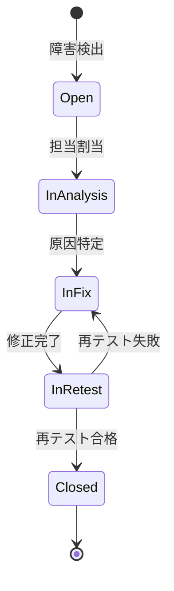

**出力:** `docs/defects/DEF-{番号}.md`（障害票）：再現手順・深刻度・根本原因・再発防止策を含む

#### 6.2.5 ライセンス管理

使用するOSSライブラリのライセンスを追跡し、互換性を確認する。

| ライセンス種別         | 商用利用             | 帰属表示 | ソース公開義務               |
| ---------------------- | -------------------- | -------- | ---------------------------- |
| MIT / BSD / Apache 2.0 | 可                   | 必要     | なし                         |
| LGPL                   | 可（動的リンクのみ） | 必要     | 部分的                       |
| GPL v2/v3              | 要確認               | 必要     | あり                         |
| AGPL                   | 要確認               | 必要     | あり（ネットワーク経由含む） |

**担当エージェント:** license-checker（第4章4.3.3参照）、**出力:** `docs/license/license-report.md`

#### 6.2.6 監査記録管理（Audit Log Management）

**参照標準:** ISO 27001, ISO/IEC 12207 監査プロセス

**記録対象:** Gitコミット履歴（ファイル操作の記録）、重要判断のユーザー承認記録（`docs/decisions/`）、セキュリティスキャン・ライセンス確認の実行記録

**意思決定記録フォーマット (docs/decisions/DEC-{番号}.md):**

- 決定番号・日付・決定内容と背景
- 検討した代替案と選択理由
- ユーザー承認の記録

#### 6.2.7 コスト管理（Token Cost Management）

progress-monitorエージェントがAPIトークン消費を追跡し、予算の80%到達時にユーザーに通知する。

**コスト追跡フォーマット (docs/progress/cost-log.json):**

```json
{
  "cost_log": [
    {
      "date": "2026-03-01",
      "phase": "design",
      "model": "claude-opus-4-6",
      "input_tokens": 125000,
      "output_tokens": 8500,
      "estimated_cost_usd": 2.34
    }
  ],
  "budget_usd": 100.0,
  "spent_usd": 2.34
}
```

#### 6.2.8 SAST/SCA セキュリティスキャン

**参照標準:** OWASP SAMM, NIST SP 800-218 (SSDF)

静的解析ツール（SAST）と依存関係脆弱性スキャン（SCA）をCI/CDパイプラインに組み込み、人手によるセキュリティレビューを補完する。

**ツール選定ガイド:**

| カテゴリ             | ツール例                                     | 実行タイミング                  |
| -------------------- | -------------------------------------------- | ------------------------------- |
| SAST                 | CodeQL（GitHub Actions組み込み）, SonarQube  | PRマージ時・Phase 3完了時       |
| SCA                  | npm audit, pip-audit, OWASP Dependency-Check | 依存追加時・Phase 3完了時       |
| シークレットスキャン | truffleHog, git-secrets                      | コミット前フック・Phase 3完了時 |
| コンテナスキャン     | Trivy, Grype                                 | コンテナビルド時・Phase 5       |

**GitHub ActionsへのCodeQL統合例:**

```yaml
- name: Initialize CodeQL
  uses: github/codeql-action/init@v3
  with:
    languages: javascript, typescript

- name: Run CodeQL Analysis
  uses: github/codeql-action/analyze@v3
```

**担当:** security-reviewerエージェントが手動レビューと合わせて結果を統合し `docs/security/vulnerability-report.md` に記録する。

---

### 6.3 推奨プロセス（中規模以上のプロジェクト）

中規模以上の目安: 開発期間1ヶ月超、または独立したモジュールが3つ以上。

#### 6.3.1 リリース管理

**参照標準:** ITIL, PMBOK

**リリース判定チェックリスト (docs/release/release-checklist.md):**

```markdown
- [ ] すべての機能要件が実装済み（ANMS仕様書 Ch2 との対比完了）
- [ ] 単体テスト合格率 95%以上
- [ ] 結合テスト合格率 100%
- [ ] コードカバレッジ 80%以上
- [ ] 性能テスト: NFR数値目標をすべて達成
- [ ] セキュリティスキャン Critical/High ゼロ件（SAST/SCA含む）
- [ ] レビューレポート Critical/High ゼロ件
- [ ] ライセンスレポート確認済み
- [ ] APIドキュメント（openapi.yaml）最新化済み
- [ ] コンテナイメージビルド・スモークテスト完了
- [ ] 可観測性（ログ・メトリクス・アラート）設定確認済み
- [ ] ロールバック手順確認済み
- [ ] リリースノート作成済み
```

#### 6.3.2 コミュニケーション管理

**参照標準:** PMBOK コミュニケーション管理

**CLAUDE.mdへの追記テンプレート:**

```markdown
## コミュニケーション計画

- 日次: progress-monitorが docs/progress/daily-report.md を更新する
- フェーズ完了時: リードエージェントがユーザーに概要報告する
- 異常発生時（リスクスコア6以上・コスト80%到達）: 即座にユーザーに通知する
```

#### 6.3.3 プロセス改善・再発防止（CAR / OPF）

**参照標準:** CMMI-CAR, CMMI-OPF

各フェーズ完了時、またはバグ多発時にふりかえりを実施し、改善内容をCLAUDE.mdとエージェント定義に反映する。実行方法は第5章5.3のretrospectiveコマンドを参照。

#### 6.3.4 ドキュメント版管理

**参照標準:** ISO/IEC 12207 ドキュメントプロセス

- 命名規則: `{文書名}-v{メジャー}.{マイナー}.md`（例: `taskapp-spec-v1.2.md`）
- 仕様書承認時・重大な仕様変更時: メジャーバージョンをインクリメント
- 軽微な記述修正・追記: マイナーバージョンをインクリメント
- 廃止文書は `docs/archive/` に移動し、廃止日と後継文書を記録する

---

### 6.4 条件付きプロセスの判断基準と判断時期

**判断タイミング:** Phase 0（spec.md読み込み直後）にリードエージェントが評価し、該当するプロセスをCLAUDE.mdに追記して有効化する。

#### 6.4.1 判断基準一覧

| プロセス                         | 追加が必要な条件（1つでも該当すれば追加）                                                                                                                                                                    | 判断時期                                                                     |
| -------------------------------- | ------------------------------------------------------------------------------------------------------------------------------------------------------------------------------------------------------------ | ---------------------------------------------------------------------------- |
| **法規調査**                     | ・個人情報・個人データを扱う<br>・医療・ヘルスケア分野<br>・金融・決済処理を扱う<br>・通信サービスを提供する<br>・EU市場向けに提供する<br>・公共・行政向けシステム                                           | Phase 0 仕様書作成**前**<br>（最優先で判断）                                    |
| **特許調査**                     | ・新規アルゴリズム・手法を独自実装する<br>・AIモデルを組み込む<br>・金融・ECの新規ビジネスロジックを実装する<br>・商用製品として第三者に販売・提供する                                                       | Phase 2 設計開始**前**<br>（アルゴリズム選定時）                             |
| **技術動向調査**                 | ・開発期間が6ヶ月以上<br>・採用予定ライブラリの最終リリースが1年以上前<br>・AI/ML・クラウドネイティブ等の急変領域<br>・主要依存関係のEOLが開発期間内に到来                                                   | Phase 0 技術スタック選定時<br>（長期プロジェクトは各フェーズ開始時に再評価） |
| **機能安全（HARA/FMEA）**        | ・人命・身体への直接的影響がある（医療機器・車載・産業機器）<br>・IEC 61508 / ISO 26262 / IEC 62304 等への準拠が要求される<br>・社会インフラへの重大な影響がある<br>・金融基幹系で重大な資産損害リスクがある | Phase 0 コンセプト提示時<br>（**最優先で判断**、安全要件は仕様書作成前に確定）      |
| **アクセシビリティ（WCAG 2.1）** | ・Webアプリケーションを提供する<br>・EU市場向け（EAA指令 2025年6月完全施行）<br>・公共・行政向けシステム<br>・多様なユーザー層を対象とする                                                                   | Phase 0 仕様書作成**前**<br>（NFRとしてANMS Ch2に含める）                            |

#### 6.4.2 Phase 0 評価プロセス

full-auto-dev コマンドのPhase 0で、リードエージェントが以下を自動評価する（第5章5.1参照）。

1. 機能安全 → 該当する場合は**即座にユーザーに確認**を求め、仕様書作成前に安全要件を確定する。`docs/safety/` を作成し、Phase 2 に HARA・FMEAを追加する
2. 法規調査 → 該当する場合はCLAUDE.mdに追記し、ANMS仕様書 Ch2 の非機能要件セクションに規制要件を含める。`docs/legal/` を作成する
3. 特許調査 → 該当する場合はWBSのPhase 2 開始前に特許調査タスクを追加する。`docs/legal/patent-clearance.md` に記録する
4. 技術動向調査 → 該当する場合は各フェーズ開始時に技術動向確認ステップをWBSに追加する。`docs/tech-watch.md` を作成する
5. アクセシビリティ → 該当する場合はANMS仕様書 Ch2 のNFRにWCAG 2.1 AA準拠要件を追加し、review-agentのR1チェック項目に含める

---

# 第4部: 開発ワークフロー

## 第7章 ほぼ全自動開発のワークフロー

### 7.1 開発フェーズの全体像

**開発フェーズフロー:**

```mermaid
flowchart LR
    subgraph Phase0["Phase 0<br/>プロセス評価"]
        P0A["AI:<br/>spec.mdバリデーション<br/>CLAUDE.md提案"]
        P0B["ユーザー:<br/>CLAUDE.md確認・承認<br/>条件付きプロセス確認"]
    end

    subgraph Phase1["Phase 1<br/>企画"]
        P1A["ユーザー:<br/>コンセプト提示"]
        P1B["AI:<br/>ANMS仕様書<br/>Ch1-2作成"]
        P1C["AI:<br/>Ch1-2レビュー(R1)"]
    end

    subgraph Phase2["Phase 2<br/>設計"]
        P2A["AI:<br/>ANMS Ch3-6<br/>詳細化"]
        P2B["AI:<br/>セキュリティ設計"]
        P2C["AI:<br/>WBS・リスク管理"]
        P2E["AI:<br/>OpenAPI・可観測性設計"]
        P2D["AI:<br/>設計レビュー(R2/R4/R5)"]
    end

    subgraph Phase3["Phase 3<br/>実装"]
        P3A["AI:<br/>コード実装<br/>（Git worktree並列）"]
        P3B["AI:<br/>単体テスト"]
        P3C["AI:<br/>コードレビュー(R2-R5)"]
        P3D["AI:<br/>SCA/シークレットスキャン"]
    end

    subgraph Phase4["Phase 4<br/>テスト"]
        P4A["AI:<br/>結合テスト"]
        P4B["AI:<br/>システムテスト"]
        P4G["AI:<br/>性能テスト"]
        P4C["AI:<br/>テストレビュー(R6)"]
    end

    subgraph Phase5["Phase 5<br/>納品"]
        P5A["AI:<br/>最終レビュー(R1-R6)"]
        P5B["AI:<br/>コンテナビルド<br/>デプロイ・スモークテスト"]
        P5C["AI:<br/>最終レポート"]
        P5D["ユーザー:<br/>受入テスト"]
    end

    P0A -->|"評価結果報告"| P0B
    P0B -->|"承認"| P1A
    P1A -->|"コンセプト"| P1B
    P1B -->|"Ch1-2完成"| P1C
    P1C -->|"PASS"| Phase2
    P2A --> P2D
    P2B --> P2D
    P2C --> P2D
    P2E --> P2D
    P2D -->|"PASS"| Phase3
    P3A -->|"実装完了"| P3B
    P3B -->|"テスト通過"| P3C
    P3C -->|"PASS"| P3D
    P3D -->|"スキャンOK"| Phase4
    P4A -->|"結合OK"| P4B
    P4B -->|"システムOK"| P4G
    P4G -->|"性能OK"| P4C
    P4C -->|"PASS"| Phase5
    P5A -->|"最終PASS"| P5B
    P5B -->|"デプロイOK"| P5C
    P5C -->|"レポート提出"| P5D
```

### 7.2 Phase 0: 条件付きプロセス評価（必須）

Phase 0は全自動開発の**最初のステップ**であり、仕様書作成前に必ず実行する。

**spec.mdバリデーション**として、以下の必須項目の記載を確認する:

- 何を作りたいか（What）、それはどうしてか（Why）

「その他の希望」は任意だが、記載があればバリデーション時に考慮する。不足項目があればユーザーに対話で補完してから先へ進む。

バリデーション通過後、spec.md の内容を基に **CLAUDE.md を提案**する（技術スタック、コーディング規約、セキュリティ方針、ブランチ戦略など）。ユーザーの承認後、CLAUDE.md を配置し、第6章6.4の判断基準に基づいて条件付きプロセスの要否を評価する。

評価結果はユーザーに報告し、追加プロセスの有効化について確認を求める。確認後、CLAUDE.mdの条件付きプロセスセクションを更新してから Phase 1 に進む。

### 7.3 Phase 1: 企画 — コンセプトからANMS仕様書 Ch1-2 作成

#### 7.3.1 ユーザーのアクション: コンセプト提示

ユーザーは `spec.md` に3つの問いに答える形でコンセプトを記述する。

**spec.md の構成（3問形式）:**

- **何を作りたい？**（必須）— 作りたいもの・やりたいことを自由に記述
- **それはどうして？**（必須）— 背景・課題・動機
- **その他の希望**（任意）— 展開方法（Web/スマホ等）、連携先、利用範囲など

プロジェクト名・技術スタック・品質要求などの詳細は、Phase 0 で AI が CLAUDE.md として提案する。ユーザーは「作りたいもの」だけに集中すればよい。

#### 7.3.2 AI のアクション: ANMS仕様書 Ch1-2 自動生成

```bash
claude "spec.mdを読み込み、ほぼ全自動開発を開始してください。
まず anms-template/anms-spec-template.md を参照し、
ANMS形式の仕様書（Ch1-2: Foundation・Requirements）を spec/[project-name]-spec.md に作成してください。
作成後、review-agentでR1観点のレビューを実施し、
PASSしたら仕様書の概要を報告し、重要な判断が必要な箇所があれば提示してください。"
```

#### 7.3.3 ユーザーの判断ポイント: 仕様書承認

- 機能要件が過不足ないか
- 非機能要件が適切か（性能・セキュリティ・アクセシビリティ含む）
- 優先順位が正しいか

### 7.4 Phase 2: 設計 — ANMS仕様書 Ch3-6 詳細化・セキュリティ・WBS

仕様書 Ch1-2 が承認されたら、設計フェーズを自動開始する。

```bash
claude "仕様書 Ch1-2 が承認されました。以下を並列で実行してください:
1. spec/ の ANMS 仕様書 Ch3 (Architecture) を詳細化する
2. spec/ の ANMS 仕様書 Ch4 (Specification) を Gherkin で詳細化する
3. spec/ の ANMS 仕様書 Ch5 (Test Strategy) を定義する
4. spec/ の ANMS 仕様書 Ch6 (Design Principles Compliance) を設定する
5. docs/api/openapi.yaml にOpenAPI 3.0仕様を生成する
6. docs/security/ にセキュリティ設計を作成する
7. docs/observability/observability-design.md に可観測性設計を作成する
8. docs/progress/wbs.md にWBSとガントチャートを作成する
9. risk-managerでリスク台帳を作成する
10. review-agentでR2/R4/R5観点の設計レビューを実施し、PASSしたら次へ進む
完了後、設計の概要とWBSを報告してください。"
```

**WBSの出力例（Mermaid gantt）:**

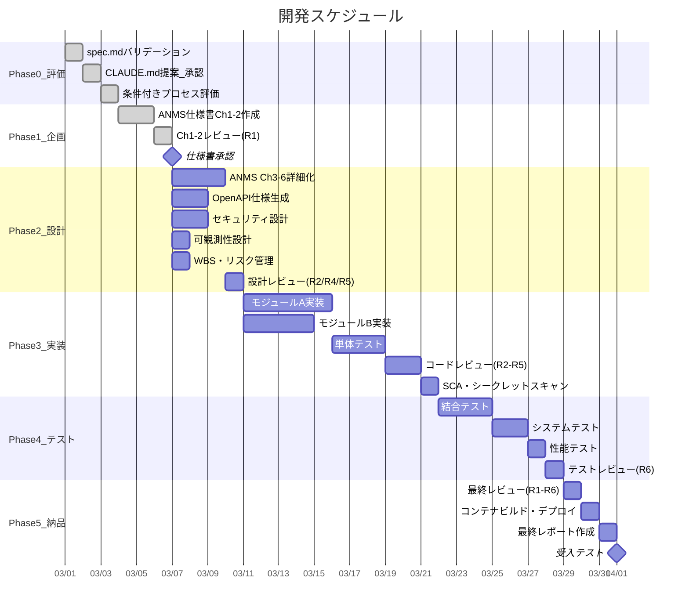

### 7.5 Phase 3: 実装 — 並列開発とテスト

#### 7.5.1 Gitブランチ戦略

Agent Teamsによる並列実装では、ブランチの競合を防ぐために以下のブランチ戦略を厳守する。

**ブランチ戦略フロー:**

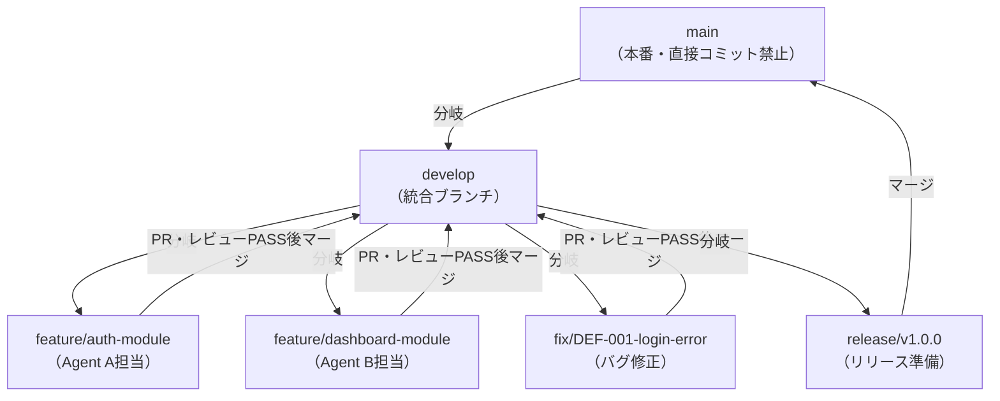

- 各 Implementation Agent は専用の `feature/` ブランチで作業する
- `develop` へのマージは review-agent の PASS 後のみ許可する
- `main` へのマージは release ブランチ経由とし、受入テスト完了後に実施する

#### 7.5.2 Agent Teams による並列実装

```bash
claude "ANMS仕様書に基づき、Agent Teamsで並列実装を開始してください。
Implementation Agentがsrc/配下にコードを実装し（各AgentはGit worktreeで専用ブランチを使用）、
Test Agentがtests/配下にテストを作成・実行し、
Review Agentがコードレビュー（R2/R3/R4/R5観点）を行い、
PM Agentが進捗を追跡してください。
各エージェントはANMS仕様書の割り当てモジュールに専念し、
ファイル競合が起きないよう担当ディレクトリを分けてください。"
```

#### 7.5.3 Git Worktree による並列開発

```bash
# ターミナル1: モジュールA（feature/auth-module ブランチ）
claude --worktree -p "ANMS仕様書に基づきモジュールA（認証モジュール）を実装してください。
feature/auth-module ブランチで作業し、完了後 develop へのPRを作成してください"

# ターミナル2: モジュールB（feature/dashboard-module ブランチ）
claude --worktree -p "ANMS仕様書に基づきモジュールB（ダッシュボード）を実装してください。
feature/dashboard-module ブランチで作業し、完了後 develop へのPRを作成してください"
```

### 7.6 Phase 4: テスト — 統合テスト・性能テスト・品質監視

#### 7.6.1 テスト自動実行

```bash
claude "すべてのモジュール実装が完了しました。以下を実行してください:
1. 結合テストを作成・実行する
2. システムテスト（APIレベル、E2Eレベル）を可能な範囲で作成・実行する
3. 性能テスト: ANMS仕様書 Ch2 のNFR数値目標（レスポンスタイム・同時接続数等）に基づきk6シナリオを実行する
4. テスト消化曲線とバグカーブを更新する
5. review-agentでテストコードのレビュー（R6観点）を実施する
6. カバレッジレポートを生成する
7. 品質基準を満たしているか評価する
8. 問題があれば自動修正を試み、重大な問題はユーザーに報告する"
```

#### 7.6.2 性能テストの実施

非機能要件（NFR）で定義した数値目標を実際の負荷テストで検証する。

**k6 性能テストシナリオ例 (tests/performance/load-test.js):**

```javascript
import http from "k6/http";
import { check, sleep } from "k6";

export const options = {
  // ANMS Ch2 NFR-002: 同時接続100ユーザーでレスポンス200ms以内
  stages: [
    { duration: "30s", target: 50 },
    { duration: "1m", target: 100 },
    { duration: "30s", target: 0 },
  ],
  thresholds: {
    http_req_duration: ["p(95)<200"], // NFR-002: P95 200ms以内
    http_req_failed: ["rate<0.01"], // エラーレート1%未満
  },
};

export default function () {
  const res = http.get("http://localhost:3000/api/tasks");
  check(res, { "status was 200": (r) => r.status === 200 });
  sleep(1);
}
```

**性能テスト結果の記録 (docs/performance/perf-report-{日付}.md):**

- NFR IDと対応する目標値・実測値の比較表
- PASS/FAILの判定
- ボトルネック箇所の特定（FAIL時）

#### 7.6.3 テスト消化曲線の自動監視

**テスト消化データ形式 (test-progress.json):**

```json
{
  "test_progress": [
    {
      "date": "2026-03-05",
      "planned": 50,
      "executed": 12,
      "passed": 10,
      "failed": 2
    },
    {
      "date": "2026-03-06",
      "planned": 50,
      "executed": 28,
      "passed": 25,
      "failed": 3
    },
    {
      "date": "2026-03-07",
      "planned": 50,
      "executed": 45,
      "passed": 42,
      "failed": 3
    },
    {
      "date": "2026-03-08",
      "planned": 50,
      "executed": 50,
      "passed": 48,
      "failed": 2
    }
  ]
}
```

**テスト消化曲線の可視化（Mermaid）:**

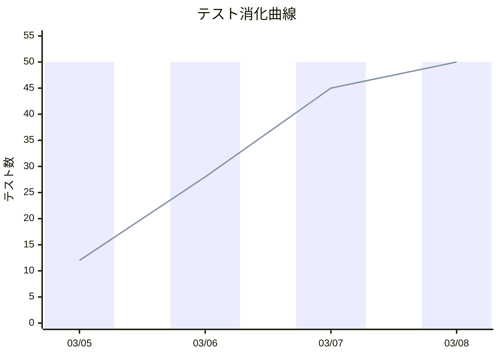

#### 7.6.4 バグカーブの自動監視

**バグカーブデータ形式 (bug-curve.json):**

```json
{
  "bug_curve": [
    { "date": "2026-03-05", "found_cumulative": 5, "fixed_cumulative": 2 },
    { "date": "2026-03-06", "found_cumulative": 12, "fixed_cumulative": 8 },
    { "date": "2026-03-07", "found_cumulative": 15, "fixed_cumulative": 13 },
    { "date": "2026-03-08", "found_cumulative": 16, "fixed_cumulative": 16 }
  ]
}
```

**バグカーブの可視化（Mermaid）:**

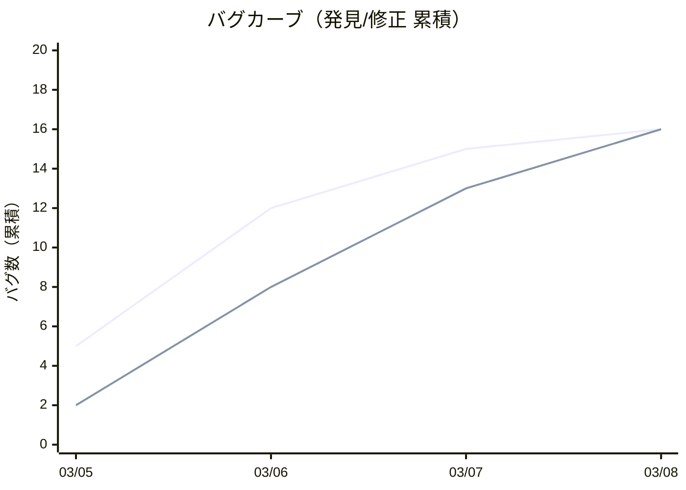

#### 7.6.5 ボトルネックへの自動リソース追加

PM Agentが異常を検知した場合、リードエージェントは自動的に以下の対応を行う:

1. 問題領域を特定（どのモジュール/機能にバグが集中しているか）
2. 追加のサブエージェントを起動して問題領域に集中投入
3. 必要に応じてモデルをアップグレード（sonnet → opus）
4. 修正後に再テストを実行

### 7.7 Phase 5: 納品 — デプロイメント・最終レポート・受入テスト

#### 7.7.1 最終レビューとFAIL時のルーティング

```bash
claude "テストが完了しました。review-agentで全成果物の最終レビュー（R1〜R6全観点）を実施してください。
FAILした場合は、指摘の観点に応じて該当フェーズへ戻り修正してください:
- R1指摘 → ANMS Ch1-2 修正（Phase 1相当）
- R2/R4/R5設計指摘 → ANMS Ch3-4 修正（Phase 2相当）
- R3/R5実装指摘 → コード修正（Phase 3相当）
- R6テスト指摘 → テスト修正（Phase 4相当）
すべてPASSしたらデプロイメントを開始してください。"
```

#### 7.7.2 コンテナビルドとデプロイメント

```bash
claude "最終レビューがPASSしました。以下のデプロイメント手順を実行してください:
1. Dockerfileを確認・ビルドし、コンテナイメージの健全性を確認する
2. infra/ のIaC構成（Terraform等）を確認し、差分を表示する（apply前にユーザーに確認）
3. デプロイメントを実行する（Blue/Greenデプロイまたはカナリアリリース）
4. スモークテスト: 主要エンドポイントへの疎通確認を自動実行する
5. ロールバック手順を確認し、docs/release/rollback-procedure.md に記録する"
```

> **重要:** IaC の apply（インフラ変更の適用）はユーザーへの確認を必ず求めること。意図しないインフラ変更を防ぐための安全措置である。

#### 7.7.3 可観測性の確認

```bash
claude "デプロイ後の可観測性を確認してください:
1. docs/observability/observability-design.md の設計と実際の設定を照合する
2. 構造化ログが正しいJSON形式で出力されているか確認する
3. メトリクス（Rate/Error/Duration）が計装されているか確認する
4. アラートルール（エラーレート1%超・SLAレイテンシ超過）が設定されているか確認する
5. 差異があれば修正し、docs/observability/ を更新する"
```

#### 7.7.4 最終レポートの自動生成

```bash
claude "以下の最終工程を実行してください:
1. license-checkerで最終ライセンス確認を実施する
2. docs/progress/final-report.md に以下を含む最終報告書を作成する:
   - プロジェクト概要・実装した機能一覧
   - テスト結果サマリー（カバレッジ、合格率）
   - 性能テスト結果（NFR達成状況）
   - テスト消化曲線・バグカーブの最終状態
   - レビュー結果サマリー（R1〜R6）
   - セキュリティ評価結果（SAST/SCA含む）
   - APIドキュメント（openapi.yaml）の最終版確認
   - 可観測性設定の確認結果
   - 既知の問題と制約事項
3. 受入テスト用の手順書を作成する"
```

#### 7.7.5 ユーザーのアクション: 受入テスト

- 要求したすべての機能が実装されているか
- 動作が期待通りか
- パフォーマンスは許容範囲か（性能テスト結果の確認）
- セキュリティ上の懸念はないか
- APIドキュメントが最新か

---

# 第5部: 品質管理

## 第8章 品質管理フレームワーク

### 8.1 段階的レビューゲート

**レビューゲートフロー（FAIL時の戻り先を明示）:**

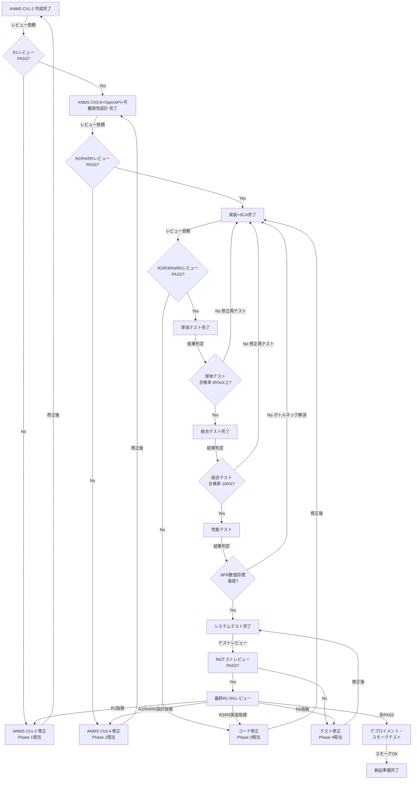

各レビューゲートはreview-agentが自動実行する。Critical/High指摘がゼロになるまで次フェーズへの移行をブロックする。

### 8.2 レビュー観点（R1〜R6）

review-agentが適用する6つの観点。詳細なチェックリストは `.claude/agents/review-agent.md` を参照すること。

| 観点                     | 内容                                                                                                                                                            | 適用対象                  |
| ------------------------ | --------------------------------------------------------------------------------------------------------------------------------------------------------------- | ------------------------- |
| **R1: 要件品質**         | 完全性・テスト可能性・矛盾・曖昧表現・用語一貫性・アクセシビリティ(WCAG)                                                                                        | ANMS Ch1-2                |
| **R2: SW設計原則**       | SOLID (SRP/OCP/LSP/ISP/DIP)、DRY、KISS、YAGNI、SoC、SLAP、LOD、CQS、POLA、PIE、CA、Naming                                                                       | ANMS Ch3-4・コード        |
| **R3: コーディング品質** | エラーハンドリング完全性・入力バリデーション・防御的プログラミング                                                                                              | コード                    |
| **R4: 並行性・状態遷移** | デッドロック（リソース取得順序・長時間ロック）、レースコンディション（Check-Then-Act・DB Read-Modify-Write・Promise競合）、グリッジ（非原子更新・中間状態露出） | ANMS Ch3-4・コード        |
| **R5: パフォーマンス**   | アルゴリズム計算量（O(n²)以上）、N+1クエリ、メモリリーク、不要な直列化                                                                                          | ANMS Ch3-4・コード        |
| **R6: テスト品質**       | テスト独立性・境界値・異常系・フレーキーテスト・要件カバレッジ・性能テストのNFR網羅                                                                             | テストコード              |

### 8.3 品質基準テーブル

| 指標                 | 基準値                    | 測定方法                              |
| -------------------- | ------------------------- | ------------------------------------- |
| 単体テスト合格率     | 95%以上                   | テストフレームワークの実行結果        |
| 結合テスト合格率     | 100%                      | テストフレームワークの実行結果        |
| コードカバレッジ     | 80%以上                   | カバレッジツール（例: c8, istanbul）  |
| 性能テスト           | NFRすべての数値目標を達成 | k6等の性能テスト結果                  |
| セキュリティ脆弱性   | Critical/High: 0件        | Security Agent + SAST/SCAスキャン結果 |
| レビュー指摘         | Critical/High: 0件        | review-agentの出力                    |
| コーディング規約準拠 | 違反0件                   | Linter（ESLint等）の実行結果          |

---

# 第6部: 運用・自動化

## 第9章 ヘッドレスモードとCI/CD連携

### 9.1 ヘッドレスモードの基本

`-p` フラグを使用すると、対話なしでClaude Codeを実行できる。これにより、CI/CDパイプラインやスクリプトからの自動呼び出しが可能になる。

```bash
# 単発のヘッドレス実行
claude -p "src/配下のすべてのテストを実行し、結果をJSON形式で出力してください"

# 出力形式を指定
claude -p "テスト結果を報告してください" --output-format json
```

### 9.2 GitHub Actions との連携

CI/CDパイプラインにClaude Codeを統合する際は、以下のセキュリティ原則に従うこと。

**セキュリティ原則:**

- `curl | sh` によるスクリプト直接実行は禁止する（内容確認なしの実行リスク）
- 公式の GitHub Actions（`anthropics/claude-code-action`等）を使用する
- OIDC（OpenID Connect）認証でクレデンシャルを最小化する
- `permissions:` フィールドで最小権限を明示する
- シークレットは GitHub Secrets に格納し、定期的にローテーションする

**GitHub Actions ワークフロー例 (.github/workflows/claude-review.yml):**

```yaml
name: Claude Code Auto Review
on:
  pull_request:
    types: [opened, synchronize]

permissions:
  contents: read
  pull-requests: write

jobs:
  security-scan:
    runs-on: ubuntu-latest
    steps:
      - uses: actions/checkout@v4

      - name: Run CodeQL Analysis
        uses: github/codeql-action/init@v3
        with:
          languages: javascript, typescript

      - name: Autobuild
        uses: github/codeql-action/autobuild@v3

      - name: Perform CodeQL Analysis
        uses: github/codeql-action/analyze@v3

      - name: Run npm audit
        run: npm audit --audit-level=high

  claude-review:
    runs-on: ubuntu-latest
    needs: security-scan
    steps:
      - uses: actions/checkout@v4

      - name: Install Claude Code (公式インストール方法)
        run: |
          # 公式ドキュメント記載の方法を使用すること
          # https://code.claude.com/docs/en/overview
          npm install -g @anthropic-ai/claude-code

      - name: Run Claude Code Review
        env:
          ANTHROPIC_API_KEY: ${{ secrets.ANTHROPIC_API_KEY }}
        run: |
          claude -p "このPRの変更内容をレビューしてください。
          セキュリティ上の問題、パフォーマンスの懸念、コーディング規約違反を報告してください。" \
          --output-format json > review-result.json

      - name: Post Review Comment
        uses: actions/github-script@v7
        with:
          script: |
            const fs = require('fs');
            const result = JSON.parse(fs.readFileSync('review-result.json', 'utf8'));
            await github.rest.issues.createComment({
              issue_number: context.issue.number,
              owner: context.repo.owner,
              repo: context.repo.repo,
              body: result.result
            });
```

> **注意:** Claude Codeのインストール方法は公式ドキュメントの最新版を参照すること。npmインストールは一部の環境で非推奨となっている場合がある。

---

# 第7部: デプロイメントと可観測性

## 第10章 デプロイメントと可観測性

### 10.1 デプロイメントプロセス

本番へのリリースには、コンテナ化・IaC・段階的デプロイメントの3要素が必要である。

#### 10.1.1 コンテナ化

**Dockerfileのベストプラクティス例:**

```dockerfile
# マルチステージビルドでイメージを最小化
FROM node:20-alpine AS builder
WORKDIR /app
COPY package*.json ./
RUN npm ci --only=production
COPY . .
RUN npm run build

FROM node:20-alpine AS runner
WORKDIR /app
# 非rootユーザーで実行（セキュリティ要件）
RUN addgroup --system --gid 1001 nodejs
RUN adduser --system --uid 1001 nextjs
COPY --from=builder --chown=nextjs:nodejs /app/.next ./.next
COPY --from=builder /app/node_modules ./node_modules
USER nextjs
EXPOSE 3000
CMD ["node", "server.js"]
```

**コンテナセキュリティスキャン（Trivy）:**

```bash
# コンテナイメージの脆弱性スキャン
trivy image --severity HIGH,CRITICAL myapp:latest
```

#### 10.1.2 IaC（Infrastructure as Code）

IaCのapplyは**必ずユーザーへの確認を経てから実行する**。

```bash
# 差分確認（安全に実行可能）
terraform plan -out=tfplan

# ユーザー確認後にapply
terraform apply tfplan
```

**IaCファイルの配置:**

```text
infra/
  main.tf                  ... メインリソース定義
  variables.tf             ... 変数定義
  outputs.tf               ... 出力定義
  migrations/              ... DBマイグレーションファイル
    V001__initial_schema.sql
    V002__add_users_table.sql
```

#### 10.1.3 段階的デプロイメント

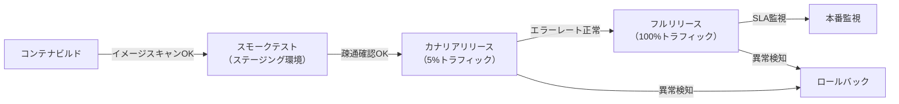

**スモークテスト（最小確認項目）:**

```bash
# 主要エンドポイントへの疎通確認
curl -f http://localhost:3000/health || exit 1
curl -f http://localhost:3000/api/status || exit 1
echo "Smoke tests passed"
```

#### 10.1.4 ロールバック手順

デプロイメント失敗時のロールバック手順を事前に定義し、`docs/release/rollback-procedure.md` に記録する。

**ロールバック手順書テンプレート:**

```markdown
# ロールバック手順書

## トリガー条件

- スモークテスト失敗
- エラーレートが1%超かつ5分以上継続
- P99レイテンシがSLA（例: 500ms）を超過かつ5分以上継続

## 手順

1. 即時判断（5分以内）: ロールバックするかユーザー（運用責任者）に確認
2. カナリア停止: トラフィックを旧バージョンに戻す
3. 状態確認: エラーレートとレイテンシが正常値に戻ったことを確認
4. 原因調査: ログ・トレースを確認し根本原因を特定
5. docs/defects/ に障害票を起票する

## ロールバックコマンド

[IaC/デプロイツールに応じて記載]
```

### 10.2 可観測性（Observability）設計

可観測性の3本柱（ログ・メトリクス・トレーシング）をPhase 2の設計段階で定義し、Phase 3の実装で組み込む。

#### 10.2.1 構造化ログ

**ログ設計原則:**

- 形式: JSON構造化ログ（`console.log` は禁止）
- レベル: DEBUG / INFO / WARN / ERROR の4段階
- 必須フィールド: `timestamp`, `level`, `service`, `traceId`, `message`

**構造化ログ例:**

```json
{
  "timestamp": "2026-03-01T12:00:00.000Z",
  "level": "ERROR",
  "service": "auth-service",
  "traceId": "abc123def456",
  "userId": "usr_001",
  "message": "Login failed: invalid credentials",
  "error": {
    "code": "AUTH_INVALID_CREDENTIALS",
    "stack": "..."
  }
}
```

**機密情報のログ出力禁止:**

- パスワード・トークン・クレデンシャルは絶対にログに含めない
- 個人情報（メールアドレス等）はマスク処理を適用する

#### 10.2.2 メトリクス（RED指標）

すべてのAPIエンドポイントに以下のREDメトリクスを計装する。

| メトリクス             | 説明                         | 例                              |
| ---------------------- | ---------------------------- | ------------------------------- |
| Rate（リクエスト率）   | 単位時間あたりのリクエスト数 | `http_requests_total`           |
| Errors（エラー率）     | エラーレスポンスの割合       | `http_errors_total`             |
| Duration（レイテンシ） | リクエスト処理時間の分布     | `http_request_duration_seconds` |

**OpenTelemetry 計装例（Node.js）:**

```javascript
import { metrics } from "@opentelemetry/api";

const meter = metrics.getMeter("api-service");
const requestCounter = meter.createCounter("http_requests_total");
const requestDuration = meter.createHistogram("http_request_duration_seconds");

// ミドルウェアで計装
app.use((req, res, next) => {
  const start = Date.now();
  res.on("finish", () => {
    requestCounter.add(1, { method: req.method, status: res.statusCode });
    requestDuration.record((Date.now() - start) / 1000, { method: req.method });
  });
  next();
});
```

#### 10.2.3 分散トレーシング

```javascript
import { trace } from "@opentelemetry/api";

const tracer = trace.getTracer("auth-service");

async function login(email, password) {
  return tracer.startActiveSpan("auth.login", async (span) => {
    try {
      span.setAttribute("user.email_hash", hashEmail(email));
      const result = await authenticate(email, password);
      span.setStatus({ code: SpanStatusCode.OK });
      return result;
    } catch (error) {
      span.recordException(error);
      span.setStatus({ code: SpanStatusCode.ERROR });
      throw error;
    } finally {
      span.end();
    }
  });
}
```

#### 10.2.4 アラート設計

アラートルールをPhase 2で設計し、`docs/observability/observability-design.md` に定義する。

**アラートルール例:**

| アラート名    | 条件                           | 優先度   | 対応                                       |
| ------------- | ------------------------------ | -------- | ------------------------------------------ |
| HighErrorRate | エラーレート > 1%（5分継続）   | Critical | 即時調査・ロールバック検討                 |
| HighLatency   | P99 > SLAレイテンシ（5分継続） | High     | ボトルネック調査                           |
| LowDiskSpace  | ディスク使用率 > 85%           | Medium   | ログローテーション確認                     |
| AgentTimeout  | エージェント無応答30分超       | High     | progress-monitorがリードエージェントに報告 |

### 10.3 本番リリースチェックリスト

Phase 5のデプロイメント前に以下の全項目を確認する。

```markdown
# 本番リリースチェックリスト

## 品質ゲート

- [ ] 最終レビュー（R1〜R6）: Critical/High ゼロ件
- [ ] 単体テスト合格率 95%以上
- [ ] 結合テスト合格率 100%
- [ ] コードカバレッジ 80%以上
- [ ] 性能テスト: NFR数値目標をすべて達成

## セキュリティ

- [ ] SAST（CodeQL）: Critical/High ゼロ件
- [ ] SCA（npm audit等）: Critical/High ゼロ件
- [ ] シークレットスキャン: 検出なし
- [ ] コンテナスキャン（Trivy等）: Critical/High ゼロ件
- [ ] ライセンスレポート確認済み

## デプロイメント

- [ ] コンテナイメージビルド成功
- [ ] IaC差分確認・ユーザー承認済み
- [ ] スモークテスト（ステージング）合格
- [ ] ロールバック手順確認・文書化済み

## 可観測性

- [ ] 構造化ログが正しく出力されている
- [ ] REDメトリクスが全APIに計装されている
- [ ] アラートルールが設定されている
- [ ] ダッシュボードが動作確認済み

## ドキュメント

- [ ] APIドキュメント（openapi.yaml）最新化済み
- [ ] 最終レポート（final-report.md）作成済み
- [ ] 受入テスト手順書作成済み
- [ ] リリースノート作成済み
```

---

# 第8部: 参考資料

## 第11章 トラブルシューティング

### 11.1 よくある問題と対処法

| 問題                               | 原因                                        | 対処法                                                                                 |
| ---------------------------------- | ------------------------------------------- | -------------------------------------------------------------------------------------- |
| サブエージェントが期待と異なる動作 | エージェント定義の description が不明確     | description を具体的に記述し直す                                                       |
| Agent Teams でファイル競合         | 複数エージェントが同一ファイルを編集        | CLAUDE.md で担当ディレクトリを明確に分離する                                           |
| コンテキストウィンドウ超過         | 長い会話で情報が溢れる                      | `/compact` コマンドで会話を要約、またはサブエージェントに委任して結果のみ受け取る      |
| テストが不安定（Flaky）            | 非同期処理やタイミング依存                  | R4（並行性）観点でレビューし、Test Agentに安定化ルールを追加する                       |
| コスト超過                         | Opus モデルの多用、Agent Teams の並列数過多 | Sonnet をデフォルトにし、Opus は重要判断時のみ使用する                                 |
| チェックポイントからの復旧失敗     | 複雑なGit状態                               | `Esc` 2回押しで巻き戻し、または `/rewind` コマンドを使用する                           |
| レビューがPASSしない               | Critical/High指摘が解消されない             | 指摘の修正案に従い修正後、再レビューを依頼する                                         |
| エージェント間循環待機             | 相互依存するエージェントが同時待機          | progress-monitorの異常検知を確認し、リードエージェントからエージェントを強制再起動する |
| 性能テストが未達                   | ボトルネックがある                          | k6の結果でボトルネック箇所を特定し、R5（パフォーマンス）観点での修正を依頼する         |
| コンテナビルド失敗                 | Dockerfileの設定ミス                        | コンテナスキャン結果と合わせてarchitectに修正を依頼する                                |

### 11.2 コスト管理のガイドライン

Agent Teams は各エージェントが独立してトークンを消費する。コスト最適化のためのガイドライン:

1. **モデル選択**: デフォルトは `sonnet`（コスト効率が高い）を使用し、アーキテクチャ判断やセキュリティ・品質レビューなど高度な判断が必要な場面でのみ `opus` を使用する
2. **エージェント数の制限**: Agent Teams の同時エージェント数は3〜5を推奨する。それ以上はコスト対効果が低下する
3. **コンテキスト管理**: `/compact` を適宜使用して不要なコンテキストを圧縮する
4. **コスト追跡**: `docs/progress/cost-log.json` でAPIトークン消費を記録し、予算の80%到達時に対策を講じる

---

## 第12章 ベストプラクティスと注意事項

### 12.1 ベストプラクティス

1. **CLAUDE.md は継続的に改善する**: プロジェクトの進行に伴い発見したルールやパターンを追記する。retrospectiveコマンドの結果を反映する
2. **Git を活用する**: Claude Code は Git と密に連携する。こまめにコミットし、チェックポイントと組み合わせて安全に開発を進める
3. **ブランチ戦略を厳守する**: Agent Teamsの並列開発では、feature/ブランチとworktreeの組み合わせでファイル競合を防ぐ
4. **段階的に信頼を構築する**: 最初は小さなタスクで Claude Code の動作を確認し、徐々に委任範囲を拡大する
5. **エージェント定義は具体的に**: 曖昧な description は誤ったエージェント起動の原因になる
6. **ファイル境界を明確に**: Agent Teams では各エージェントの担当ディレクトリを明確に分け、ファイル競合を防ぐ
7. **Plan → Execute パターン**: Agent Teams を使う前に `/plan` で計画を立て、レビュー後にチームに渡すのが最も効果的なパターンである
8. **レビューゲートを省略しない**: Critical/High指摘を残したまま次フェーズに進むと後工程で手戻りが増大する
9. **可観測性をコードと同時に実装する**: Phase 3でログ・メトリクス・トレーシングを後付けにすると設計ミスが生じやすい
10. **IaC変更は必ず確認を求める**: インフラへの変更は取り消しが困難なため、ユーザーへの確認を経てから実行する

### 12.2 注意事項と制約

1. **Agent Teams は実験的機能**: 仕様が変更される可能性がある。本番運用前に十分なテストを行うこと
2. **完全な自律性は保証されない**: Claude Code は時折ユーザーに確認を求める場合がある。これは安全性のための設計であり、完全無人での実行を前提としないこと
3. **コスト認識**: Agent Teams の並列実行はトークン消費が増大する。事前にコスト試算を行うことを推奨する
4. **セキュリティの最終確認は人間が行う**: AI によるセキュリティレビューは有用だが、重要なシステムでは人間のセキュリティ専門家による最終確認を推奨する
5. **外部サービス連携の権限管理**: MCP 経由で外部サービスに接続する場合、権限の範囲を最小限に設定する
6. **システムテストの限界**: UI操作を伴うE2Eテストや、実際のインフラを必要とするテストはClaude Code単体では実行が困難な場合がある。Puppeteer MCP等の活用、またはユーザーによる手動確認が必要になる場合がある
7. **IaC適用の慎重な扱い**: `terraform apply` 等のインフラ変更は必ずユーザー確認を経てから実行すること。本番データベースのスキーマ変更は特に注意が必要
8. **モデルバージョンの変化**: 本マニュアルはOpus 4.6 / Sonnet 4.6対応で記述しているが、モデルバージョンが変わった場合は公式ドキュメントで最新のモデルIDを確認すること

---

## 第13章 実践チュートリアル：ほぼ全自動でWebアプリを開発する

### 13.1 ステップ1: プロジェクト準備

```bash
mkdir my-web-app
cd my-web-app
git init
git checkout -b develop
```

### 13.2 ステップ2: spec.md を作成

**spec.md:**

```markdown
# 作りたいもの

## 何を作りたい？
チームのタスクを管理できるWebアプリ。タスクの作成・担当者割当・期限設定ができて、ダッシュボードで進捗が見えるようにしたい。

## それはどうして？
チーム内のタスク管理がExcelで属人化しており、誰が何をしているかわからない。進捗が可視化できていない。

## その他の希望
Webで使いたい。スマホからも確認できるとうれしい。社内の5〜20人くらいで使う想定。
```

### 13.3 ステップ3: CLAUDE.md の提案を確認

`/full-auto-dev` を実行すると、Phase 0 で AI が spec.md を読み込み、プロジェクトに適した CLAUDE.md を提案する。技術スタック・コーディング規約・セキュリティ方針・ブランチ戦略などが含まれるので、内容を確認して承認する。

### 13.4 ステップ4: エージェントとコマンドを配置

第4章のエージェント定義を `.claude/agents/` に、第5章のコマンドを `.claude/commands/` に配置する。特に **architect.md を忘れずに配置すること**（ANMS仕様書 Ch3-6 詳細化・OpenAPI仕様生成に必須）。

### 13.5 ステップ5: 全自動開発を開始

```bash
claude
> /project:full-auto-dev
```

以降、Claude Codeが以下を自動的に実行する:

1. Phase 0: spec.mdバリデーション → CLAUDE.md提案 → 条件付きプロセスを評価 → ユーザーに確認
2. Phase 1: spec.md + anms-template/ を基にANMS仕様書 Ch1-2 を作成 → R1レビュー → ユーザーに仕様書承認を求める
3. Phase 2: ANMS仕様書 Ch3-6 詳細化/OpenAPI仕様/セキュリティ設計/可観測性設計/WBSを並列作成 → 設計レビュー
4. Phase 3: Gitブランチ戦略に従いコード実装とテストを並列実行 → コードレビュー → SCA/シークレットスキャン
5. Phase 4: テスト消化曲線・バグカーブを監視しながら品質を確保 → 性能テスト → テストレビュー
6. Phase 5: 最終レビュー → コンテナビルド・デプロイ・スモークテスト → 最終レポートを作成し、ユーザーに受入テストを依頼

ユーザーが関与するのは、Phase 0の確認・仕様書承認・IaC適用承認・受入テスト（および途中で重要判断が必要な場合）のみである。

### 13.6 ステップ6: 受入テスト

Claude Codeが作成した受入テスト手順書に従い、ユーザーが最終確認を行う。問題があれば修正指示を出し、Claude Codeが自動修正する。

---

## 付録A: エージェント間コミュニケーション図

**Agent Teams のコミュニケーションフロー:**

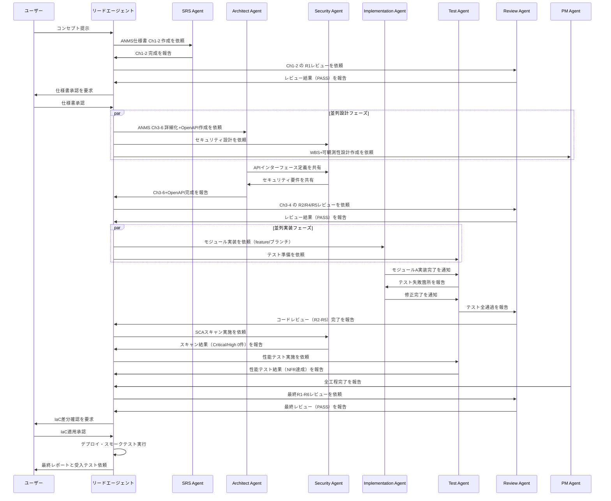

---

## 付録B: 進捗管理データのスキーマ

**進捗管理JSON スキーマ定義 (status-schema.json):**

```json
{
  "project_status": {
    "project_name": "string",
    "last_updated": "ISO8601 datetime",
    "current_phase": "phase0 | planning | design | implementation | testing | delivery",
    "overall_progress_percent": "number (0-100)",
    "wbs": {
      "total_tasks": "number",
      "completed_tasks": "number",
      "in_progress_tasks": "number",
      "blocked_tasks": "number"
    },
    "test_metrics": {
      "total_test_cases": "number",
      "executed": "number",
      "passed": "number",
      "failed": "number",
      "skipped": "number",
      "coverage_percent": "number"
    },
    "performance_metrics": {
      "nfr_total": "number",
      "nfr_passed": "number",
      "p95_latency_ms": "number",
      "error_rate_percent": "number"
    },
    "bug_metrics": {
      "total_found": "number",
      "total_fixed": "number",
      "open_critical": "number",
      "open_high": "number",
      "open_medium": "number",
      "open_low": "number"
    },
    "review_metrics": {
      "critical_open": "number",
      "high_open": "number",
      "medium_open": "number",
      "low_open": "number"
    },
    "security_metrics": {
      "sast_critical": "number",
      "sast_high": "number",
      "sca_critical": "number",
      "sca_high": "number"
    },
    "cost_metrics": {
      "budget_usd": "number",
      "spent_usd": "number",
      "percent_used": "number"
    },
    "risk_items": [
      {
        "id": "string",
        "description": "string",
        "severity": "critical | high | medium | low",
        "mitigation": "string"
      }
    ],
    "next_actions": ["string"]
  }
}
```

PM Agent はこのスキーマに従って `docs/progress/status-report.json` を更新する。リードエージェントはこのデータを参照して全体の進捗を把握する。

---

## 付録C: クイックリファレンス

### 主要コマンド一覧

| コマンド                    | 用途                                 |
| --------------------------- | ------------------------------------ |
| `claude`                    | Claude Code を対話モードで起動       |
| `claude -p "指示"`          | ヘッドレスモードで単発実行           |
| `claude --worktree`         | 独立Git Worktreeで起動               |
| `claude --agent agent-name` | 指定エージェントとして起動           |
| `claude --resume`           | 前回のセッションを再開               |
| `/plan`                     | 計画モードに切り替え                 |
| `/compact`                  | 会話コンテキストを圧縮               |
| `/rewind`                   | チェックポイントに巻き戻し           |
| `/model`                    | 使用モデルを切り替え                 |
| `/init`                     | プロジェクト初期分析を実行           |
| `/project:full-auto-dev`    | ほぼ全自動開発を開始（Phase 0〜5）   |
| `/project:check-progress`   | 開発進捗を確認・報告                 |
| `/project:retrospective`    | ふりかえり・再発防止策の反映（推奨） |

### カスタムエージェント一覧

| エージェント名      | 役割                                                                | モデル | 区分         |
| ------------------- | ------------------------------------------------------------------- | ------ | ------------ |
| `srs-writer`        | ANMS仕様書 Ch1-2（Foundation・Requirements）の作成                  | opus   | コア         |
| `architect`         | ANMS仕様書 Ch3-6 詳細化・OpenAPI仕様・マイグレーション設計          | opus   | コア         |
| `security-reviewer` | セキュリティ設計・脆弱性レビュー・SCA                               | opus   | コア         |
| `test-engineer`     | テスト作成・実行・性能テスト・カバレッジ計測                        | sonnet | コア         |
| `review-agent`      | SW工学原則・並行性・パフォーマンス観点のレビュー（R1〜R6）          | opus   | コア         |
| `progress-monitor`  | 進捗管理・WBS・品質メトリクス・コスト追跡・エージェント監視         | sonnet | コア         |
| `change-manager`    | 変更要求の受付・影響分析・記録                                      | sonnet | プロセス管理 |
| `risk-manager`      | リスク特定・評価・軽減策管理                                        | sonnet | プロセス管理 |
| `license-checker`   | OSSライセンス互換性確認                                             | haiku  | プロセス管理 |

### 環境変数

| 変数                                     | 説明                 |
| ---------------------------------------- | -------------------- |
| `CLAUDE_CODE_EXPERIMENTAL_AGENT_TEAMS=1` | Agent Teams を有効化 |
| `ANTHROPIC_API_KEY`                      | API キー（CI/CD用）  |

### 公式リソース

| リソース                 | URL                                             |
| ------------------------ | ----------------------------------------------- |
| Claude Code ドキュメント | https://code.claude.com/docs/en/overview        |
| Claude Code GitHub       | https://github.com/anthropics/claude-code       |
| MCP サーバー一覧         | https://github.com/modelcontextprotocol/servers |
| Claude API ドキュメント  | https://docs.claude.com                         |

---

> **免責事項:** 本マニュアルは2026年2月時点のClaude Codeの公開情報に基づいて作成されている。Agent Teams等の実験的機能を含むため、実際の動作は公式ドキュメントの最新版を参照すること。また、AIによる自動開発は人間による最終確認を完全に置き換えるものではなく、特にセキュリティやミッションクリティカルなシステムでは人間の専門家による検証を推奨する。IaC（インフラ変更）の適用は必ずユーザーの承認を経てから実行すること。
