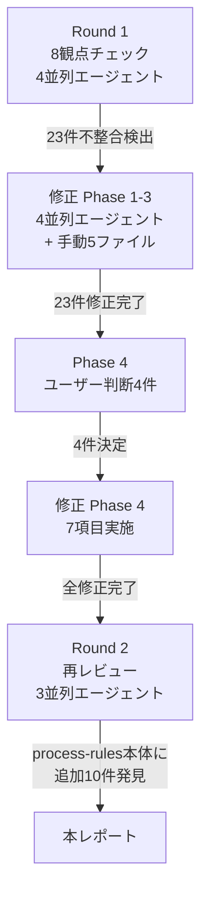
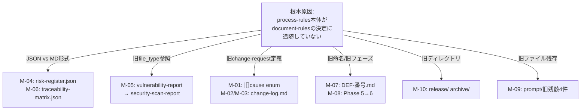

``````markdown
# full-auto-dev 整合性チェック最終レポート

**日付:** 2026-03-15
**手法:** 8観点チェック → 修正 → 神の視点再レビュー（3ラウンド、計10サブエージェント使用）

---

## 1. セッション全体の成果

**チェック全体の流れ:**



本セッションで合計30件の修正を完了。再レビューで process-rules 本体に残る10件の追加不整合を発見した。

---

## 2. 修正完了一覧（30件）

### Phase 1: エージェント誤動作防止（5件）

| ID | ファイル | 修正内容 |
|----|---------|---------|
| H-01 | `.claude/commands/full-auto-dev.md` | 旧6フェーズ → 7フェーズ化。Phase 2: dependency-selection挿入、ステップ番号統一（0a-6h形式） |
| H-02 | `.claude/agents/review-agent.md` | 実行タイミングテーブル・FAILルーティングのフェーズ番号を+1修正 |
| H-03 | `.claude/agents/license-checker.md` | Phase 5 → Phase 6 |
| H-04 | `.claude/commands/check-progress.md` | `docs/progress/` → `project-management/progress/` |
| H-05 | `.claude/commands/retrospective.md` | `docs/defects/` → `project-records/defects/`、`docs/improvement/` → `project-records/improvement/` |

### Phase 2: ルール文書の内部整合（4件）

| ID | ファイル | 修正内容 |
|----|---------|---------|
| M-01 | `document-rules` §9.1/§9.6/§9.7 | phase値域 `0-5` → `0-6`（3箇所） |
| M-02 | `document-rules` §7.1 | フェーズ名テーブルに `phase-dependency-selection` 追加 |
| M-09 | `document-rules` §2 | 8ディレクトリ追記（observability, hardware, ai, framework, licenses, performance, improvement, legal, safety, snapshots） |
| L-07 | `document-rules` §3 | §3.45 → §3.5 セクション番号正規化、以降§3.6〜§3.10に繰り下げ |

### Phase 3: 周辺文書の更新（4件）

| ID | ファイル | 修正内容 |
|----|---------|---------|
| M-03 | `README.md` | 旧6フェーズ → 7フェーズ化 |
| M-04/05 | `docs/document-inventory.md` | 全面改訂（Type Block→Form Block、24タイプ反映、ステータス修正） |
| M-06 | `prompt/block-placement-examples.md` | Type Block→Form Block、Body→Detail Block 全置換 |
| M-11 | `essays/anms-essay-ja.md` | References番号重複修正 |

### Phase 4: ユーザー判断に基づく修正（7件）

| ID | ファイル | 修正内容 |
|----|---------|---------|
| P4-1 | `.claude/agents/lead.md` | 新規作成。orchestratorの責務・オーナーシップ・フェーズ遷移基準を定義 |
| P4-2 | `.claude/agents/implementer.md` | 新規作成。SRPに基づきleadから実装責務を分離 |
| P4-3 | `document-rules` §7/§8/§7.1/§11 | security-scan-report を登録（scan_type: sast/sca/dast/manual） |
| P4-4 | `document-rules` §9.8 | change-request cause enumを `requirement-addition / requirement-change / scope-change` に限定（ユーザー起点のみ） |
| P4-5 | `.claude/agents/change-manager.md` | change-log参照削除、ユーザー起点の変更のみを扱う旨を明記 |
| P4-6 | `project-records/` 実FS + §2 | archive/+release/ → snapshots/ 統合。improvement/legal/safety/を§2に追記 |
| P4-7 | `CLAUDE.md` Agent Teams | lead/implementer追加、全エージェントに(agent-file-name)併記 |

### 引継ぎ文書の更新（1件）

| ID | ファイル | 修正内容 |
|----|---------|---------|
| HO | `prompt/document-rules-handoff.md` | 整合性チェックセッション#18-#30の完了記録、未着手タスク更新、Form Block定義対象リスト更新 |

---

## 3. 再レビュー結果

### 修正確認: 全項目OK

| チェック観点 | 結果 |
|------------|:----:|
| A: 旧用語（Type Block / Body / user-prompt） | OK |
| B: 7フェーズモデル（Phase 0-6） | OK |
| C: ファイルタイプ数（§7=26行、§8=27行） | OK |
| D: エージェント ↔ オーナーシップ（11ファイル、§7.1/§11整合） | OK |
| E: ディレクトリ構成（§2、実FS、§7一致） | OK |
| F: change-request（cause enum、commissioned_by=user） | OK |

### 神の視点: 全体調和の評価

**調和している点（8項目）:**

1. **STFB（上剛下柔）の一貫適用** — ANMS essayの章構成原則がprocess-rulesのフェーズ定義と構造的に対応
2. **Clean Architecture / DIP** — CLAUDE.md、implementer.md、external-dependency-specが一貫
3. **命名は言霊** — §7名前空間命名規則、Form Blockフィールド名（decision_status等）が汎用語を回避
4. **抽象→具体の順序** — process-rules（Part 1→4）、document-rules（§1→§9）、essayすべてが抽象→具体
5. **SRP** — spec-foundation/spec-architectureの分割、change-request（ユーザー）/defect・decision（AI）の分離
6. **11エージェントの責務分離** — agents/とCLAUDE.md Agent Teamsが1:1対応、§11オーナーシップに破綻なし
7. **lead vs implementerの明確な分離** — オーケストレーション vs コード実装
8. **プロセスフローの完全性** — Phase 0→6の入出力が途切れなく接続

### 新たに発見された不整合（10件 + 軽微5件）

**残存不整合の根本原因:**



**High（3件）— JSON vs Markdown 形式の矛盾:**

| ID | 箇所 | 問題 | 修正案 |
|----|------|------|--------|
| M-04 | `process-rules` §3.2.2 + `agents/risk-manager.md` | risk-register が `.json` と記載。document-rules では `.md`（Common Block付き） | process-rulesとagents/をMarkdown形式に統一 |
| M-05 | `process-rules` §3.2.8 + `agents/security-reviewer.md` | vulnerability-report.md を出力と記載。§7では security-scan-report に統合済み | 参照を security-scan-report に修正 |
| M-06 | `process-rules` §3.2.3 | traceability-matrix が `.json` と記載。document-rules では `.md` | Markdown形式に統一 |

**Medium（5件）— 旧定義の残骸:**

| ID | 箇所 | 問題 |
|----|------|------|
| M-01 | `process-rules` §7.3.1 | change-managerの旧cause enum「バグ/要件追加/仕様変更」が残存 |
| M-02 | `process-rules` §7.3.1 | change-log.mdへの追記手順が残存 |
| M-03 | `process-rules` §3.2.1 | change-log.mdへの出力参照が残存 |
| M-07 | `process-rules` §3.2.4 | defectファイル名が `DEF-{番号}.md`（正: `defect-{NNN}-{timestamp}.md`） |
| M-08 | `document-rules` §3.5 | final-reportの作成フェーズが「Phase 5」（正: Phase 6） |
| M-10 | `process-rules` §3.3.1/§3.3.4 | 旧ディレクトリ release/, archive/ への参照が残存 |

**Low（5件）:**

| ID | 箇所 | 問題 |
|----|------|------|
| L-01 | `document-rules` §4.2 実例6 | 「Phase 4不合格」→ 正: Phase 5 |
| L-02 | `document-rules` §4.2 実例5 | `spec:` 名前空間 → 正: `spec-foundation:` / `spec-architecture:` |
| L-05 | `process-rules` §3.2.8 | 出力先が docs/security/（正: project-records/security/） |
| M-09 | `prompt/` 配下 | 旧残骸4件（prompt.md, project-review.md, naming-decision-anps.md, semi-auto-sw-dev-prompt.md） |
| L-04 | `CLAUDE.md` L111 | 「Implementation Agent」→ agents/ファイル名は `implementer`。軽微な呼称差異 |

---

## 4. 次セッションへの推奨アクション

### 即時修正（process-rules 本体の追随）

| 優先度 | 対象 | 作業 |
|:------:|------|------|
| 1 | `process-rules` §3.2.2 + `agents/risk-manager.md` | risk-register: JSON→MD形式に統一 |
| 2 | `process-rules` §3.2.8 + `agents/security-reviewer.md` | vulnerability-report → security-scan-report に統一 |
| 3 | `process-rules` §3.2.3 | traceability-matrix: JSON→MD形式に統一 |
| 4 | `process-rules` §7.3.1 | change-manager定義: 旧cause enum修正、change-log.md削除 |
| 5 | `process-rules` §3.2.1 | change-log.md参照削除 |
| 6 | `process-rules` §3.2.4 | defect命名規則修正 |
| 7 | `document-rules` §3.5 | final-report: Phase 5→6 |
| 8 | `process-rules` §3.3.1/§3.3.4 | release/archive/ → snapshots/ |

### 既存の未着手タスク（handoff.md より）

| 優先度 | タスク |
|:------:|--------|
| 高 | Phase 1にモック/サンプル工程追加 |
| 高 | 新規16タイプのForm Block定義（§9.10〜§9.25） |
| 中 | AI/プロンプトのスコープ整理 |
| 低 | 英語版の規則文書 |

---

## 5. 総合評価

> **プロジェクトのコア設計は堅牢に調和している。**
>
> 設計哲学（STFB、Clean Architecture/DIP、命名は言霊、抽象→具体、SRP）は
> CLAUDE.md / document-rules / process-rules / essay の全文書に一貫して適用されている。
> 11エージェントの責務分離と26ファイルタイプのオーナーシップモデルに破綻はない。
>
> 残存する不整合は **process-rules 本体が document-rules の決定に追随していない** 1点に集約される。
> これは document-rules 側で設計判断（JSON→MD統一、change-request限定、security-scan-report統合）を
> 先行して行ったため、process-rules がまだ旧体系のままになっていることが原因。
> 次セッションで process-rules を document-rules に同期させれば、プロジェクト全体の整合性は完全になる。
``````
