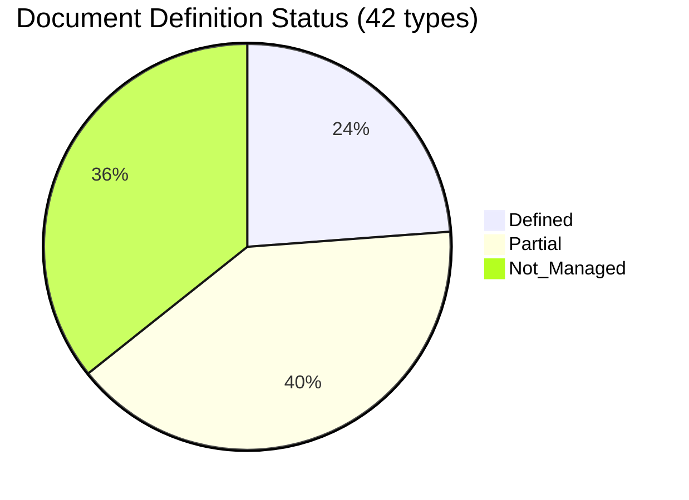

``````markdown
# full-auto-dev Document Inventory v2.0

Date: 2026-03-15

This inventory lists every document type managed by the full-auto-dev framework, with current definition status in the document-rules and process-rules. Updated to reflect the 2026-03-15 document-rules overhaul (v0.0.0).

---

## Status Legend

| Status | Meaning |
|--------|---------|
| Defined | Fully defined in document-rules (§3 naming + §7 file_type + §8 namespace + §9 Form Block + §11 ownership) |
| Partial | §7 file_type registered but §9 Form Block not yet defined |
| Not Managed | Common Block not required (external format, JSON, code, or CLAUDE.md) |

---

## Overview

**Document_Inventory_Overview:**

```mermaid
graph LR
    subgraph Root["Root (3 docs)"]
        R1["executive-dashboard.md"]
        R2["final-report.md"]
        R3["user-order.md"]
    end

    subgraph PM["project-management (9 types)"]
        PM1["pipeline-state.md"]
        PM2["handoff-NNN"]
        PM3["progress-NNN"]
        PM4["hearing-record.md"]
        PM5["wbs.md"]
        PM6["test-plan.md"]
        PM7["cost-log.json"]
        PM8["test-progress.json"]
        PM9["bug-curve.json"]
    end

    subgraph PR["project-records (10 types)"]
        PR1["review-NNN"]
        PR2["decision-NNN"]
        PR3["risk-NNN"]
        PR4["risk-register.md"]
        PR5["defect-NNN"]
        PR6["cr-NNN"]
        PR7["traceability-matrix.md"]
        PR8["sast-report-NNN"]
        PR9["license-report.md"]
        PR10["performance-report-NNN"]
    end

    subgraph Docs["docs (8 types)"]
        D1["project-spec-foundation.md"]
        D2["project-spec-architecture.md"]
        D3["openapi.yaml"]
        D4["threat-model.md"]
        D5["security-architecture.md"]
        D6["observability-design.md"]
        D7["hw/ai/framework-requirement-spec.md"]
    end

    subgraph Setup["Setup (5 types)"]
        S1["CLAUDE.md"]
        S2[".mcp.json"]
        S3["agents x9"]
        S4["commands x3"]
        S5["settings.json"]
    end

    subgraph Code["Code (6 types)"]
        C1["src"]
        C2["tests"]
        C3["k6 perf"]
        C4["Docker"]
        C5["Terraform"]
        C6["GH Actions"]
    end

    Root -->|"managed by"| PM
    Root -->|"managed by"| PR
    Root -->|"designed in"| Docs
    Setup -->|"configures"| Root
    Docs -->|"implemented as"| Code
```



This diagram shows the 6 categories and their document types managed by the framework. Arrows indicate primary relationships between categories.

---

## Category A: Root-Level Documents

Documents at the project root. High-visibility artifacts for users and stakeholders.

| # | File | Format | Owner | Singleton | Common Block | §9 Form Block | Status |
|---|------|--------|-------|:---------:|:------------:|:-------------:|:------:|
| A1 | executive-dashboard.md | Markdown | lead | Yes | Yes | No | **Partial** |
| A2 | final-report.md | Markdown | lead | Yes | Yes | No | **Partial** |
| A3 | user-order.md | Markdown (3Q) | srs-writer | Yes (ANMS) / No (ANPS) | Yes | No | **Partial** |

### What is missing (Category A)

All 3 types are registered in §7 with naming (§3.5), namespace (§8), and ownership (§11). Only §9 Form Block is missing.

| File | §3 Naming | §7 file_type | §8 Namespace | §9 Form Block | §11 Ownership |
|------|:---------:|:------------:|:------------:|:-------------:|:--------------:|
| executive-dashboard.md | Defined (§3.5) | Defined | Defined | Missing | Defined |
| final-report.md | Defined (§3.5) | Defined | Defined | Missing | Defined |
| user-order.md | Defined (§3.5) | Defined | Defined | Missing | Defined |

---

## Category B: Project Setup (.claude/ + root config)

Claude Code configuration files. External tool format — no Common Block.

| # | File | Location | Format | Owner | Common Block | Status |
|---|------|----------|--------|-------|:------------:|:------:|
| B1 | CLAUDE.md | root | Markdown | user / lead | No | Not Managed |
| B2 | .mcp.json | root | JSON | user | No | Not Managed |
| B3 | agents/*.md (x9) | .claude/agents/ | MD + YAML frontmatter | user | No | Not Managed |
| B4 | commands/*.md (x3) | .claude/commands/ | Markdown | user | No | Not Managed |
| B5 | settings.json | .claude/ | JSON | user | No | Not Managed |

No action needed — all governed by Claude Code conventions.

---

## Category C: Process Documents (project-management/)

Orchestration state, handoffs, progress tracking, and planning artifacts.

| # | File | Location | Format | Owner | Singleton | Common Block | §9 Form Block | Status |
|---|------|----------|--------|-------|:---------:|:------------:|:-------------:|:------:|
| C1 | pipeline-state.md | project-management/ | MD | lead | Yes | Yes | Yes (§9.1) | **Defined** |
| C2 | handoff-NNN-*.md | project-management/handoff/ | MD | from-agent | No | Yes | Yes (§9.2) | **Defined** |
| C3 | progress-NNN-*.md | project-management/progress/ | MD | progress-monitor | No | Yes | Yes (§9.6) | **Defined** |
| C4 | hearing-record.md | project-management/ | MD | srs-writer | Yes | Yes | No | **Partial** |
| C5 | wbs.md | project-management/progress/ | MD | progress-monitor | Yes | Yes | No | **Partial** |
| C6 | test-plan.md | project-management/ | MD | test-engineer | Yes | Yes | No | **Partial** |
| C7 | cost-log.json | project-management/progress/ | JSON | progress-monitor | Yes | No | — | Not Managed |
| C8 | test-progress.json | project-management/progress/ | JSON | progress-monitor | Yes | No | — | Not Managed |
| C9 | bug-curve.json | project-management/progress/ | JSON | progress-monitor | Yes | No | — | Not Managed |

### What is missing (Category C)

| File | §3 Naming | §7 file_type | §8 Namespace | §9 Form Block | §11 Ownership |
|------|:---------:|:------------:|:------------:|:-------------:|:--------------:|
| hearing-record.md | Defined (§3.2) | Defined | Defined | Missing | Defined |
| wbs.md | Defined (§3.2) | Defined | Defined | Missing | Defined |
| test-plan.md | Defined (§3.2) | Defined | Defined | Missing | Defined |

---

## Category D: Process Records (project-records/)

Audit trail, reviews, decisions, risks, defects, change requests, and compliance evidence.

| # | File | Location | Owner | Singleton | Common Block | §9 Form Block | Status |
|---|------|----------|-------|:---------:|:------------:|:-------------:|:------:|
| D1 | review-NNN-*.md | reviews/ | review-agent | No | Yes | Yes (§9.3) | **Defined** |
| D2 | decision-NNN-*.md | decisions/ | lead | No | Yes | Yes (§9.4) | **Defined** |
| D3 | risk-NNN-*.md | risks/ | risk-manager | No | Yes | Yes (§9.5) | **Defined** |
| D4 | risk-register.md | risks/ | risk-manager | Yes | Yes | Yes (§9.5) | **Defined** |
| D5 | defect-NNN-*.md | defects/ | test-engineer | No | Yes | Yes (§9.7) | **Defined** |
| D6 | cr-NNN-*.md | change-requests/ | change-manager | No | Yes | Yes (§9.8) | **Defined** |
| D7 | traceability-matrix.md | traceability/ | test-engineer | Yes | Yes | Yes (§9.9) | **Defined** |
| D8 | sast-report-NNN-*.md | security/ | security-reviewer | No | Yes | No | **Partial** |
| D9 | license-report.md | licenses/ | license-checker | Yes | Yes | No | **Partial** |
| D10 | performance-report-NNN-*.md | performance/ | test-engineer | No | Yes | No | **Partial** |

### What is missing (Category D)

| File | §3 Naming | §7 file_type | §8 Namespace | §9 Form Block | §11 Ownership |
|------|:---------:|:------------:|:------------:|:-------------:|:--------------:|
| sast-report-NNN-*.md | Defined (§3.3) | Not registered | — | Missing | Defined (§11) |
| license-report.md | Defined (§3.3) | Defined | Defined | Missing | Defined |
| performance-report-NNN-*.md | Defined (§3.3) | Defined | Defined | Missing | Defined |

Note: `sast-report` has naming (§3.3) and ownership (§11) but is not registered as a file_type in §7. It may need to be added to §7, or it may be intentionally managed only via §11.

---

## Category E: Design Artifacts (docs/)

Specifications, API definitions, security design, and observability design.

| # | File | Location | Owner | Singleton | Common Block | §9 Form Block | Status |
|---|------|----------|-------|:---------:|:------------:|:-------------:|:------:|
| E1 | {project}-spec.md (foundation) | spec/ | srs-writer | Yes (ANMS) | Yes | No | **Partial** |
| E2 | {project}-spec.md (architecture) | spec/ | architect | Yes (ANMS) | Yes | No | **Partial** |
| E3 | openapi.yaml | api/ | architect | Yes | No | — | Not Managed |
| E4 | threat-model.md | security/ | security-reviewer | Yes | Yes | No | **Partial** |
| E5 | security-architecture.md | security/ | security-reviewer | Yes | Yes | No | **Partial** |
| E6 | observability-design.md | observability/ | architect | Yes | Yes | No | **Partial** |
| E7 | hw-requirement-spec.md | hardware/ | architect | Yes | Yes | No | **Partial** |
| E8 | ai-requirement-spec.md | ai/ | architect | Yes | Yes | No | **Partial** |
| E9 | framework-requirement-spec.md | framework/ | architect | Yes | Yes | No | **Partial** |

### What is missing (Category E)

All listed types (except openapi.yaml) are registered in §7 with naming, namespace (§8), and ownership (§11). Only §9 Form Block is missing.

| File | §3 Naming | §7 file_type | §8 Namespace | §9 Form Block | §11 Ownership |
|------|:---------:|:------------:|:------------:|:-------------:|:--------------:|
| spec-foundation | Defined (§3.4) | Defined | Defined | Missing | Defined |
| spec-architecture | Defined (§3.4) | Defined | Defined | Missing | Defined |
| threat-model.md | Defined (§3.5) | Defined | Defined | Missing | Defined |
| security-architecture.md | Defined (§3.5) | Defined | Defined | Missing | Defined |
| observability-design.md | Defined (§3.5) | Defined | Defined | Missing | Defined |
| hw-requirement-spec.md | Defined (§7) | Defined | Defined | Missing | Defined |
| ai-requirement-spec.md | Defined (§7) | Defined | Defined | Missing | Defined |
| framework-requirement-spec.md | Defined (§7) | Defined | Defined | Missing | Defined |

---

## Category F: Code, Tests, and Infrastructure

Source code, test code, and infrastructure-as-code. All follow external conventions — no Common Block.

| # | File | Location | Format | Common Block | Status |
|---|------|----------|--------|:------------:|:------:|
| F1 | Source code | src/ | Language convention | No | Not Managed |
| F2 | Unit / Integration / E2E tests | tests/ | Framework convention | No | Not Managed |
| F3 | Performance tests (k6) | tests/ | k6 JS | No | Not Managed |
| F4 | Dockerfile, docker-compose | root or infra/ | Tool standard | No | Not Managed |
| F5 | *.tf | infra/ | Terraform | No | Not Managed |
| F6 | *.yml | .github/workflows/ | GitHub Actions | No | Not Managed |

No action needed — all governed by language, framework, or tool conventions.

---

## Summary Table

| Category | Types | Common Block | Defined | Partial | Not Managed |
|----------|:-----:|:------------:|:-------:|:-------:|:-----------:|
| A. Root | 3 | 3 | 0 | 3 | 0 |
| B. Setup | 5 | 0 | 0 | 0 | 5 |
| C. Process Docs | 9 | 6 | 3 | 3 | 3 |
| D. Process Records | 10 | 10 | 7 | 3 | 0 |
| E. Design Artifacts | 9 | 8 | 0 | 8 | 1 |
| F. Code/Tests/Infra | 6 | 0 | 0 | 0 | 6 |
| **Total** | **42** | **27** | **10** | **17** | **15** |

**Completion_Status_Chart:**



Of the 27 documents requiring Common Block, 10 are fully defined (§7 + §9 Form Block) and 17 still need §9 Form Block definitions in the document-rules.

---

## Gap Analysis: 17 Partial Documents

The following documents are registered in §7 (or have naming/ownership) but lack §9 Form Block definitions.

| # | File | §7 Registered | Needs §9 Form Block |
|---|------|:-------------:|:-------------------:|
| 1 | executive-dashboard.md | Yes | Yes |
| 2 | final-report.md | Yes | Yes |
| 3 | user-order.md | Yes | Yes |
| 4 | hearing-record.md | Yes | Yes |
| 5 | wbs.md | Yes | Yes |
| 6 | test-plan.md | Yes | Yes |
| 7 | sast-report-NNN-*.md | No (§7 unregistered) | Yes |
| 8 | license-report.md | Yes | Yes |
| 9 | performance-report-NNN-*.md | Yes | Yes |
| 10 | spec-foundation ({project}-spec.md Ch1-2) | Yes | Yes |
| 11 | spec-architecture ({project}-spec.md Ch3-6) | Yes | Yes |
| 12 | threat-model.md | Yes | Yes |
| 13 | security-architecture.md | Yes | Yes |
| 14 | observability-design.md | Yes | Yes |
| 15 | hw-requirement-spec.md | Yes | Yes |
| 16 | ai-requirement-spec.md | Yes | Yes |
| 17 | framework-requirement-spec.md | Yes | Yes |

### Priority for closing gaps

| Priority | Rationale | Documents |
|----------|-----------|-----------|
| High | Root-level, user-facing | executive-dashboard, final-report |
| High | Used from Phase 1 | user-order, hearing-record, spec-foundation |
| Medium | Used from Phase 2 | wbs, test-plan, spec-architecture, threat-model, security-architecture, observability-design |
| Medium | Conditional (Phase 2) | hw-requirement-spec, ai-requirement-spec, framework-requirement-spec |
| Medium | Used from Phase 3-4 | license-report, performance-report, sast-report |

### Additional gap: sast-report §7 registration

`sast-report` is referenced in §3.3 (naming) and §11 (ownership under security-reviewer) but is not listed in the §7 file_type table. Either:
- Register it in §7 as a new file_type, or
- Confirm it is intentionally excluded from §7 (e.g., managed only by external tool output conventions)

---

## Known Discrepancy: process-rules vs document-rules

The process-rules (§2.5, Ch4 agent definitions) still references old directory paths from before the 3-directory split. These need to be updated to match the document-rules.

| Old path (process-rules) | Correct path (document-rules) | Affected sections |
|--------------------------|-------------------------------|-------------------|
| spec/ | docs/spec/ | §2.5, §4.2, §5.1 |
| docs/reviews/ | project-records/reviews/ | §2.5, §4.2 |
| docs/progress/ | project-management/progress/ | §2.5, §4.2 |
| docs/change-log/ | project-records/change-requests/ | §2.5, §4.2 |
| docs/risk/ | project-records/risks/ | §2.5, §4.2 |
| docs/decisions/ | project-records/decisions/ | §2.5, §4.2 |
| docs/defects/ | project-records/defects/ | §2.5, §4.2 |
| docs/traceability/ | project-records/traceability/ | §2.5, §4.2 |
| docs/license/ | project-records/licenses/ | §2.5, §4.2 |
| docs/performance/ | project-records/performance/ | §2.5, §4.2 |
| docs/test-plans/ | project-management/ | §2.5 |

---

## References

- process-rules/full-auto-dev-document-rules-ja.md v0.0.0 — Document management rules (§3-§14)
- process-rules/full-auto-dev-process-rules-ja.md — Process rules (§2.5, §4, §5)
- CLAUDE.md — Project configuration template
``````
