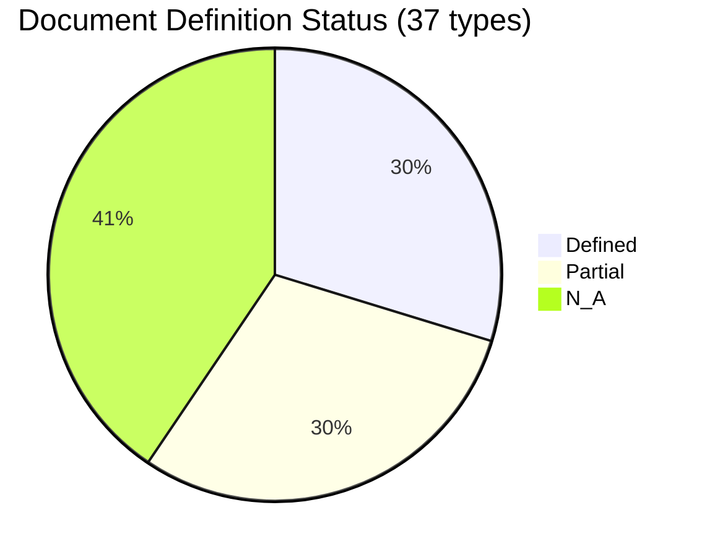

``````markdown
# full-auto-dev Document Inventory v1.0

Date: 2026-03-15

This inventory lists every document type managed by the full-auto-dev framework, with current definition status in the document-rules and process-rules.

---

## Status Legend

| Status | Meaning |
|--------|---------|
| Defined | Fully defined in document-rules (naming, Common Block, Type Block, ownership) |
| Partial | Common Block required per §13, but no Type Block / naming rule / ownership defined yet |
| N/A | Common Block not required (external format, JSON, code, or CLAUDE.md) |

---

## Overview

**Document_Inventory_Overview:**

```mermaid
graph LR
    subgraph Root["Root (3 docs)"]
        R1["executive-dashboard.md"]
        R2["final-report.md"]
        R3["user-order.md"]
    end

    subgraph PM["project-management (8 types)"]
        PM1["pipeline-state.md"]
        PM2["handoff-NNN"]
        PM3["progress-NNN"]
        PM4["wbs.md"]
        PM5["test-plan.md"]
        PM6["cost-log.json"]
        PM7["test-progress.json"]
        PM8["bug-curve.json"]
    end

    subgraph PR["project-records (10 types)"]
        PR1["review-NNN"]
        PR2["decision-NNN"]
        PR3["risk-NNN"]
        PR4["risk-register.md"]
        PR5["defect-NNN"]
        PR6["cr-NNN"]
        PR7["traceability-matrix.md"]
        PR8["sast-report-NNN"]
        PR9["license-report.md"]
        PR10["performance-report-NNN"]
    end

    subgraph Docs["docs (5 types)"]
        D1["project-spec.md"]
        D2["openapi.yaml"]
        D3["threat-model.md"]
        D4["security-architecture.md"]
        D5["observability-design.md"]
    end

    subgraph Setup["Setup (6 types)"]
        S1["CLAUDE.md"]
        S2[".mcp.json"]
        S3["agents x9"]
        S4["commands x3"]
        S5["settings.json"]
    end

    subgraph Code["Code (6 types)"]
        C1["src"]
        C2["tests"]
        C3["k6 perf"]
        C4["Docker"]
        C5["Terraform"]
        C6["GH Actions"]
    end

    Root -->|"managed by"| PM
    Root -->|"managed by"| PR
    Root -->|"designed in"| Docs
    Setup -->|"configures"| Root
    Docs -->|"implemented as"| Code
```



This diagram shows the 6 categories and 38 document types managed by the framework. Arrows indicate primary relationships between categories.

---

## Category A: Root-Level Documents

Documents at the project root. High-visibility artifacts for users and stakeholders.

| # | File | Format | Owner | Singleton | Common Block | Status |
|---|------|--------|-------|:---------:|:------------:|:------:|
| A1 | executive-dashboard.md | Markdown | progress-monitor | Yes | Yes | **Partial** |
| A2 | final-report.md | Markdown | lead | Yes | Yes | **Partial** |
| A3 | user-order.md | Markdown (3Q) | user / srs-writer | Yes (ANMS) / No (ANPS) | Yes | **Partial** |

### What is missing (Category A)

| File | §3 Naming | §7 file_type | §8 Namespace | §9 Type Block | §11 Ownership |
|------|:---------:|:------------:|:------------:|:-------------:|:--------------:|
| executive-dashboard.md | Missing | Missing | Missing | Missing | Missing |
| final-report.md | Missing | Missing | Missing | Missing | Missing |
| user-order.md | Defined (§3.4) | Missing | Missing | Missing | Partial |

---

## Category B: Project Setup (.claude/ + root config)

Claude Code configuration files. External tool format — no Common Block.

| # | File | Location | Format | Owner | Common Block | Status |
|---|------|----------|--------|-------|:------------:|:------:|
| B1 | CLAUDE.md | root | Markdown | user / lead | No | N/A |
| B2 | .mcp.json | root | JSON | user | No | N/A |
| B3 | agents/*.md (x9) | .claude/agents/ | MD + YAML frontmatter | user | No | N/A |
| B4 | commands/*.md (x3) | .claude/commands/ | Markdown | user | No | N/A |
| B5 | settings.json | .claude/ | JSON | user | No | N/A |

No action needed — all governed by Claude Code conventions.

---

## Category C: Process Documents (project-management/)

Orchestration state, handoffs, progress tracking, and planning artifacts.

| # | File | Location | Format | Owner | Singleton | Common Block | Status |
|---|------|----------|--------|-------|:---------:|:------------:|:------:|
| C1 | pipeline-state.md | project-management/ | MD | lead | Yes | Yes | **Defined** |
| C2 | handoff-NNN-*.md | project-management/handoff/ | MD | from-agent | No | Yes | **Defined** |
| C3 | progress-NNN-*.md | project-management/progress/ | MD | progress-monitor | No | Yes | **Defined** |
| C4 | wbs.md | project-management/progress/ | MD | progress-monitor | Yes | Yes | **Partial** |
| C5 | test-plan.md | project-management/ | MD | test-engineer | Yes | Yes | **Partial** |
| C6 | cost-log.json | project-management/progress/ | JSON | progress-monitor | Yes | No | N/A |
| C7 | test-progress.json | project-management/progress/ | JSON | progress-monitor | Yes | No | N/A |
| C8 | bug-curve.json | project-management/progress/ | JSON | progress-monitor | Yes | No | N/A |

### What is missing (Category C)

| File | §3 Naming | §7 file_type | §8 Namespace | §9 Type Block | §11 Ownership |
|------|:---------:|:------------:|:------------:|:-------------:|:--------------:|
| wbs.md | Defined (§3.2) | Missing | Missing | Missing | Missing |
| test-plan.md | Missing | Missing | Missing | Missing | Missing |

---

## Category D: Process Records (project-records/)

Audit trail, reviews, decisions, risks, defects, change requests, and compliance evidence.

| # | File | Location | Owner | Singleton | Common Block | Status |
|---|------|----------|-------|:---------:|:------------:|:------:|
| D1 | review-NNN-*.md | reviews/ | review-agent | No | Yes | **Defined** |
| D2 | decision-NNN-*.md | decisions/ | lead / architect | No | Yes | **Defined** |
| D3 | risk-NNN-*.md | risks/ | risk-manager | No | Yes | **Defined** |
| D4 | risk-register.md | risks/ | risk-manager | Yes | Yes | **Defined** |
| D5 | defect-NNN-*.md | defects/ | test-engineer | No | Yes | **Defined** |
| D6 | cr-NNN-*.md | change-requests/ | change-manager | No | Yes | **Defined** |
| D7 | traceability-matrix.md | traceability/ | test-engineer | Yes | Yes | **Defined** |
| D8 | sast-report-NNN-*.md | security/ | security-reviewer | No | Yes | **Defined** |
| D9 | license-report.md | licenses/ | license-checker | Yes | Yes | **Partial** |
| D10 | performance-report-NNN-*.md | performance/ | test-engineer | No | Yes | **Partial** |

### What is missing (Category D)

| File | §3 Naming | §7 file_type | §8 Namespace | §9 Type Block | §11 Ownership |
|------|:---------:|:------------:|:------------:|:-------------:|:--------------:|
| license-report.md | Missing | Missing | Missing | Missing | Missing |
| performance-report-NNN-*.md | Missing | Missing | Missing | Missing | Missing |

---

## Category E: Design Artifacts (docs/)

Specifications, API definitions, security design, and observability design.

| # | File | Location | Owner | Singleton | Common Block | Status |
|---|------|----------|-------|:---------:|:------------:|:------:|
| E1 | {project}-spec.md | spec/ | srs-writer + architect | Yes (ANMS) | Yes | **Partial** |
| E2 | openapi.yaml | api/ | architect | Yes | No | N/A |
| E3 | threat-model.md | security/ | security-reviewer | Yes | Yes | **Partial** |
| E4 | security-architecture.md | security/ | security-reviewer | Yes | Yes | **Partial** |
| E5 | observability-design.md | observability/ | architect | Yes | Yes | **Partial** |

### What is missing (Category E)

| File | §3 Naming | §7 file_type | §8 Namespace | §9 Type Block | §11 Ownership |
|------|:---------:|:------------:|:------------:|:-------------:|:--------------:|
| {project}-spec.md | Defined (§3.4) | Missing | Missing | Missing | Partial |
| threat-model.md | Defined (§3.5) | Missing | Missing | Missing | Partial |
| security-architecture.md | Defined (§3.5) | Missing | Missing | Missing | Partial |
| observability-design.md | Missing | Missing | Missing | Missing | Missing |

---

## Category F: Code, Tests, and Infrastructure

Source code, test code, and infrastructure-as-code. All follow external conventions — no Common Block.

| # | File | Location | Format | Common Block | Status |
|---|------|----------|--------|:------------:|:------:|
| F1 | Source code | src/ | Language convention | No | N/A |
| F2 | Unit / Integration / E2E tests | tests/ | Framework convention | No | N/A |
| F3 | Performance tests (k6) | tests/ | k6 JS | No | N/A |
| F4 | Dockerfile, docker-compose | root or infra/ | Tool standard | No | N/A |
| F5 | *.tf | infra/ | Terraform | No | N/A |
| F6 | *.yml | .github/workflows/ | GitHub Actions | No | N/A |

No action needed — all governed by language, framework, or tool conventions.

---

## Summary Table

| Category | Types | Common Block | Defined | Partial | N/A |
|----------|:-----:|:------------:|:-------:|:-------:|:---:|
| A. Root | 3 | 3 | 0 | 3 | 0 |
| B. Setup | 5 | 0 | 0 | 0 | 5 |
| C. Process Docs | 8 | 5 | 3 | 2 | 3 |
| D. Process Records | 10 | 10 | 8 | 2 | 0 |
| E. Design Artifacts | 5 | 4 | 0 | 4 | 1 |
| F. Code/Tests/Infra | 6 | 0 | 0 | 0 | 6 |
| **Total** | **37** | **22** | **11** | **11** | **15** |

**Completion_Status_Chart:**



Of the 22 documents requiring Common Block, 11 are fully defined and 11 still need §7 file_type registration, namespace assignment, Type Block definition, and ownership declaration in the document-rules.

---

## Gap Analysis: 11 Partial Documents

The following documents have Common Block required (per §13) but lack full definitions in the document-rules.

| # | File | Needs §3 Naming | Needs §7 file_type | Needs §9 Type Block | Needs §11 Ownership |
|---|------|:---------------:|:------------------:|:-------------------:|:-------------------:|
| 1 | executive-dashboard.md | Yes | Yes | Yes | Yes |
| 2 | final-report.md | Yes | Yes | Yes | Yes |
| 3 | user-order.md | No | Yes | Yes | No (partial) |
| 4 | wbs.md | No | Yes | Yes | Yes |
| 5 | test-plan.md | Yes | Yes | Yes | Yes |
| 6 | license-report.md | Yes | Yes | Yes | Yes |
| 7 | performance-report-NNN-*.md | Yes | Yes | Yes | Yes |
| 8 | {project}-spec.md | No | Yes | Yes | No (partial) |
| 9 | threat-model.md | No | Yes | Yes | No (partial) |
| 10 | security-architecture.md | No | Yes | Yes | No (partial) |
| 11 | observability-design.md | Yes | Yes | Yes | Yes |

### Priority for closing gaps

| Priority | Rationale | Documents |
|----------|-----------|-----------|
| High | Root-level, user-facing | executive-dashboard, final-report |
| High | Used from Phase 1 | user-order.md, {project}-spec.md |
| Medium | Used from Phase 2 | wbs, test-plan, threat-model, security-architecture, observability-design |
| Medium | Used from Phase 3-4 | license-report, performance-report |

---

## Known Discrepancy: process-rules vs document-rules

The process-rules (§2.5, Ch4 agent definitions) still references old directory paths from before the 3-directory split. These need to be updated to match the document-rules.

| Old path (process-rules) | Correct path (document-rules) | Affected sections |
|--------------------------|-------------------------------|-------------------|
| spec/ | docs/spec/ | §2.5, §4.2, §5.1 |
| docs/reviews/ | project-records/reviews/ | §2.5, §4.2 |
| docs/progress/ | project-management/progress/ | §2.5, §4.2 |
| docs/change-log/ | project-records/change-requests/ | §2.5, §4.2 |
| docs/risk/ | project-records/risks/ | §2.5, §4.2 |
| docs/decisions/ | project-records/decisions/ | §2.5, §4.2 |
| docs/defects/ | project-records/defects/ | §2.5, §4.2 |
| docs/traceability/ | project-records/traceability/ | §2.5, §4.2 |
| docs/license/ | project-records/licenses/ | §2.5, §4.2 |
| docs/performance/ | project-records/performance/ | §2.5, §4.2 |
| docs/test-plans/ | project-management/ | §2.5 |

---

## References

- process-rules/full-auto-dev-document-rules-ja.md — Document management rules (§3-§14)
- process-rules/full-auto-dev-process-rules-ja.md — Process rules (§2.5, §4, §5)
- CLAUDE.md — Project configuration template
``````
