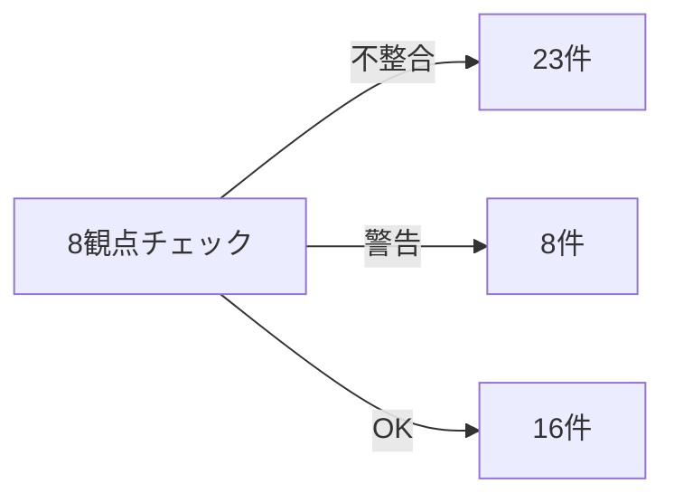

``````markdown
# full-auto-dev プロジェクト整合性チェックレポート

**チェック日:** 2026-03-15
**チェック対象:** リポジトリ全体（old/ 除外）
**チェック手法:** 4並列サブエージェントによる8観点突合

---

## 1. エグゼクティブサマリー

**チェック結果概観:**



23件の不整合を検出。最大の問題は **旧6フェーズモデルの残骸** が広範囲に残存していること（10件）。次いで **document-inventory.md の陳腐化**（実態と大幅に乖離）、**§2 ディレクトリ図の未更新**（8ディレクトリ未反映）が主要な課題。

**観点別サマリー:**

| 観点 | 内容 | 不整合 | 警告 | OK |
|:----:|------|:------:|:----:|:--:|
| A | 用語・命名統一 | 3 | 0 | 4 |
| B | フェーズモデル | 10 | 1 | 0 |
| C | ファイルタイプ数 | 0 | 1 | 4 |
| D | エージェント ↔ オーナーシップ | 5 | 2 | 2 |
| E | ディレクトリ構成 | 4 | 1 | 2 |
| F | 条件付きプロセス | 0 | 1 | 3 |
| G | 論文 ↔ ルール整合 | 1 | 2 | 4 |
| H | spec-template ↔ ルール整合 | 0 | 0 | 5 |
| **合計** | | **23** | **8** | **24** |

---

## 2. 不整合一覧（重大度別）

### 2.1 Critical（プロセス実行に直接影響）

なし。

### 2.2 High（エージェントの誤動作リスク）

| ID | 観点 | ファイル | 問題 | 影響 |
|----|:----:|---------|------|------|
| H-01 | B | `.claude/commands/full-auto-dev.md` L39-67 | **全体が旧6フェーズモデル**。Phase 2=設計、Phase 3=実装...と記載。Phase 2: dependency-selection が不在 | ユーザーが `/full-auto-dev` 実行時に誤ったフェーズ順序でプロセスが進行する |
| H-02 | B | `.claude/agents/review-agent.md` L304-314 | 実行タイミングテーブルとFAILルーティングのフェーズ番号がすべて旧モデル | review-agent がゲート判断を誤ったフェーズで実行する |
| H-03 | B | `.claude/agents/license-checker.md` L30 | `Phase 5（納品前）` → 正しくは Phase 6 | license-checker の実行タイミングが1フェーズずれる |
| H-04 | B | `.claude/commands/check-progress.md` L3 | `docs/progress/` を参照（旧パス） | 進捗確認コマンドがファイルを発見できない |
| H-05 | B | `.claude/commands/retrospective.md` L3,8 | `docs/defects/`, `docs/improvement/` を参照（旧パス） | ふりかえりコマンドがファイルを発見できない |

### 2.3 Medium（文書間の矛盾・混乱リスク）

| ID | 観点 | ファイル | 問題 |
|----|:----:|---------|------|
| M-01 | B | `process-rules/full-auto-dev-document-rules-ja.md` L770, L870, L894 | `pipeline-state:phase`, `progress:phase`, `defect:found_in_phase` の値域が `0-5`。7フェーズ体系では `0-6` |
| M-02 | B | `process-rules/full-auto-dev-document-rules-ja.md` L636-645 | §7.1 フェーズ名テーブルに `phase-dependency-selection` が欠落 |
| M-03 | B | `README.md` L140-151 | 旧6フェーズモデル（Phase 0-5）がそのまま記載 |
| M-04 | A | `docs/document-inventory.md` L14,15,104,145,171,192,239,247 | 旧用語「Type Block」が8箇所残存。自身のL187で「旧用語は検出されない」と記載しており**自己矛盾** |
| M-05 | E | `docs/document-inventory.md` 全体 | §7の24タイプ登録を反映しておらず、11タイプが「Missing」と誤報告。2026-03-15の改修が未反映 |
| M-06 | A | `prompt/block-placement-examples.md` 全体 | 旧用語「Type Block」「Body」が計30箇所以上残存。教育資料として参照されるリスク |
| M-07 | D | CLAUDE.md Agent Teams | `lead` エージェントが Agent Teams セクションに未定義。§11/§7.1では4 file_typeのownerだが、位置付けが暗黙的 |
| M-08 | D | CLAUDE.md Agent Teams L110 | `Implementation Agent` が定義されているが agents/ に対応ファイルが不在 |
| M-09 | E | `process-rules/full-auto-dev-document-rules-ja.md` §2 | §7で追加された8ディレクトリが§2のディレクトリ図に未反映 |
| M-10 | E | `project-records/` 実FS | §2/§7に未定義のサブディレクトリ5つが存在: `archive/`, `improvement/`, `legal/`, `release/`, `safety/` |
| M-11 | G | `essays/anms-essay-ja.md` L210-211 | References番号が重複（番号2が2つ）。en版は正しく付番 |

### 2.4 Low（軽微・参考情報）

| ID | 観点 | ファイル | 問題 |
|----|:----:|---------|------|
| L-01 | A | `prompt/prompt.md` L114,116 | 旧用語「Type Block」「Body」が2箇所。ブレーンストーミングノートのため影響小 |
| L-02 | D | `docs/document-inventory.md` L159 | `decision` の owner が `lead / architect` だが §11/§7.1 では `lead` のみ |
| L-03 | D | `.claude/agents/security-reviewer.md` | `vulnerability-report.md` を出力するが §7 file_type に未登録 |
| L-04 | D | `.claude/agents/change-manager.md` L4 | `change-log.md` を参照するが §7 file_type に未登録 |
| L-05 | B | `prompt/project-review.md` L33-36 | 旧フェーズモデルの可能性（旧レビュー文書の残骸） |
| L-06 | C | `docs/document-inventory.md` | 「38 document types」と記載。§7の24タイプとはカウント基準が異なるが、混乱のリスク |
| L-07 | B | `process-rules/full-auto-dev-document-rules-ja.md` §3.45 | セクション番号が `3.45` と半端（3.4と3.5の間に挿入された痕跡） |

---

## 3. 警告一覧

| ID | 観点 | 内容 |
|----|:----:|------|
| W-01 | D | CLAUDE.md のエージェント呼称（SRS Agent等）と agents/ / §11 の名前（srs-writer等）が非統一。混乱リスクは低いが統一が望ましい |
| W-02 | D | agents/security-reviewer.md の `vulnerability-report` と §11 の `sast-report` の関係が曖昧 |
| W-03 | E | `prompt/`, `sandbox/` ディレクトリが §2 に未定義。フレームワーク開発用の一時領域と推察 |
| W-04 | F | CLAUDE.md と handoff で条件付きプロセス8項目の記載順序が異なる（内容は一致） |
| W-05 | G | ANMS論文のライフサイクルと process-rules の7フェーズの対応関係が暗黙的 |
| W-06 | G | ANGS運用手順が process-rules に未記述（ANGSがドラフトのため意図的と推察） |
| W-07 | G | process-rules が ANMS専用の記述。ANPS/ANGS採用時のプロセス差分が未定義 |
| W-08 | E | §2記載の `old/` サブディレクトリ3つ、`docs/spec/` が実FSに不在（空ディレクトリはgitに含まれないため） |

---

## 4. 不整合の構造分析

**不整合の根本原因マッピング:**

```mermaid
flowchart TD
    Root1["根本原因1:<br/>7フェーズ化の波及漏れ"] -->|"影響"| H01["H-01: full-auto-dev.md"]
    Root1 -->|"影響"| H02["H-02: review-agent.md"]
    Root1 -->|"影響"| H03["H-03: license-checker.md"]
    Root1 -->|"影響"| M01["M-01: phase値域 0-5"]
    Root1 -->|"影響"| M02["M-02: phase-dependency-selection欠落"]
    Root1 -->|"影響"| M03["M-03: README.md"]
    Root1 -->|"影響"| L05["L-05: project-review.md"]

    Root2["根本原因2:<br/>ディレクトリ再編の波及漏れ"] -->|"影響"| H04["H-04: check-progress.md旧パス"]
    Root2 -->|"影響"| H05["H-05: retrospective.md旧パス"]
    Root2 -->|"影響"| M09["M-09: section2ディレクトリ図"]
    Root2 -->|"影響"| M10["M-10: 未定義サブディレクトリ"]

    Root3["根本原因3:<br/>document-inventory.md未更新"] -->|"影響"| M04["M-04: Type Block残存"]
    Root3 -->|"影響"| M05["M-05: 11タイプMissing誤報"]
    Root3 -->|"影響"| L02["L-02: decision owner不整合"]
    Root3 -->|"影響"| L06["L-06: 38 types記載"]

    Root4["根本原因4:<br/>ブロック名変更の波及漏れ"] -->|"影響"| M06["M-06: block-placement-examples.md"]
    Root4 -->|"影響"| L01["L-01: prompt.md"]

    Root5["根本原因5:<br/>leadエージェントの暗黙定義"] -->|"影響"| M07["M-07: lead未定義"]
    Root5 -->|"影響"| M08["M-08: Implementation Agent不在"]
```



5つの根本原因に23件の不整合が集約される。つまり、根本原因を5つ解決すれば全不整合が解消する。

---

## 5. 修正計画（推奨優先順）

### Phase 1: 即時修正（エージェント誤動作防止）

| 順序 | 対象 | 作業内容 | 関連ID |
|:----:|------|---------|--------|
| 1 | `.claude/commands/full-auto-dev.md` | 7フェーズモデルに全面改訂。Phase 2: dependency-selection を挿入し番号繰り下げ | H-01 |
| 2 | `.claude/commands/check-progress.md` | パス修正: `docs/progress/` → `project-management/progress/` | H-04 |
| 3 | `.claude/commands/retrospective.md` | パス修正: `docs/defects/` → `project-records/defects/`, `docs/improvement/` → 正しいパス | H-05 |
| 4 | `.claude/agents/review-agent.md` | 実行タイミングテーブル・FAILルーティングのフェーズ番号を7フェーズに修正 | H-02 |
| 5 | `.claude/agents/license-checker.md` | `Phase 5` → `Phase 6` | H-03 |

### Phase 2: ルール文書の内部整合

| 順序 | 対象 | 作業内容 | 関連ID |
|:----:|------|---------|--------|
| 6 | `document-rules` §9.1, §9.6, §9.7 | phase値域 `0-5` → `0-6` に修正（3箇所） | M-01 |
| 7 | `document-rules` §7.1 | フェーズ名テーブルに `phase-dependency-selection` を追加 | M-02 |
| 8 | `document-rules` §2 | §7で追加された8ディレクトリをディレクトリ図に追記 | M-09 |
| 9 | `document-rules` §3.45 | セクション番号を正規化（§3.5に繰り上げ、以降繰り下げ） | L-07 |

### Phase 3: 周辺文書の更新

| 順序 | 対象 | 作業内容 | 関連ID |
|:----:|------|---------|--------|
| 10 | `README.md` | 7フェーズモデルに更新 | M-03 |
| 11 | `docs/document-inventory.md` | 全面改訂: 24タイプ反映、Form Block用語統一、ステータス修正 | M-04, M-05, L-02, L-06 |
| 12 | `prompt/block-placement-examples.md` | Type Block → Form Block, Body → Detail Block に全置換 | M-06 |
| 13 | `essays/anms-essay-ja.md` | References番号の重複修正 | M-11 |

### Phase 4: 設計判断（ユーザー確認が必要）

| 順序 | 対象 | 判断事項 | 関連ID |
|:----:|------|---------|--------|
| 14 | CLAUDE.md | `lead` の位置付けを明記するか？（orchestrator = Claude Code本体） | M-07 |
| 15 | CLAUDE.md / agents/ | `Implementation Agent` のファイルを作成するか、leadが兼務する旨を明記するか？ | M-08 |
| 16 | project-records/ | 未定義サブディレクトリ5つ（archive, improvement, legal, release, safety）を§2/§7に登録するか削除するか？ | M-10 |
| 17 | agents/ | security-reviewer の `vulnerability-report`、change-manager の `change-log` を §7 に登録するか agents/ の記述を修正するか？ | L-03, L-04 |

---

## 6. OK項目一覧（問題なし確認済み）

| 観点 | 確認内容 |
|:----:|---------|
| A | process-rules 規則書は「Form Block」「Detail Block」に正しく統一済み |
| A | 「user-prompt」→「user-order」の置換は全ファイルで完了 |
| A | 日本語旧用語「タイプブロック」「ボディ」は検出なし |
| C | §7テーブル25行（24タイプ + 1抽象テンプレート）、§8は26行（doc: + 25タイプ）で整合 |
| C | §9のForm Block定義数は9（9.1-9.9）で、残り15は未着手タスクとして正しく管理 |
| D | §7.1 の owner と §11 の owner は全25 file_type で完全一致 |
| E | CLAUDE.md の開発方針記述と §2 は完全整合 |
| F | 条件付きプロセス8項目はCLAUDE.md / process-rules / handoff で内容一致 |
| G | ANMS/ANPS/ANGS の定義テーブルは論文 ↔ CLAUDE.md ↔ document-rules で完全一致 |
| G | ブロック構造名称（Common Block / Form Block / Detail Block / Footer）は全論文で統一済み |
| H | spec-template の Ch1-2 = spec-foundation / Ch3-6 = spec-architecture の分割は process-rules と整合 |
| H | spec-template の日英版は構造的に完全一致（24原則、6章+Appendix、Mermaid図すべて同一） |
| H | spec-template の file_type 参照は document-rules §7 に存在 |
| G | 日英論文ペアは概念レベルで一致 |
| F | 条件付きプロセスの項目内容は3文書間で一致 |
| D | architect, srs-writer, test-engineer, review-agent, risk-manager, license-checker の責務は CLAUDE.md と agents/ で矛盾なし |

---

## 7. 結論

プロジェクトの**コア設計**（Common Block仕様、Form Block/Detail Blockの概念、ファイルタイプ体系、オーナーシップモデル、spec-template）は堅牢に整合している。

不整合の大半は **2026-03-15の大規模改修（7フェーズ化・ブロック命名変更・ディレクトリ再編）の波及が周辺文書に到達していない** ことに起因する。根本原因は5つに集約され、修正Phase 1-3は機械的な置換・追記で完了可能。Phase 4の4件のみユーザー判断が必要。
``````
