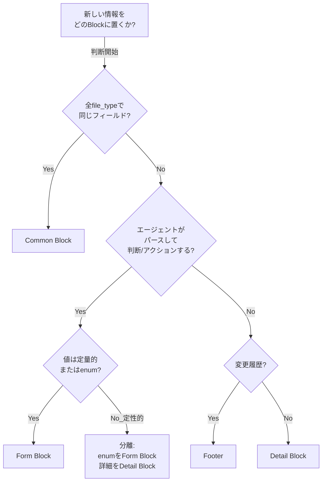

``````markdown
# Block Placement Examples — 迷いやすいケースの判断ガイド

## 判断基準（おさらい）

| Block | 判断テスト | 性質 |
|-------|-----------|------|
| **Common Block** | 「全ファイルタイプで同じフィールドか？」→ Yes | ファイルの身元証明 |
| **Form Block** | 「エージェントがこの値をパースして判断/アクションするか？」→ Yes | 構造化された状態・メトリクス |
| **Detail Block** | 「詳細な説明・根拠・証拠か？」→ Yes | ドメイン知識の本体 |
| **Footer** | 「いつ誰が何を変えたか？」→ Yes | 変更履歴（append-only） |

---

## 例1: threat-model.md（脅威モデル）

**シナリオ:** security-reviewer が脅威モデルを作成。他のエージェントはこれを参照して実装する。

| 情報 | 候補 | 判断 | 理由 |
|------|------|------|------|
| ファイルの目的「脅威モデルを定義する」 | Common? Form? | **Common** (`doc:purpose`) | 全ファイルタイプ共通フィールド |
| 採用した脅威分析手法（STRIDE, DREAD等） | Form? Detail? | **Form Block** (`security:methodology`) | エージェントがパースして「どの手法で分析されたか」を判断できる。dashboardにも表示可能 |
| 特定された脅威の総数 | Form? Detail? | **Form Block** (`security:threat_count`) | 数値メトリクス。dashboardで監視、progress-monitorが集計 |
| 未軽減の高リスク脅威数 | Form? Detail? | **Form Block** (`security:unmitigated_high_count`) | review-agentがゲート判断に使う可能性あり（0でないとfail） |
| 脅威ごとの詳細（攻撃ベクター、影響、軽減策） | Form? Detail? | **Detail Block** | 詳細な分析内容。人間とエージェントが「理解」のために読む。パースして判断はしない |
| アセット一覧表 | Form? Detail? | **Detail Block** | 表形式だが、詳細なドメイン知識。Form Blockに入れるには情報量が多すぎる |

**迷いポイント:** 「脅威の総数」はDetail Blockの表を数えればわかる。Form Blockに重複して持つ必要があるか？
**判断:** ある。エージェントがDetail Blockの自由形式テーブルをパースするのは脆い。Form Blockに正規化した数値を持つことで、確実に機械読取可能になる。

---

## 例2: wbs.md（WBS）

**シナリオ:** progress-monitor がWBSを管理。lead がフェーズ進行判断に参照する。

| 情報 | 候補 | 判断 | 理由 |
|------|------|------|------|
| 総タスク数 | Form? Detail? | **Form Block** (`wbs:task_total`) | progress-monitorが完了率を算出する入力 |
| 完了タスク数 | Form? Detail? | **Form Block** (`wbs:task_completed`) | 同上。dashboardに表示 |
| 現在のクリティカルパス | Form? Detail? | **Form Block** (`wbs:critical_path`) | leadがボトルネック判断に使う |
| 各タスクの詳細（担当、期間、依存関係） | Form? Detail? | **Detail Block** | タスク詳細はドメイン知識。表やガントチャートで表現 |

**迷いポイント:** クリティカルパスはDetail Block内のタスク表から導出できる。Form Blockに持つべきか？
**判断:** 持つ。導出値であっても、エージェントが即座に判断に使うならForm Block。Detail Blockから毎回計算させるのは冗長で不安定。

---

## 例3: executive-dashboard.md（エグゼクティブダッシュボード）

**シナリオ:** progress-monitor が更新するプロジェクト全体の要約。ユーザーが一目で状況を把握するためのもの。

| 情報 | 候補 | 判断 | 理由 |
|------|------|------|------|
| 現在のフェーズ | Form? Detail? | **Form Block** (`dashboard:phase`) | pipeline-stateと同期。他のエージェントも参照 |
| プロジェクト全体の完了率 | Form? Detail? | **Form Block** (`dashboard:completion_pct`) | 数値メトリクス |
| 全体のヘルスステータス（green/yellow/red） | Form? Detail? | **Form Block** (`dashboard:health`) | leadが「ユーザーに報告すべきか」を判断 |
| オープン中のブロッカー数 | Form? Detail? | **Form Block** (`dashboard:blocker_count`) | 0でなければエスカレーション |
| 各フェーズの詳細サマリー | Form? Detail? | **Detail Block** | 人間が読むための要約文 |
| 直近のマイルストーン達成状況 | Form? Detail? | **Detail Block** | 詳細なタイムライン情報 |

**迷いポイント:** executive-dashboardはほぼ全フィールドがメトリクスに見える。Form Blockが肥大化しないか？
**判断:** dashboardの性質上、Form Blockが大きくなるのは正しい。このファイルの存在意義が「構造化されたステータスの集約」だから。Detail Blockは補足説明に使う。

---

## 例4: final-report.md（総括レポート）

**シナリオ:** Phase 5でleadが作成。ユーザーがプロジェクト終了を判断するための材料。

| 情報 | 候補 | 判断 | 理由 |
|------|------|------|------|
| 最終テスト合格率 | Form? Detail? | **Form Block** (`report:test_pass_rate`) | ユーザーの受入判断の入力 |
| カバレッジ達成率 | Form? Detail? | **Form Block** (`report:coverage_pct`) | 同上 |
| 未解決のCritical/Highバグ数 | Form? Detail? | **Form Block** (`report:open_critical`, `report:open_high`) | 0でなければリリース不可 |
| 総コスト | Form? Detail? | **Form Block** (`report:total_cost_usd`) | 予算対比の判断材料 |
| 目標達成の評価（Goal vs Outcome） | Form? Detail? | **Detail Block** | 定性的な評価。人間が読んで判断 |
| 残課題・技術的負債のリスト | Form? Detail? | **Detail Block** | 詳細なリスト。次フェーズへの引継ぎ |
| 学んだ教訓（Lessons Learned） | Form? Detail? | **Detail Block** | ふりかえり。完全に自由記述 |

**迷いポイント:** 「目標達成の評価」は重要だがForm Blockに入れるか？
**判断:** 入れない。定性的な評価は機械パースに不向き。代わりに `report:goal_achievement` を enum（achieved/partial/not-achieved）としてForm Blockに置き、詳細はDetail Blockで説明する、という分離が適切。

---

## 例5: user-order.md / {project}-spec.md（仕様書）

**シナリオ:** srs-writerがCh1-2を作成、architectがCh3-6を詳細化。review-agentがレビュー。

| 情報 | 候補 | 判断 | 理由 |
|------|------|------|------|
| 仕様形式（ANMS/ANPS） | Form? Detail? | **Form Block** (`spec:format`) | エージェントが読取方法を判断 |
| 現在のドラフト状態（draft/review/approved） | Form? Detail? | **Form Block** (`spec:draft_status`) | review-agentのゲート判断、change-managerの変更管理トリガー |
| 完成済みチャプター | Form? Detail? | **Form Block** (`spec:completed_chapters`) | architectが「どこから作業するか」を判断 |
| 機能要件数 | Form? Detail? | **Form Block** (`spec:fr_count`) | traceabilityのカバレッジ算出の母数 |
| 非機能要件数 | Form? Detail? | **Form Block** (`spec:nfr_count`) | 同上 |
| Ch1-6の本文全体 | Form? Detail? | **Detail Block** | ANMS/ANPSフォーマットに従う仕様本体 |

**迷いポイント:** 仕様書は独自フォーマット（ANMS）を持つ。Common Block + Form Blockを追加すると、ANMSの章構成と二重管理にならないか？
**判断:** ならない。Common BlockとForm Blockは「仕様書というファイルのメタデータ」。ANMSの章構成は「仕様の中身」。メタデータと中身は別レイヤー。ANMSのCh1がCommon Blockの`purpose`と被るように見えても、粒度と用途が異なる。

---

## 例6: performance-report-NNN-*.md（性能テストレポート）

**シナリオ:** test-engineerがk6実行後に作成。NFR目標との比較結果。

| 情報 | 候補 | 判断 | 理由 |
|------|------|------|------|
| テスト対象エンドポイント数 | Form? Detail? | **Form Block** (`perf:endpoint_count`) | dashboardに集計 |
| NFR達成率（pass/total） | Form? Detail? | **Form Block** (`perf:nfr_pass_rate`) | ゲート判断：100%でないとPhase 4不合格 |
| P99レイテンシの最大値 | Form? Detail? | **Form Block** (`perf:p99_max_ms`) | SLA超過のアラート判断 |
| 各エンドポイントの詳細結果 | Form? Detail? | **Detail Block** | エンドポイントごとのレイテンシ・スループット・エラー率の表 |
| k6スクリプトの設定パラメータ | Form? Detail? | **Detail Block** | テスト条件の記録（再現性のため） |

---

## 判断フローチャート

**Block_Placement_Decision_Flow:**



このフローチャートは、情報のBlock配置を判断する手順を示す。最も迷いやすいのはQ2→Q3の分岐で、「エージェントが使うが定性的」な場合にenumとDetail Blockに分離するパターン。

---

## まとめ: 迷ったときの3原則

1. **数値・enumはForm Block。** dashboardやゲートで使う可能性があるなら、Detail Blockから導出させず正規化してForm Blockに持つ
2. **定性的な説明はDetail Block。** ただし「定性的に見えるがenumで分類できる」場合は、enumをForm Blockに、詳細をDetail Blockに分離する
3. **迷ったらForm Block寄りに判断する。** 自由形式のDetail Blockからの情報抽出は脆い。構造化できるものは構造化する
``````
