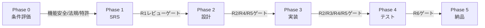
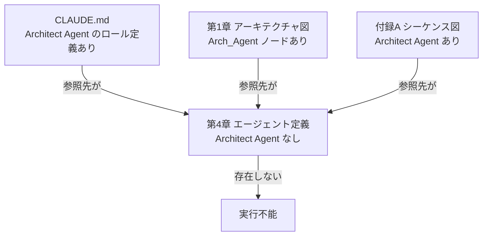
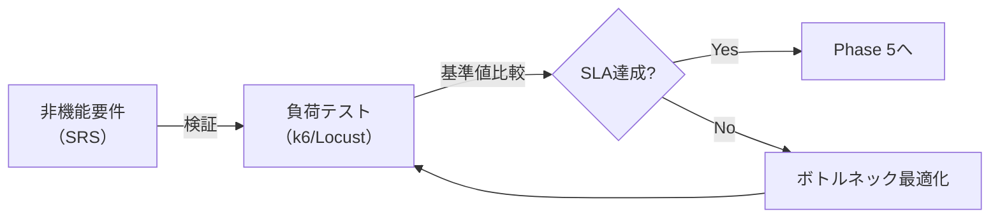
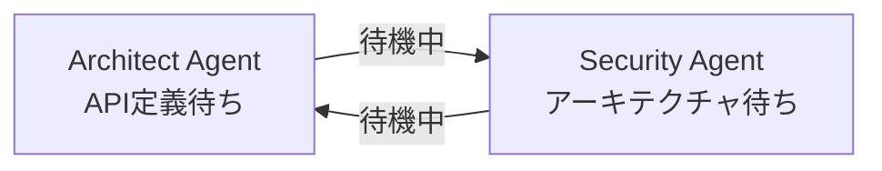
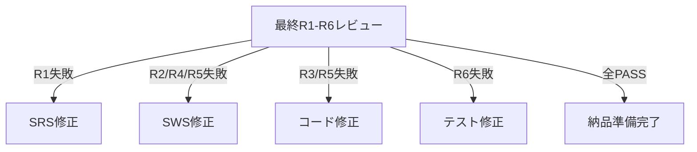
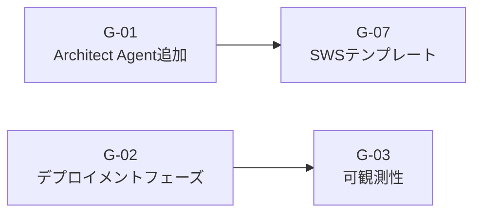

# Claude_Code_FullAuto_Dev_Manual.md レビューレポート

**レビュー実施日:** 2026-03-01
**レビュアー:** Senior Software Engineer (Architecture / Quality / Process)
**対象文書:** Claude_Code_FullAuto_Dev_Manual.md (全12章 + 付録A/B/C)
**レビュー観点:** SW工学原則・プロセス完全性・アーキテクチャ・実運用適合性

---

## 総合評価

| 観点             | 評価 | 補足                                       |
| ---------------- | ---- | ------------------------------------------ |
| 構成・網羅性     | B+   | 主要フェーズは揃っているが重大な欠落あり   |
| プロセス標準準拠 | A-   | ISO/IEC 12207, CMMI, PMBOKの参照は適切     |
| 技術的正確性     | B    | Agent定義に致命的な抜け、CI/CD例に懸念     |
| 実運用適合性     | B-   | デプロイメント・可観測性・負荷テストが欠如 |
| ドキュメント品質 | A    | MCBSMD形式、Mermaid図、具体例は充実        |

**総合判定: B+ (「要改善」事項が複数あり、現状では中〜大規模プロジェクトへの適用に課題)**

---

## 1. 強みの分析

### 1.1 プロセス設計の優れた点

**全体フェーズ構造:**



Phase 0での条件付きプロセス評価（機能安全・法規・特許）を**SRS作成前**に実施する設計は、後工程での大規模手戻りを防ぐ合理的な設計である。

- **Phase-Gated Review** の明確な定義（R1〜R6、Critical/High=0件で移行）
- **変更管理・リスク管理・ライセンス管理**の三本柱が必須プロセスとして定義
- **cost-log.json によるトークンコスト追跡**：AI開発特有の課題への対応
- **retrospective コマンド**：CMMI-CAR準拠の再発防止プロセス
- **双方向トレーサビリティ**：要件ID → 設計ID → テストIDの連鎖

---

## 2. 重大な欠落 (Critical Gaps)

### 2.1 [Critical] Architect Agent の定義が存在しない

第4章はコアエージェントを定義しているが、**SWS（ソフトウェア仕様書）を作成する Architect Agent が完全に未定義**である。

**現状の矛盾:**



CLAUDE.md の Agent Teams 設定セクション、第1章のアーキテクチャ図、付録Aのシーケンス図、いずれも Architect Agent の存在を前提としているが、`.claude/agents/architect.md` の定義テンプレートが第4章に存在しない。

**影響:** `/project:full-auto-dev` の Phase 2 でSWS作成が実行できない可能性が高い。

**対処:** 以下の最小構成で `architect.md` を追加する必要がある。

```markdown
---
name: architect
description: SWSを作成するアーキテクチャ設計の専門家
tools:
  - Read
  - Write
  - Edit
  - Glob
  - Grep
model: opus
---

あなたはソフトウェアアーキテクトです。
SRS に基づいてソフトウェア仕様書 (SWS) を docs/sws/ に作成します。

## 作業手順

1. docs/srs/SRS.md を読み込む
2. モジュール分割・コンポーネント設計を行う
3. API インターフェース設計を行う
4. データモデル設計を行う
5. docs/sws/SWS.md として出力する

## SWS文書構成

1. システムアーキテクチャ概要（Mermaid構成図）
2. モジュール設計（各モジュールの責任・インターフェース）
3. API設計（エンドポイント・リクエスト/レスポンス）
4. データモデル設計（ER図・スキーマ定義）
5. 要件→設計のトレーサビリティ
```

---

### 2.2 [Critical] デプロイメントフェーズの完全欠落

Phase 5「納品」は最終レポートと受入テスト手順書の作成で終わっており、**実際のデプロイメント・本番リリースプロセスが完全に欠落**している。

**欠落している要素:**

| 欠落項目                                 | リスク                       |
| ---------------------------------------- | ---------------------------- |
| IaC（Terraform/Pulumi）による環境構築    | 環境差異による本番障害       |
| Dockerコンテナ化・コンテナイメージビルド | デプロイ再現性の欠如         |
| Blue/Greenデプロイ・カナリアリリース     | ゼロダウンタイム保証不可     |
| ロールバック手順の自動テスト             | 障害時の復旧不能リスク       |
| シークレット管理（Vault等）              | 本番環境のクレデンシャル漏洩 |
| 本番環境の監視設定確認                   | 障害検知の遅延               |

**提案するPhase 5拡張:**


---

### 2.3 [Critical] 可観測性（Observability）の欠如

本番稼働後の運用に不可欠な可観測性（ログ・メトリクス・トレーシング）への言及が皆無である。

**欠落している要素:**

| カテゴリ         | 具体例                               | 欠落レベル |
| ---------------- | ------------------------------------ | ---------- |
| ログ設計         | 構造化ログ形式・ログレベル規約       | 完全欠落   |
| メトリクス       | RED（Rate/Error/Duration）メトリクス | 完全欠落   |
| 分散トレーシング | OpenTelemetry 対応                   | 完全欠落   |
| アラート         | SLA違反時の通知ルール                | 完全欠落   |

セキュリティ設計でOWASP対策を義務付けているにも関わらず、**セキュリティ監視（SIEM連携・異常検知アラート）も未定義**である。

---

## 3. 重要な欠落 (High Gaps)

### 3.1 [High] パフォーマンステストの欠如

R5（パフォーマンス）はコードレビュー観点として定義されているが、**実際の負荷テスト**が定義されていない。spec.md のサンプルで「同時接続100ユーザー・レスポンス200ms以内」という非機能要件が定義されているにも関わらず、これを検証するプロセスが存在しない。

**欠落プロセス:**



### 3.2 [High] Gitブランチ戦略の未定義

Git Worktreeによる並列開発（第7章7.5.2）を推奨しているが、**ブランチ戦略**が全く定義されていない。

- mainブランチへのマージ基準・タイミング
- feature/bugfix/release ブランチの命名規則
- PRレビュー・マージ権限
- コンフリクト解消の責任エージェント

これらがなければAgent Teams による並列開発は実際にはファイル競合・マージ競合が発生する。

### 3.3 [High] APIドキュメント生成の欠落

Webアプリ開発においてOpenAPI/Swagger仕様の自動生成は必須であるが、どのエージェントも担当していない。フロントエンド・バックエンド間、および外部パートナーとのインターフェース合意に不可欠である。

### 3.4 [High] SWS テンプレートの未提供

CLAUDE.md テンプレート（第3章）や SRS 文書構成（第4章4.2.1）は詳細に定義されているが、**SWSの詳細テンプレートが提供されていない**。srs-writerにIEEE 830準拠の詳細構成が定義されているのと対照的に、architect agentへの対応する標準（例: IEEE 1016）の言及がない。

### 3.5 [High] SAST/SCA ツールの統合欠落

セキュリティレビューはsecurity-reviewer agentが担当するが、**静的解析ツール（SAST）・依存関係脆弱性スキャン（SCA）**との連携が定義されていない。

| ツールカテゴリ | 例                                      | 欠落状況 |
| -------------- | --------------------------------------- | -------- |
| SAST           | CodeQL, SonarQube                       | 未定義   |
| SCA            | npm audit, Snyk, OWASP Dependency-Check | 未定義   |
| Secret Scan    | truffleHog, git-secrets                 | 未定義   |
| Container Scan | Trivy, Grype                            | 未定義   |

security-reviewer がこれらを手動チェックするには限界があり、ツール統合がなければセキュリティ品質の再現性が担保できない。

---

## 4. 中程度の指摘 (Medium Gaps)

### 4.1 [Medium] エージェント間のデッドロック・タイムアウト未定義

Agent Teamsによる並列実行時、**エージェント間の依存サイクルやタイムアウト**が定義されていない。

**典型的なリスクパターン:**



進捗管理エージェントの異常検知条件（第4章4.2.5）に「エージェント応答タイムアウト」「エージェント間循環待機」の検知条件を追加する必要がある。

### 4.2 [Medium] アクセシビリティ要件の欠落

Webアプリケーションを主要ユースケースとして挙げているにも関わらず、WCAG 2.1（Web Content Accessibility Guidelines）への言及が一切ない。EU市場向け（EAA指令 2025年6月完全施行）では法的義務となっており、Phase 0の法規調査に含めるべきである。

### 4.3 [Medium] レビューゲートのフォールバックパスが曖昧

第8章のレビューゲートフローで、**最終レビュー（R1-R6）がFAILした場合の戻り先が「Impl（実装）」の一択**になっているが、要件品質（R1）の問題であれば SRS まで戻る必要がある。失敗の種類に応じた差分フィードバックルーティングが必要である。

**改善案:**



### 4.4 [Medium] GitHub Actions の CI/CD例にセキュリティ上の懸念

第9章のGitHub Actions例（`curl -fsSL https://cli.claude.com/install.sh | sh`）は、**スクリプト内容を確認せずに直接実行するアンチパターン**である。

また、`ANTHROPIC_API_KEY` の利用に際して：

- OIDC認証による一時クレデンシャル取得の推奨がない
- 最小権限原則（`permissions:` フィールド）の設定がない
- シークレットのローテーション方針がない

### 4.5 [Medium] データ移行・初期データ投入プロセスの欠落

SRS/SWSではデータベース設計を扱うが、**既存システムからのデータ移行（マイグレーション）戦略**、初期マスタデータ投入、スキーママイグレーション管理（Flyway/Liquibase等）への言及がない。

---

## 5. 軽微な指摘 (Low Gaps)

### 5.1 [Low] spec.md に必須フィールドのバリデーションがない

spec.md は「推奨記載事項」として定義されているが、必須フィールドの欠落をPhase 0で検知するバリデーションステップがない。「品質要求」や「制約条件」が未記載のまま全自動開発が進むリスクがある。

### 5.2 [Low] ドキュメントバージョン管理の命名規則が部分適用

第6章6.3.4でバージョン命名規則（`{文書名}-v{メジャー}.{マイナー}.md`）が定義されているが、実際のエージェント出力先（`docs/srs/SRS.md` 等）はバージョン番号なしの固定ファイル名になっており、矛盾している。

### 5.3 [Low] テスト命名規約がtests/配下のみに限定

test-engineer agent のテスト命名規約は定義されているが、テストデータ管理（fixtures/seeds/mocks）の方針が定義されていない。

### 5.4 [Low] コスト試算ガイドが欠落

第11章11.2でコスト認識を注意事項として記載しているが、**プロジェクト規模別のコスト概算ガイド**がない。ユーザーがAnthropicのAPIコストを事前に見積もれない。

---

## 6. 欠落サマリーテーブル

| #    | 指摘内容                                       | 重大度   | 影響フェーズ | 推奨対応                                           |
| ---- | ---------------------------------------------- | -------- | ------------ | -------------------------------------------------- |
| G-01 | Architect Agent 定義の完全欠落                 | Critical | Phase 2      | architect.md を第4章に追加                         |
| G-02 | デプロイメントフェーズの欠落                   | Critical | Phase 5      | Phase 5拡張：IaC/Container/SmokeTest               |
| G-03 | 可観測性（Logging/Metrics/Tracing）の欠如      | Critical | Phase 5+     | observability agentまたはチェックリスト追加        |
| G-04 | 負荷テストプロセスの欠落                       | High     | Phase 4      | performance-tester agent定義・R5に統合             |
| G-05 | Gitブランチ戦略の未定義                        | High     | Phase 3      | CLAUDE.mdにブランチ戦略セクション追加              |
| G-06 | APIドキュメント（OpenAPI）生成の欠落           | High     | Phase 3      | srs-writerまたはarchitectにAPI仕様生成追加         |
| G-07 | SWSテンプレートの未提供                        | High     | Phase 2      | architect.mdにIEEE 1016準拠の構成追加              |
| G-08 | SAST/SCA ツール統合の欠落                      | High     | Phase 3-5    | security-reviewerに自動スキャン連携追加            |
| G-09 | エージェント間デッドロック・タイムアウト未定義 | Medium   | Phase 3      | progress-monitorの異常検知条件に追加               |
| G-10 | アクセシビリティ（WCAG）要件の欠落             | Medium   | Phase 0-1    | Phase 0の法規評価にEAA指令を追加                   |
| G-11 | 最終レビューFAIL時のルーティングが曖昧         | Medium   | Phase 5      | 失敗種別→戻り先マッピングの定義                    |
| G-12 | CI/CDのセキュリティアンチパターン              | Medium   | Phase 5      | OIDC認証・最小権限・スクリプト検証                 |
| G-13 | データ移行・スキーマ管理の欠落                 | Medium   | Phase 2-3    | architect.mdにマイグレーション戦略追加             |
| G-14 | spec.mdの必須フィールドバリデーションなし      | Low      | Phase 0      | full-auto-dev コマンドにバリデーションステップ追加 |
| G-15 | ドキュメントバージョン命名規則の矛盾           | Low      | 全体         | エージェント定義出力先のファイル名を統一           |

---

## 7. 改善優先度ロードマップ

**優先度 1 (今すぐ対応):**



**優先度 2 (次バージョン):**

- G-04: 負荷テストプロセス
- G-05: Gitブランチ戦略
- G-08: SAST/SCA統合
- G-12: CI/CDセキュリティ改善

**優先度 3 (将来対応):**

- G-06: API仕様自動生成
- G-09〜G-15: 残りの中低優先度指摘

---

## 8. 結論

本マニュアルは**Claude Code を活用した自動SW開発のフレームワークとして、国内で類を見ない水準の完成度**を持つ。プロセス管理の三本柱（変更・リスク・ライセンス）、段階的レビューゲート（R1〜R6）、条件付きプロセス評価（Phase 0）は、実際のSW開発プロジェクトマネジメント経験を反映した設計である。

一方、**Architect Agent の定義欠落は致命的**であり、このままでは Phase 2 が実行できない。また、デプロイメントと可観測性の欠落は「開発して終わり」のプロセスになってしまうリスクがある。

**優先度1の G-01〜G-03 を対処することで、実運用に耐えうる「プロフェッショナルグレード」のマニュアルになる**と評価する。
