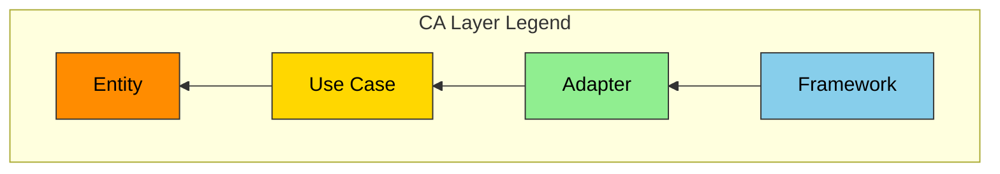
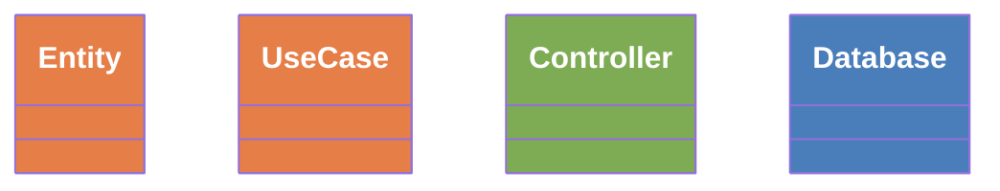

じゃ、順番に行こう。

まずはこれから
spec.md → user-order.md のリネーム（全ファイルに影響大）

なんだけど、単純Grep置換は危険だよね？

Detail Block 採用。

Type Bock改名:
あー。伝わってないなぁ。
ステータスだけじゃないんだよ。
例えばテストケースやテスト結果レポートも書式を定めたい

また、1つのファイルに複数のテストケースが連なる場合は、 (今のところ type block)が複数ならんでもいい。

目的はAIを縛ること。

文書管理規則全体をレビューした。

本ルールは仕様書のフォーマット（ANMS / ANPS / ANGS）とは独立している
は誤解を招くな。
プロセスが使う仕様書の形態（ANMS / ANPS / ANGS）にかかわらず、本仕様書のフォーマット...
とするべき
spec.md # ユーザー入力仕様（3問形式）

spec.md って命名が良くないね。
全然specificじゃない内容が入るから。
user-order.md とかの方がいい。

プロセスの最初にヒアリング工程が欲しい。
Phase 0 と Phase1かな。
そこで、仕様書を作っていく。

infra/ # IaC
IaC って何？ IaC( Infra....) ってフルセンテンスで書いて。

ブロック図の矢印のラベルで 先行 ってなに？
次
ぐらいで良くない？

各ブロックの役割は明確である。Common Blockはファイルを識別し、Type Blockはファイルタイプ固有の構造化メタデータを持ち、Bodyは本体を記述し、Footerは変更履歴を追跡する。

Body って名前が悪いね。
Freeform とかそんな感じがいいかな。

Block 判断テスト 性質 消費者
消費者⇒ 用途・利用者

Block: Common block, type block...
type ってあいまいやな。
predefined block とか？
purpose oriented blockとか

ソフトは言霊。 命名が命。
一旦、ここまでで意見くれたし。

You're right.
But before do the work, we should define the criteria which block should have each item.

We need to control the agent precisely.
If we can define the format we should define it.
If there are big freedom area it'll be difficult to control them.
Are these true?

OK. Let's recall the definition and purpose of the type block.

Could you show that?

Woom...

There are a lot of remaining items.
In this kind of the case, we should clarify the concept. What do you think about it?

Nice criteria! And CLAUDE.md should't have the common header.

Update the rues about the common header as your proposed.

not quite.
spec.md can be multiple files in case of ANPS.
spec.md should have the common header.
final-report also has the common header.

test-plan should have the common header.

Why B1,B2, C4,E1 don't don't need the common header?

Let's recap the criteria whether the common header is required.

executive-dashboard.md is a singleton.
The purpose is to check the overall progress rapidly.

final-report.md will be made at the phase which is the human needs to check whether the project can end or not depending on the outcome compare to the goal of the project.

executive-dashboard.md should have the common header.

license-report is a singleton doc.

Here are my answer.
license-report.md is one of the metadata.
test-plan.md should be handled as project management docs.
I can't remember the pref-report-\*.md; explain it. I guess it should be in the project folder.

final-report.md is metadata.

Application of the MCBSMD depends on the document purpose. Let's decide one by one later.

license is not a part of the security.
independent folder is required in /project-records.

The place of the test-plan is OK.

The places of perf-report are OK.
The place of each report depends on the phase.
But, the filename should be changed from pref-report to performance-report...

Place of the final-report should be root.
And also, executive-dashboard.md is required in the root.

How about it?

下記フォルダの.mdを読め。
C:\Users\good\_\OneDrive\Documents\GitHub\claude-code-full-auto-dev\process-rules

C:\Users\good\_\OneDrive\Documents\GitHub\claude-code-full-auto-dev\anms-template

その上で
C:\Users\good\_\OneDrive\Documents\GitHub\claude-code-full-auto-dev\prompt\document-rules-handoff.md
がどこまで進んだか確認せよ。

さらにメモリ/メモの内容を提示せよ。

これを受けて、今後のタスクを決める。

** 変遷（時間軸） コミット = スナップショット diff = 状態遷移
ダメ 状態遷移**
OK 履歴変遷

可換条件
F∘H≅JF∘H≅J が成立すること、すなわちMD経由の経路（checkout→parse）と直接経路（rebuild）が同じ結果を返すことが、システム整合性の数学的保証となる。可換性の破れはバグである。

イミフ。 過去のGitにバグがるのは普通。

2.3 GraphDB自体にバージョニング機能は不要
→GraphDBのバージョン管理をGitにいたくしてんだよね？
そういう感じで書いてよ。 そも論この論文はGitにこだわりすぎ。 Gitはただのバックアップだと思え。

---

以下ざっくりレビュー するよ。

修正せよ。指摘の意図があいまいな場合は問え。

第1論文[1]ではMarkdown単一ファイルに全情報を集約することをアーキテクチャの中心に置いた。
→アーキじゃないね。 仕様書構成の基本コンセプトぐらいかな。

本論文は仕様の本体を
G
×
V
G×V （GraphDB × Git）に移し、Markdownをビューとして再定義する。

ここで M だせよ。

CA on Spec構造は
CAがイミフ

本設計では圏論を形式的証明ではなく概念化ツールとして使用する。3要素の関係を統一的に記述し、可換性の破れを設計レベルで検知するための言語である。

仕様管理に関わる三要素 — Markdown、Git、GraphDB — を圏論の三圏として定義する。

いきなり言い訳から入るな。
言い訳はこのセクションの最後

Three_Categories:
MのObjectsがなぜSections？
Specifications じゃないのはなぜ？

仕様の本体は
G （構造）と
V （変遷）の積圏
G×V である

いや違う。 Gです。
Vはただの管理。

Gitから J 関手（rebuild）
J関手 ってなに？　唐突すぎ。 ちゃんと説明を入れて。

データ構造が決まればアルゴリズムは導かれる。
次のセクションと重複
どっちか削除

上図はANMSグラフの抽象

ANGMに変えた。 他にぬけがないか ANMSで本論文をGrepし、
ANMSとANGMのどちらが適切かチェックしとけ。

STFB_CA_Unified:
Layer2 とか。 各Layerがイミフ

forward ってどういう意味？ depends ? Satisfy ?
ソフトは言霊。　適切なラベルが重要

各STFB層に特殊化する。？特殊化？ 継承？ 具体化？
こっちも言霊を入れて。 =しっかりNammingせよ

、全てこの4ペアの組み合わせで記述できる。
その根拠を1文で

1. 解決策 — オーガナイザーによるコンテキスト配分
   課題も良く分からんのに何を解決するの？
   課題に紐づけて。 章名はシンプルに

Solution_Overview:
FR, CMP とかイミフ

忘却関手（Forgetful Functor）
この後膨らませるから。 Sectionだけ用意しておけ

抽象化の歴史
→ プログラミング言語と抽象化の歴史

世代 抽象化の代償 導入された制約

世代と代表言語で列を分けろ

ってか、1世代とか、0世代の言及しとけ

AI Code世代
→AI Coding世代 とどっちが適切なん？

本論文では、ANGS (AI-Native Graph Spec) — ANMSを大規模ソフトウェアに適用するための設計を示した。
→ 本論文ではANMSを大規模ソフトウェアに適用するための手法として、ANGS (AI-Native Graph Spec) を示した。
の方が良くない？

MDはビュー — 仕様の本体は G×V であり、MDはレンダリング結果
→ 本体はG

CQRSの複雑性とGit粒度ズレ:
うーん。 まあ、言い訳は最小でいいよ。
本質はそこじゃないし。
って感じの言い訳をちょびっと入れよう。
何処がいい？
なんて書く？

Abs:
これらの原則に基づき、STFB層とClean Architectureの依存方向を統一したグラフスキーマを定義し、オーガナイザーエージェントによるサブグラフ切り出しと最小コンテキスト配分の仕組みを示す。
→圏論/忘却関手のキーワードを入れる

これは表現媒体の抽象度を一段上げる変更であり、第1論文の拡張ではなく前提の転換である。
→拡張やん。 転換してないって。

順番前後するけど補足しておく。

引用Specどうするの？？ ISOとかRFCとか？
→一旦AIが解釈してこのGraph DBにする。間違ってもそのまま突っ込まない

ってどっかに書いて。

1. 設計原則
   のセクション順が気持ち悪い。
   優先順位別に書くか、ストーリー性を重視するか、
   複数案列挙し、根拠とともに推奨案を出せ。

2.2節の冒頭（圏の定義表の前）に概念を..の断りを入れるのは賛成。なんだけど、もっと短い文を提案して。

仕様書更新前にここに案を3つ出せ

6.3 ANMSは正統進化である
は強すぎかな。

位置づけぐらいで。

なんかいい感じやね。
じゃ、最後にプログラミングの歴史を書こう

マシン語 → C → C++ → Java/Python → FOPの何か → AI Code
じゃん？
で、抽象度を上げたと。　本質的情報を集約したと。
だけど、抽象化の精度が悪いと具体がバグると。
だから、制約を増やしたと。
AI Codeの制約の提案がANMSであり、圏論をベースにしたグラフ構造
だからこの論文は正統進化

って話じゃない？

おうおう。やるやん。

骨格はよかよ！

# 注文

1. 分割/命名 → 類比/対比 → 帰納/演繹 → 具体/抽象
   この順番が大事。 ちょっとちがうやろ？

2. グラフが見にくいのよ。 もうちょっと整理できんかね？
   上位が上　or 左。
   まずは優先度の高い要素をMermaidの中で上の方に定義して。
   次に優先度の高い要素順に連結の定義を書いて。

まぁ、いいや。 細かいのはあとで直そう。

んで最初に戻る。

でやりたいことはほぼ全自動SW開発。

課題はコンテキストサイズ。と大規模な仕様群。

解決策は仕様の階層を考慮した上でのグラフ化とエージェントへのタスクとコンテキスト割当。

GraphDB自体にバージョニング機能は不要。
はい正解。

じゃさ、これまで整理した下記のポイントがあるよね？
・GraphDBならなんでもいい。 (ようにしておく)
・Spec管理を圏論で概念化
・MDは中継点ではなくビュー
・GraphDB自体にバージョニング機能は不要

ここまでの話を論文にまとめて。
ファイル名は
C:\Users\good\_\OneDrive\Documents\GitHub\claude-code-full-auto-dev\anms-template
angs-essay-ja.md
とかでどう？

くれば話が見えるやろ？

一旦ポイントをMCBSMDでレポートして。

そうそう。
MDは中継点ではなくビュー
が本質。

んでさ。 GitとGraphDBの相性問題ってさ
RDBとHistory問題と一緒やんね？
RDBの時はどうやってたっけ？

大体イメージは合ってるけどさ。
V⇔M⇔G　って直線関係だけじゃなくてさ。
V⇔Gを入れた三角関係ね。
Three_Categories:
の図をまず更新してよ。

数学的には同じ話なんだが、考える時はこれが意外と重要。

それと前述の記事について、Nullの話は一旦置いておいて。
Nullより、
分割/命名
類比/対比
帰納/演繹
具体/抽象

の4つの方が重要

それでv2のレポートをMSBSMDで書いてみな。

そういうこと。

ところでDAGってなんだっけ？何の略？

あぁ、それか。

まずさ。要素は下記ね。

MD,　Git,　GraphDB

で、ここに持ち込むのは...
圏論(Category Theory)

さァ、「射（Morphism）」は？「対象（Object）」は？

この記事読んで、俺の頭の中にあるもやっとしているのをMCBSMDでレポートせよ。 疲れたので、言語化がめんどい。 レビューはする。
https://dev.to/goodrelax/the-symbol-for-all-of-us-is-null-59kn
https://zenn.dev/good_relax/articles/39b4fc014bf035

まー、グラフDBだったら細かいのは何でもいいのよ。
ここの記事読んで。 英語版だけでいいよ。
C:\Users\good\_\OneDrive\Documents\GitHub\articles\clean-architecture

大事なのはアルゴリズムとデータ構造。
特にデータ構造。

そして本質は要件管理と構成管理。
でしょ？

下記のフォルダにある論文とテンプレを読め。
C:\Users\good\_\OneDrive\Documents\GitHub\claude-code-full-auto-dev\anms-template

これは、分かりやすい説明のため、中小規模のSWにフォーカスしすぎた。
大規模なSW開発では単一仕様書をAIが読み込むのは不可能。
よって、必要な部分だけエージェントに切り分ける必要がある。
何をどう切り分けるかはオーガナイザーやマネージャーのようなエージェントのタスクとなる。
そのタスクを効率よくするためには、以下の対応が必須と考える。

1. 全仕様や図表ににIDをつける
2. IDをベースとしてIndexを付けたデータベースを構築する
3. データーベースはRDBやKVSベースより、グラフ理論をベースとしたDBの方がAIとの相性が良い。

このコンセプトについて、質問や意見があれば述べよ。

近年のグラフDBについて調査し、比較検討せよ。特に本目的に対する相性や既存のグラフDBの課題を挙げよ
また上記のノード、エッジ、プロパティーをMeamaidで書け。
結果はMCBSMDでレポートせよ

CLAUDE.md
とANMSの関係は？ どこまでをCLAUD.mdに書いて、何処からをANMS参照にする？ 判定基準を示せ。

プロジェクト概要
[ユーザーが提示するコンセプトをspec.mdからここに転記]

IaCってなんだっけ？
ESLintって？

必須プロセス設定（第6章参照）
何の6章？

プロジェクト名もAIに提案させよう。
語彙力がない人も多い。

何を作りたい？ と対になる背景がいるよね？

俺は常に Why When Who Where What How
で考えるけど、
一般の人には

何を作りたい？
それはどうして？

の方がいいかも。

技術的な希望・制約
は
その他の希望
でいいかも。

自由記述　っていうと書けないけど、その他の希望なら書けるかな。

あとは、その例が重要。
使いたい技術とか予算は要らんやろ。
Webなのか、スマホなのか、そういう展開方法的なのをシンプルに例に書いたら？

やっぱそうやね。 マニュアルに反映しよう。
でもその前に今の spec.md ってどう？
もっと簡略化できない？
例文だけでも見るとつらいかも。

じゃ、最初に。

spec.md と CLAUDE.md の使い分けをどうしようか？
案: 最初はspec.mdを書く。
次にClaudeが CLAUDE.md を提案。
特に大事なことはCLAUDE.mdに書きながら、詳細は
ANMSに定義して開発。

どうかな？

本仕様書の章構成は Robert C. Martin の安定依存の原則 (Stable Dependencies Principle) に従う。

従う は言いすぎかな。 参考にしている。 とか、リスペクトしている感じで。

AmazonじゃなくてWebのリンクあったよね？ ボブのおっさんとのか。
あと、RFCもリンク入れとこうか。本文では出ないけど大いに参考にしてるし。

References
は全部公式のLinkを埋め込んで。

まだレビュー観点があるね。

状態遷移の条件の取得をやって、別の関数で状態遷移しているか？
デッドロックやグリッジが発生しないか？

ほかにない？

どのSWにも当てはまるこの粒度のレビュー観点。

今必要でない機能を作っていないか。過剰な汎用化をしていないか
はオーバーエンジニアリングの言葉が欲しい

　
他のレビュー観点として、以下も必要やね。
単体テストがしやすいか？ = Mockやダミーを簡単に作れるか？
純粋関数と汚い関数の仕分け/フォルダ分けができているか？

もう少し改善が必要。

LSP 派生型が基底型と置換可能か 子クラスを親クラスの代わりに使っても正しく動くか

→逆じゃない？ 子の代わりに親では？

LoD 不要な知識の伝播（列車事故コード）がないか 他モジュールの内部構造を知りすぎていないか（a.b.c.d のような連鎖呼び出し）
→列車事故って何？ abcdってなに？

まずね、略語の全文を書いた列が必要。
あと、以下の説明が微妙。

簡潔性 DRY 知識の重複がないか →おなじことをくりかえすな。 車輪の再発明するな …とか 知識だけじゃないやろ？
簡潔性 YAGNI 未使用の機能・過剰な汎用化がないか →オーバーエンジニアリング変言及が欲しい
SOLID LSP 派生型が基底型と置換可能か →用語がイミフ
SOLID DIP 抽象に依存し具象に依存していないか → 日本語の修飾関係ががあいまい。 抽象に依存してちゃダメ？ って思いかねない。
結合 LoD 不要な知識の伝播（列車事故コード）がないか → 列車事故って何？ 唐突。
可読性 POLA 驚きのない設計か → 驚きねぇ。 もう少しなんかない？ 初見でもすぐイメージできるとか。

悪くないけど、一番大事なのはNaming

この記事を読んで。俺が書いたやつ。
https://zenn.dev/good_relax/articles/5b1ac4c1031ea6

あと、CA敵に依存関係があっているかの視点がかなり重要。

SW設計原則 準拠確認

https://goodrelax.github.io/gr-cheat-sheets/ai-coding/gr_ai_coding_ja.html
に入れてる国木全部テンプレに反映していいかな？ 初見の人には重い？ AIなら大丈夫？

テストレベル 対象 方針 合格基準
の表は例かな？
例なら例と明示が必要でしょ？

4.x API Definition API定義 Web API を提供するアプリ
APIってWeb限定じゃないよね？

OK.

Ch2の要求を検証可能なシナリオとして具体化する。
のCh2がイミフ。 Chapter 2 って書いたほうが良くない？

PASS FAIL SKIP OTHER
は？ テストした。 PASSじゃないけど、 だいたいOK. ちょっと改善してほしいので、備考参照 てきな。
そういうのはFAILにすべき？

細かいけど。

**Result:** Pass / Fail / N/A

でN/Aの / とデリミタの / が競合して気持ち悪い。

使い方としては 非該当の部分を削除すればいいだけにしたい。
つまりOKの場合は Fail以降を削除。
どうするのがいい？
Pass Fail Other
とか？
提案せよ

4.1 は Scenarios (Gherkin) を固定配置し、4.2以降はプロジェクトの性質に応じて取捨選択する。

4.1 Scenarios (シナリオ)
Gherkin形式によるUATの受入基準。仕様の最も上位の具体化。各シナリオの直下にテスト結果を記録する。

Scenarios (Gherkin) を固定配置しの部分は太字じゃない方がいい。 4.1の章名と見分けが困難で混乱する。
UATのフルセンテンスが必要。 UAT (User Acceptance Test) とか。

仕様の最も上位の具体化。 ってなんとなくあってるけど、何処か違和感。
意見くれたし

いいね。
次。
Chapter 4. Specification (仕様)
最も具体的で、最もよく変わる層。AIがコードに直接変換できるレベルの定義。

最もよく変わる？ もっと変わるところあるんじゃない？ テストケースは？ 最も に違和感。どう？

ちょっと順序が違うな。
最初に手本とする？ 基本とする？アーキのコンセプトを選定する。
それに合わせてシステムのアーキを設計する
その時に、コンポ図やクラス図に色付けしてレビューしやすくする。
って感じ。

SWの構造と設計判断。Mermaid図はCAレイヤー色分けを必須とする。
ここは必須ではなく、強く推奨、ぐらいの方がいいよね？
レイヤードアーキや、マイクロサービスもあるし。
ただ、どういう考えでアーキ設計したのかと、コンポ図/クラス図にはその色分けが必須だよ。
デフォルトのMermaidは色分けしてないし、PlantUMLに比べてレイアウト制約が弱いから、色分けが命綱でしょ？

テンプレ更新前に、意見くれたし。

Chapter 2. Requirements (要求)
システムが常に満たすべき要求。EARS構文および数式で記述する。

ここは
常に満たすべき
を削除していいんじゃない？
常に満たすかどうかはEARSで定義するし。

まずは、上剛下柔の英訳とその略語を付けようか。

STFB : Stable Top and Flexible Bottom
とか？

ありがとう。
ここにコピーしたので、これからはこれを更新しながら協議しよう。
C:\Users\good\_\OneDrive\Documents\GitHub\claude-code-full-auto-dev\ANMS_Spec_Template.md
まずは内容を確認せよ。

AIでほぼ全自動のSW開発をやろうとしている。
そこで重要なのが、人間にもAIにも読みやすくて使いやすい仕様書だ。
そこで今これを作っている。
C:\Users\good\_\OneDrive\Documents\GitHub\claude-code-full-auto-dev\ANMS\*.md
一旦これまでのところをレビューし、質問や意見があれば述べよ。

まて。
この章はちゃんの練りたい。

```markdown
#### Background:

-

#### Given [全シナリオ共通の前提条件]

-

#### Rule: [ビジネスルール名]

##### Scenario: SC-001 [シナリオ名]

###### Given [前提条件]

    - And [追加の前提条件]
    - When [操作・イベント]
    - Then [期待結果]
    - And [追加の期待結果]
    - But [起きてはならないこと]

##### Result

- Judge : Pass, Fail, or N/A

##### Remark

-
```

そうなんよ。
やっぱそこ来たか。
EARSとがーきんってちょっとかぶってんだよね....
でもさ、実用的にはEARSで要求を書いて、がーきんをUATのテストケースにした方が良くない？
あるいは、4. Specの上の方に持ってくる？

**重要**
この仕様は上の方は変えにくく、下の方は変えやすくだよ。
CAにちょっと似てるやろ？
SW開発でよく変えるのはどれ？

あぁ、いいね！
それでやろう。

冒頭に上は変えにくく下は変えやすいのコンセプトをかっこよく書こう。
英語で言うと
USDC (Upper Stable & Downer Changeable)
的な？ 日本語だと上硬下柔 (じょうこうゲジュウ)
どうかな？

ANMS_v0.2.mdを出して。
んで、

ごめん、見落としてたね。
だけど、フォルダ構成はアーキやろ？
3章に入れるべきじゃない？
アプローチってほどでもない。だってフォルダ構成変えるもんちょいちょい。
そしてフォルダ構成を変える時はアーキを変える時じゃない？

つぎ。テスト。
Gherkin
ってテスト仕様？ 要求仕様？ 一般的な位置づけは？ まぁTDDの文脈もあるだろうけど....

上剛下柔は賛成！
英語で似たような考えかたってないの？ 用語の再定義は避けたい。
STFBはだめ？

うん。だいぶくなったね。
でもまだいろいろ足りんやろ。
少なくともフォルダ構成がない。
あとはテストケースをどうする？
全部の仕様書に書くわけもないが... 何も書かないのも変でしょ？

提案を求む

AIにほぼ全自動でSW開発させたいのでこのプロジェクトをやってる。
経験上、Specが重要。
最適なSpecのテンプレを作りたい。
とりま、
C:\Users\good\_\OneDrive\Documents\GitHub\claude-code-full-auto-dev\sandbox\spec\ANMS_v0.md
を作ったが、どうか？
少なくとも章の構成は的を外していないが、章名が悪い。

Capter 1. Foundation (基本事項)
Capter 2. Requirements (要求)
Capter 3. Design (設計):
Capter 4. Detail (詳細):
Capter 5. Scenarios (シナリオ)
....

とかの方がいい気がする。

また、Designではコンポーネント図、クラス図を色分けするのが重要だと思う。
CAにするか、Layered にするかはなどはあるが、何らかの送別が必須。
だが、Mermaidだと位置関係の指定が面倒なのでnamespaceか色分けが重要

C:\Users\good\_\OneDrive\Documents\GitHub\claude-code-full-auto-dev\sandbox\spec\
にある既存の仕様書や今どき標準の仕様書テンプレを見て
**AIにほぼ全自動でSW開発** させるために適切な仕様書テンプレを比較検討せよ。

段々議論して、実用的なテンプレに仕上げたい。

なお、ほぼ全自動でSW開発のプロセスは
C:\Users\good\_\OneDrive\Documents\GitHub\claude-code-full-auto-dev\claude-code-full-auto-dev-manual.md
を想定しているが、まだ始めてないので、必要に応じてこれも修正可能。

質問や意見があれば述べよ。

意見1: SRS/SWS分離を廃止し、Spec一本化を推奨
はい、賛成！

質問1: テンプレートの想定スコープは？
全SW開発。
詳細は分野別にその派生を作ればいい。ただし、根幹=抽象は同じはず。

質問2: マニュアルのPhaseプロセスは変更してよいか？
プロセスの変更は歓迎。
だが、それは別ファイルに改善提案としてまとめて、後で一括変更しよう。
sandbox/proposal.md にまとめておいて。

まずは、ANMS_v0.mdのバージョンを上げながら、仕様書テンプレを最適化したい。
質問や意見があれば述べよ。

章名はしっかり練りたい。
この記事読んでよ。 どう？
https://goodrelax.github.io/articles/naming/kotodama_en.html
https://goodrelax.github.io/articles/naming/kotodama_jp.html

うん。第1章が重要なのは同じ。
Foundation (基本事項)
って好きなんだけけど。
会社を興すときもファンデでしょ？
Foundationの詳細は、現状のANMSの Sectionに書いてある通り。
どうかな？
あ、日本語は基盤じゃなくて基本事項がいいと思う。

まて。
2章が微妙。
なんでールール何？ なんか法律っぽくって堅苦しくって嫌悪感。

Requirements (要求)じゃダメなの？

じゃ、3章はアーキやね。 Archtecture でどう？

Detailはダメやろ。 イミフやん。

Implementation の前。何がいい？
DesignはもうArchitectureで始めたんだよなぁ...

まぁ、やっぱ Specが穏当やろうね。 詳細を決めることだし。語幹もあってるやろ？

ADRは別章にしない？
SW開発してると 「なんでこれでいいの？」 誰がOKしたん？ってなるやん。

なんだったら、 3-2 とかでもいいくらい。
どうやろ？

あと制限事項も。
FoundationのScopeやConstraintsとは違うよね？
合った方がいいけど、なくてもいい奴。妥協すること。

3.1 Diagrams (Mermaid色分け),
3.2 Decisions (ADR)
がだめやね。
並列の関係になってないやん。
図は何かを表現する手段でしょ？

そうそう。いい感じ。
でも、 Data Modelが微妙やね。

> DBがなければData Modelは薄いし、リアルタイム系なら状態遷移が厚い。
> って言ってるやん。
> この辺を抽象化した言葉は？

まぁ、Modelやね。
だが、 Modelだと広すぎ。

3.1 Components
3.2 XXX Model
3.3 Behavior
3.4 Decisions

XXXは何がいい？

Functional Model???

それ採用！

じゃぁ、一旦これまで議論した章とセクション名を日英併記でまとめて、MCBSMDで出して。

あぁ、いい感じ
まずは2点改善して。

---

Design Principles Compliance
は Chap5に分けよう。
ほかと階層が違うやろ？

---

CAの色。
grsmd_gen2_spec_ja.md
と合わせて。

ごめん。なんか失敗した。
Design Principles Complianceは6章やね。

あと、色の判例は以下のmermaidをそのまま使って。



上記を 下記のバージョンに反映せよ。
結果を
ANMS_v0.1.md
で出せ

# ANMS v1.0 — Chapter & Section Structure (Draft)

## Overview

AI-Native Minimal Spec (ANMS) の章・セクション構成案。
本文書は章名とセクション名の確定を目的とする。

---

## Chapter Structure

| #   | English           | 日本語         | 主な記法                     |
| --- | ----------------- | -------------- | ---------------------------- |
| 1   | **Foundation**    | 基本事項       | 自然言語 + テーブル          |
| 2   | **Requirements**  | 要求           | EARS + 数式 + テーブル       |
| 3   | **Architecture**  | アーキテクチャ | Mermaid (レイヤー色分け必須) |
| 4   | **Specification** | 仕様           | テーブル + コードブロック    |
| 5   | **Scenarios**     | シナリオ       | Gherkin                      |
| A   | **Appendix**      | 付録           | 自由形式                     |

---

## Section Structure

### Chapter 1. Foundation (基本事項)

プロジェクトの「北極星」。すべての後続章の前提となる。

| Section | English     | 日本語   | 記述内容                                   |
| ------- | ----------- | -------- | ------------------------------------------ |
| 1.1     | Background  | 背景     | なぜこのSWが必要か。ドメインの現状         |
| 1.2     | Issues      | 課題     | 現状の具体的な問題点                       |
| 1.3     | Goals       | 目標     | 成功の定義。達成すべき状態                 |
| 1.4     | Approach    | 解決方針 | 技術スタック、アーキテクチャ方針           |
| 1.5     | Scope       | 範囲     | In-scope / Out-of-scope                    |
| 1.6     | Constraints | 制約事項 | 絶対に破れない物理的・技術的制約           |
| 1.7     | Limitations | 制限事項 | 既知の妥協点。「やるが完璧ではない」事項   |
| 1.8     | Glossary    | 用語集   | プロジェクト固有の用語定義。AIとの語彙同期 |

### Chapter 2. Requirements (要求)

システムが常に満たすべき要求。EARS構文および数式で記述する。

| Section | English                     | 日本語     | 記述内容                           |
| ------- | --------------------------- | ---------- | ---------------------------------- |
| 2.1     | Functional Requirements     | 機能要求   | EARS構文による機能要求の定義       |
| 2.2     | Non-Functional Requirements | 非機能要求 | 性能、セキュリティ、可用性等の要求 |

EARS構文パターン:

- **Ubiquitous:** The [System] shall [Response].
- **Event-driven:** When [Trigger], the [System] shall [Response].
- **State-driven:** While [In State], the [System] shall [Response].
- **Unwanted Behavior:** If [Trigger], then the [System] shall [Response].

数式による要求定義も許容する（暗号、信号処理等のドメイン）。

### Chapter 3. Architecture (アーキテクチャ)

SWの構造と設計判断。Mermaid図はレイヤー別の色分け（classDef / namespace）を必須とする。

| Section | English      | 日本語         | 記述内容                                                       |
| ------- | ------------ | -------------- | -------------------------------------------------------------- |
| 3.1     | Components   | コンポーネント | 部品と責務の分割。コンポーネント図                             |
| 3.2     | Domain Model | ドメインモデル | 構造・関係・状態の定義。クラス図、ER図、状態遷移図             |
| 3.3     | Behavior     | 振る舞い       | 処理フロー・相互作用。シーケンス図、アクティビティ図           |
| 3.4     | Decisions    | 設計判断       | ADR（Architecture Decision Records）。判断理由・代替案・決定者 |

Mermaid色分けルール（例）:



### Chapter 4. Specification (仕様)

AIがコードに直接変換できるレベルの具体的定義。プロジェクトの性質に応じてセクションを取捨選択する。

| Section候補 | English                      | 日本語              | 適用場面                       |
| ----------- | ---------------------------- | ------------------- | ------------------------------ |
| 4.x         | UI Elements Map              | UI要素マップ        | UIを持つアプリ                 |
| 4.x         | Configuration                | 設定定義            | 設定オブジェクトを持つアプリ   |
| 4.x         | API Definition               | API定義             | Web API を提供するアプリ       |
| 4.x         | Data Schema                  | データスキーマ      | DB を使用するアプリ            |
| 4.x         | State Management             | 状態管理            | 複雑な状態遷移を持つアプリ     |
| 4.x         | Algorithm                    | アルゴリズム        | 数理・暗号等の演算ロジック     |
| 4.x         | File Structure               | ファイル構成        | 全アプリ共通（推奨）           |
| 4.x         | Error Handling               | エラー処理          | エラー体系の定義が必要なアプリ |
| 4.x         | Design Principles Compliance | SW設計原則 準拠確認 | 全アプリ共通（推奨）           |

### Chapter 5. Scenarios (シナリオ)

Gherkin形式による振る舞い定義。AIがテストコードを直接生成するための入力となる。

```gherkin
Feature: [機能名]
  Scenario: [シナリオ名]
    Given [前提条件]
    When [操作・イベント]
    Then [期待結果]
    And [追加の期待結果]
```

### Appendix (付録)

| Section | English    | 日本語     | 記述内容                       |
| ------- | ---------- | ---------- | ------------------------------ |
| A.1     | References | 参考文献   | 標準規格、外部資料へのリンク   |
| A.2     | Licenses   | ライセンス | 依存ライブラリのライセンス情報 |
| A.x     | (その他)   | (その他)   | プロジェクト固有の補足資料     |

---

## Design Rationale (本構成の設計根拠)

| 判断                              | 根拠                                                                                 |
| --------------------------------- | ------------------------------------------------------------------------------------ |
| SRS/SWS統合 → 1文書化             | AIのコンテキストウィンドウに全情報を入れるため。参照の切れ目がハルシネーションの温床 |
| EARS + 数式のハイブリッド         | EARSだけでは数理仕様を表現できない。ドメインに応じて使い分け                         |
| Mermaid色分け必須                 | 人間のレビュー効率向上。レイヤー識別が一目で可能                                     |
| ADRをArchitecture章内に配置       | 設計と根拠をセットで読める。Appendixに追いやると参照が切れる                         |
| Specification章はセクション候補制 | 全SW開発に適用するため。分野ごとに取捨選択                                           |
| Limitations追加                   | Scope(やらない)とConstraints(破れない)の間にある「妥協点」を明示                     |
| Glossary追加                      | AIとの語彙同期。grsmd_gen2_specで有効性を実証済み                                    |
