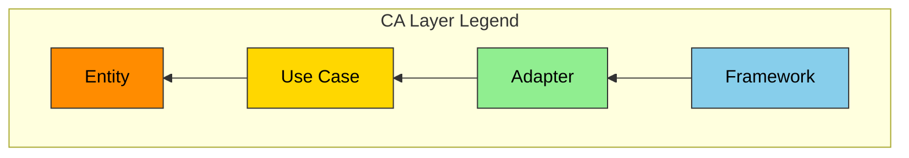

# ANMS v0.21 — AI-Native Minimal Spec Template

## Design Principle: 上剛下柔 (Jōgō-Kajū)

> **Stable Dependencies Principle (SDP) applied to specification structure.**
>
> This specification is ordered by Robert C. Martin's Stable Dependencies Principle:
> upper chapters are **stable and abstract**, lower chapters are **volatile and concrete**.
> Changes in upper chapters cascade downward, but changes in lower chapters do not affect upper chapters.
> This mirrors the Dependency Rule in Clean Architecture.

```
  Chapter 1  Foundation       ← Most Stable / Most Abstract
  Chapter 2  Requirements
  Chapter 3  Architecture
  Chapter 4  Specification    ← Most Volatile / Most Concrete
```

> **上剛下柔** — 上位の章は剛（かたく変わりにくい）、下位の章は柔（やわらかく変わりやすい）。
> 剛と柔が協調することで、仕様書全体の安定性と柔軟性を両立する。

---

## Chapter Structure

| # | English | 日本語 | 主な記法 | 安定度 |
|---|---|---|---|---|
| 1 | **Foundation** | 基本事項 | 自然言語 + テーブル | 最も安定 |
| 2 | **Requirements** | 要求 | EARS + 数式 + テーブル | 安定 |
| 3 | **Architecture** | アーキテクチャ | Mermaid (CAレイヤー色分け必須) | やや安定 |
| 4 | **Specification** | 仕様 | Gherkin + テーブル + コードブロック | よく変わる |
| 5 | **Test Strategy** | テスト戦略 | テーブル | よく変わる |
| 6 | **Design Principles Compliance** | SW設計原則 準拠確認 | テーブル | レビュー時 |
| A | **Appendix** | 付録 | 自由形式 | — |

---

## Section Structure

### Chapter 1. Foundation (基本事項)

プロジェクトの「北極星」。すべての後続章の前提となる。最も安定し、最も変わりにくい層。

| Section | English | 日本語 | 記述内容 |
|---|---|---|---|
| 1.1 | Background | 背景 | なぜこのSWが必要か。ドメインの現状 |
| 1.2 | Issues | 課題 | 現状の具体的な問題点 |
| 1.3 | Goals | 目標 | 成功の定義。達成すべき状態 |
| 1.4 | Approach | 解決方針 | 技術スタック、アーキテクチャ方針 |
| 1.5 | Scope | 範囲 | In-scope / Out-of-scope |
| 1.6 | Constraints | 制約事項 | 絶対に破れない物理的・技術的制約 |
| 1.7 | Limitations | 制限事項 | 既知の妥協点。「やるが完璧ではない」事項 |
| 1.8 | Glossary | 用語集 | プロジェクト固有の用語定義。AIとの語彙同期 |

### Chapter 2. Requirements (要求)

システムが常に満たすべき要求。EARS構文および数式で記述する。

| Section | English | 日本語 | 記述内容 |
|---|---|---|---|
| 2.1 | Functional Requirements | 機能要求 | EARS構文による機能要求の定義 |
| 2.2 | Non-Functional Requirements | 非機能要求 | 性能、セキュリティ、可用性等の要求 |

EARS構文パターン:

- **Ubiquitous:** The [System] shall [Response].
- **Event-driven:** When [Trigger], the [System] shall [Response].
- **State-driven:** While [In State], the [System] shall [Response].
- **Unwanted Behavior:** If [Trigger], then the [System] shall [Response].

数式による要求定義も許容する（暗号、信号処理等のドメイン）。

### Chapter 3. Architecture (アーキテクチャ)

SWの構造と設計判断。Mermaid図はCAレイヤー色分けを必須とする。

| Section | English | 日本語 | 記述内容 |
|---|---|---|---|
| 3.1 | Components | コンポーネント | 部品と責務の分割。コンポーネント図 |
| 3.2 | File Structure | ファイル構成 | ディレクトリ構成。コンポーネントとフォルダの対応 |
| 3.3 | Domain Model | ドメインモデル | 構造・関係・状態の定義。クラス図、ER図、状態遷移図 |
| 3.4 | Behavior | 振る舞い | 処理フロー・相互作用。シーケンス図、アクティビティ図 |
| 3.5 | Decisions | 設計判断 | ADR（Architecture Decision Records）。判断理由・代替案・決定者 |

**CA レイヤー凡例 (コンポーネント図・クラス図 共通):**



| CAレイヤー | 役割 | 色 | Hex |
|---|---|---|---|
| Entity | ドメインデータ・コアロジック | 橙 | `#FF8C00` |
| Use Case | ビジネスロジック調整 | 金 | `#FFD700` |
| Adapter | 外部IF適合 | 緑 | `#90EE90` |
| Framework | UI・デバイス・外部サービス | 青 | `#87CEEB` |

### Chapter 4. Specification (仕様)

最も具体的で、最もよく変わる層。AIがコードに直接変換できるレベルの定義。

**4.1 は Scenarios (Gherkin) を固定配置**し、4.2以降はプロジェクトの性質に応じて取捨選択する。

| Section | English | 日本語 | 記述内容 |
|---|---|---|---|
| 4.1 | Scenarios | シナリオ | **Gherkin形式。UATの受入基準。仕様の最も上位の具体化** |

Gherkinテンプレート:

```gherkin
Feature: [機能名]
  Scenario: [シナリオ名]
    Given [前提条件]
    When [操作・イベント]
    Then [期待結果]
    And [追加の期待結果]
```

4.2以降のセクション候補（プロジェクトに応じて取捨選択）:

| Section候補 | English | 日本語 | 適用場面 |
|---|---|---|---|
| 4.x | UI Elements Map | UI要素マップ | UIを持つアプリ |
| 4.x | Configuration | 設定定義 | 設定オブジェクトを持つアプリ |
| 4.x | API Definition | API定義 | Web API を提供するアプリ |
| 4.x | Data Schema | データスキーマ | DB を使用するアプリ |
| 4.x | State Management | 状態管理 | 複雑な状態遷移を持つアプリ |
| 4.x | Algorithm | アルゴリズム | 数理・暗号等の演算ロジック |
| 4.x | Error Handling | エラー処理 | エラー体系の定義が必要なアプリ |

### Chapter 5. Test Strategy (テスト戦略)

テストレベル別の方針。個別テストケースの詳細はAIに委任し、ここでは「何をどのレベルでテストするか」を定義する。

| テストレベル | 対象 | 方針 | 合格基準 |
|---|---|---|---|
| 単体テスト | 全ビジネスロジック | AIが自動生成。カバレッジ目標: [X]% | 合格率 [X]% 以上 |
| 結合テスト | [結合ポイント列挙] | [方針] | 合格率 100% |
| 性能テスト | [対象API/処理] | Ch2 NFR の数値目標に基づく | [目標値] |
| E2Eテスト | [主要ユーザーフロー] | Ch4.1 Gherkin シナリオに対応 | 全シナリオPASS |

### Chapter 6. Design Principles Compliance (SW設計原則 準拠確認)

アーキテクチャおよび実装がSW設計原則に準拠しているかを確認する。Ch1-5 の「定義・設計・検証」とはメタレベルが異なる、品質保証の層。

| 原則 | 準拠状況 |
|---|---|
| SRP | [各クラス/モジュールの単一責務の説明] |
| OCP | [拡張ポイントの説明] |
| DIP | [依存性逆転の適用箇所] |
| CQS | [コマンド/クエリ分離の説明] |
| POLA | [最小驚きの原則への準拠] |
| PIE | [意図の明確な命名・表現] |

プロジェクトの性質に応じて確認する原則を追加・削除してよい。

### Appendix (付録)

| Section | English | 日本語 | 記述内容 |
|---|---|---|---|
| A.1 | References | 参考文献 | 標準規格、外部資料へのリンク |
| A.2 | Licenses | ライセンス | 依存ライブラリのライセンス情報 |
| A.x | (その他) | (その他) | プロジェクト固有の補足資料 |

---

## Design Rationale (本構成の設計根拠)

| 判断 | 根拠 |
|---|---|
| 上剛下柔 (SDP適用) | 章の順序はStable Dependencies Principleに従う。上位=安定・抽象、下位=可変・具体 |
| SRS/SWS統合 → 1文書化 | AIのコンテキストウィンドウに全情報を入れるため。参照の切れ目がハルシネーションの温床 |
| EARS + 数式のハイブリッド | EARSだけでは数理仕様を表現できない。ドメインに応じて使い分け |
| Mermaid CAレイヤー色分け必須 | 人間のレビュー効率向上。レイヤー識別が一目で可能 |
| 色はgrsmd_gen2_specに準拠 | Entity(橙#FF8C00), UseCase(金#FFD700), Adapter(緑#90EE90), Framework(青#87CEEB) |
| File StructureをCh3.2に独立 | フォルダ構成変更=アーキテクチャ変更。コンポーネントとフォルダの対応を明示する重要セクション |
| ADRをArchitecture章内に配置 | 設計と根拠をセットで読める。Appendixに追いやると参照が切れる |
| GherkinをCh4.1に配置 | GherkinはUATの受入基準=仕様の具体化。EARSより不安定→SDPにより下位章に配置 |
| Specification章はセクション候補制 | 全SW開発に適用するため。分野ごとに取捨選択 |
| Test StrategyをCh5に独立 | テストケース詳細はAIに委任。ここでは方針とマトリクスのみ定義 |
| Design Principles ComplianceをCh6に独立 | Ch1-5の「定義・設計・検証」とはメタレベルが異なる品質保証の層 |
| Limitations追加 | Scope(やらない)とConstraints(破れない)の間にある「妥協点」を明示 |
| Glossary追加 | AIとの語彙同期。grsmd_gen2_specで有効性を実証済み |

---

## References

1. Martin, R.C. "Clean Architecture" — Stable Dependencies Principle (SDP), Stable Abstractions Principle (SAP)
2. Mavin, A., et al. "EARS: Easy Approach to Requirements Syntax" — IEEE, 2009
3. North, D. "Gherkin Language" — Cucumber Documentation
4. Starke, G. "arc42 Architecture Template"
5. ISO/IEC/IEEE 29148:2018 — Requirements Engineering
