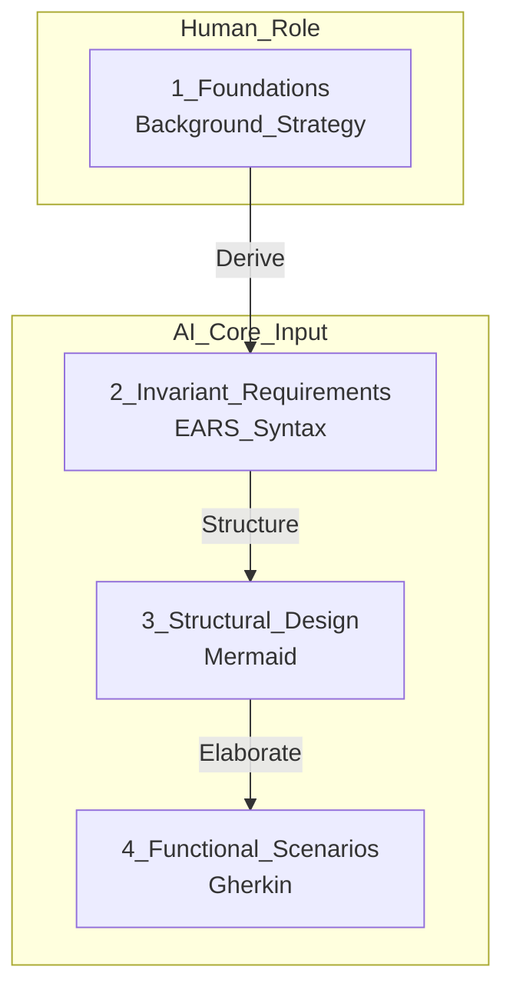
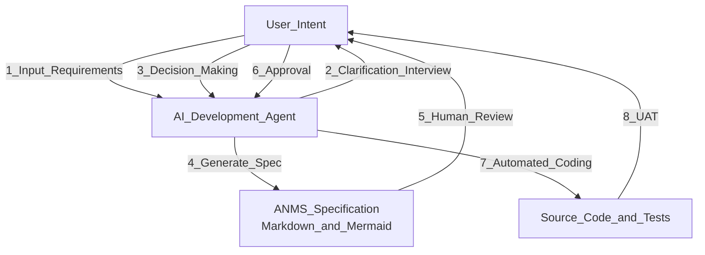
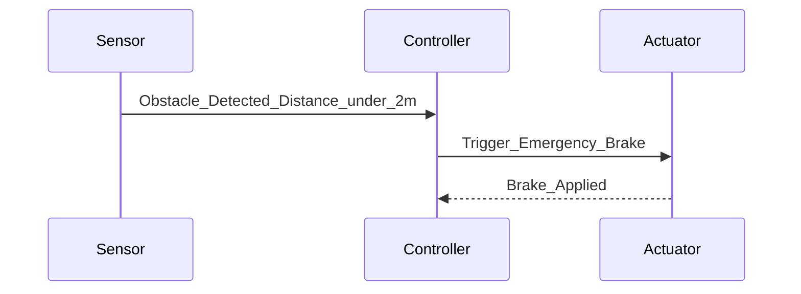

# Title: AIドリブン SW開発時代における仕様書テンプレートの提案

## Abstract

LLM（大規模言語モデル）の急速な進化により、ソフトウェア開発は人間がコードを書く時代から、AIが仕様書を解釈してコードを生成する時代へと移行している。しかし、従来の重厚な仕様書はAIにとって冗長であり、一方で断片的な指示はシステム全体の整合性を欠く「コンテキスト喪失」を招く。本論文では、人間とAIが共通の設計基盤として参照し、開発をほぼ全自動化するための新しい仕様書テンプレート「AI-Native Minimal Spec (ANMS)」を提案する。本提案は、論理的な厳密性と視覚的な設計同期を両立し、人間によるレビュー効率とAIの実装精度を最大化することを目的とする。

## Keywords

LLM-driven Development, AI-Native Specification, Requirements Engineering, EARS, Gherkin, Mermaid, Human-in-the-Loop

## Introduction

従来のソフトウェア開発における仕様書（IEEE 830等）は、人間同士のコミュニケーションを主眼に置いていた。しかし、AI駆動開発において仕様書は「プロンプトの源泉」であり、「実装の正当性を評価する検品仕様書」としての役割が求められる。

現在の主な問題点は以下の2点に集約される：

1. **冗長性とコストの乖離:** 厳格な標準（IEEE 29148やAUTOSAR SRSなど）は記述コストが極めて高く、アジャイルなAI開発のスピードを阻害する。
2. **曖昧性によるハルシネーション:** 自然言語のみの指示では、AIがシステムの制約や境界条件を勝手に推論し、意図しない挙動（バグ）を埋め込むリスクがある。

本論文では、これらを解決するために、最小限の記述で最大の制御力を発揮する階層的仕様書フォーマットを定義する。

```markdown
## 1. Foundations (基礎)

- 本章では、開発の根底にある思想とプロジェクトの境界を定義する。ここが曖昧であると、AIによる生成物の整合性が崩壊するため、最も重要な「北極星」となるセクションである。

### 1.1 Background (背景)

-なぜこのソフトウェアが必要になったのか、解決したいドメインの現状を記述する。AIに対して、実装の背景にある「暗黙の了解」やドメイン知識を補完させる役割を持つ。

### 1.2 Issues (課題)

-現状のプロセスやシステムにおいて、具体的に何が問題であり、何を解決すべきかを列挙する。これにより、AIは実装すべき機能の優先順位を判断できる。

### 1.3 Goals (目的)

-本プロジェクトが達成すべき「成功」の状態を定義する。Goalを明確にすることで、AIによるオーバーエンジニアリングや、本質から外れた機能生成を抑制する。

### 1.4 Solution Approach (解決方針)

-技術スタック（言語、フレームワーク、DB等）や、採用するアーキテクチャの基本方針を記述する。AIに対して具体的な「実装の型」を指定する層である。

### 1.5 Scope (範囲)

-「何をするか（In-scope）」だけでなく「何を目指さないか（Out-of-scope）」を明示する。全自動開発において、AIが勝手に機能拡張を始めるのを防ぐための境界線である。

### 1.6 Constraints ( 制約事項)

-必ず守らなければならない物理的・技術的な制限。AIの自由度をあえて制限することで、ハルシネーションを物理的に防ぐ「ガードレール」として機能する。

## 2. Invariant Requirements (不変ルール):

- Easy Approach to Requirements Syntax (EARS) を用い、「常に守るべきルール」を定義。AIの推論を縛るガードレールとなる。

## 3.Structural Design (構想設計):

- Mermaidによるコンポーネント図、クラス図、シーケンス図、状態遷移図でSWの構造や主要な動作、仕様を図示する。
- テキストでは伝わりにくい「責務の分離」や「処理順序」をAIと同期する。
- ここでSOLIDやCAなどSW工学的に適切な設計となっているかのレビューが可能

## 3 Functional Scenarios (Gherkinによる動作定義):

- Given/When/Then形式で記述。そのままAIがテストコードを生成するための入力となる。
```

## Proposed Approach

提案する「AI-Native Minimal Spec (ANMS)」は、情報を「背景」「不変論理」「具体的振る舞い」「構造」の4層に分離し、人間とAIの認識を同期させる。仕様書は固定された文書ではなく、人間が要件を提示し、AIとの対話によって図解と論理が肉付けされる「動的設計図」として定義される。

**Specification_Alignment_Flow:**



上記は、仕様の各要素がどのように派生し、人間とAIの役割がどう分担されるかを示すアラインメントフロー（仕様のアラインメント）です。

**Proposed_Specification_Lifecycle:**



上記は、ユーザーの意図から仕様書が生成され、コード化されてUATに至るまでの、提案する仕様書のライフサイクルです。

### 提案テンプレートの章立てと定義（Foundations以降）

1章のFoundationsに続き、AIへ渡すコア入力として以下の構成をとる：

- **2. Invariant Requirements (不変ルール):** Easy Approach to Requirements Syntax (EARS) を用い、「常に守るべきルール」を定義する。AIの推論を縛るガードレールとなる。
- **3. Structural Design (構想設計):** クラス図、シーケンス図、状態遷移図などを記述する。テキストでは伝わりにくい「責務の分離」や「処理順序」をAIと同期する。
- **4. Functional Scenarios (動作定義):** Given/When/Then形式で記述する。そのままAIがテストコードを生成するための入力となる。

## Methods

本提案の妥当性を検証するため、現在流通している主要な仕様書形式およびフレームワークを調査した。

- **IEEE 29148:** 要求工学の国際標準。要求の質（一義性、検証可能性）を定義するが、記述コストが高く実運用では重厚すぎる。
- **arc42:** アーキテクチャ中心のテンプレート。Markdownとの親和性が高く、構造の定義に優れる。
- **RFC (Request for Comments):** IETFの標準化プロセスであり、設計意図の共有に特化している。「なぜその設計にしたか」という背景（Context）が厚い。
- **Gherkin (BDD):** 実行可能な仕様書。テストコード生成（テスト駆動開発）においてAIとの親和性が極めて高い。
- **EARS (Easy Approach to Requirements Syntax):** 簡潔な自然言語パターン。システムルールや例外処理、状態依存の挙動を厳密に定義するのに適している。

## Results

調査した既存テンプレートの比較結果を以下に示す。

**Comparison of Specification Formats:**

| フォーマット    | 網羅性 | 記述コスト | 人間可読性 | AI適性 | 備考                         |
| :-------------- | :----: | :--------: | :--------: | :----: | :--------------------------- |
| IEEE 29148      |   ◎    |     高     |     △      |   △    | 厳密だがAIには冗長           |
| arc42           |   ○    |     中     |     ○      |   ○    | 構造把握に最適               |
| RFC             |   △    |     低     |     ◎      |   △    | 意図の共有には良いが構造不足 |
| Gherkin         |   △    |     中     |     ◎      |   ◎    | テスト生成と直結             |
| **ANMS (提案)** | **◎**  |   **低**   |   **◎**    | **◎**  | **階層化による最適化**       |

分析の結果、単一のフォーマットではAI開発の全工程をカバーできないことが判明した。そのため、上位要求にはEARS、詳細動作にはGherkin、構造把握にはMermaidを組み合わせる「ハイブリッド形式」がAI開発に最適（最も効率的）であるという結論に至った。

## Discussion

本セクションでは、提案するフォーマットの妥当性と、AI駆動開発における図解の重要性について検討する。

### 1. 図解（Mermaid）は「設計」そのものである

AI開発において、Mermaid等による図解は単なる補助ではなく、ソフトウェア設計そのものである。人間は数千行のコードから設計ミス（責務の重複など）を見つけるのは困難だが、図解によって構造の歪みを即座に認識できる。AIにとっても、構造化テキストである図解データは、正確なクラス構成やファイル分割、継承関係を決定する際の強力な制約（Blueprint）となる。

### 2. 人間が担当すべき「最低限」の役割

全自動開発においても、以下の3つのステップは人間が主導しなければならない：

1. **要件の提示:** ソフトウェアのコンセプトと解決したい課題の定義。
2. **重要な意思決定:** 技術選定や仕様の分岐点における最終判断。
3. **受入テスト (UAT):** 生成物がビジネス要件を満たしているかの最終承認。

### 3. 数理的な妥当性の定義（数理的整合性の担保）

要求の集合 $R$ (Requirements) において、個々の要求 $r$ (requirement) $r \in R$ が有効 (Valid) であるためには、以下の条件が必要である。

$$
\forall r \in R, \quad Valid(r) \iff Unambiguous(r) \land Verifiable(r)
$$

ここで、 $Valid(r)$ とは「AIが迷いなく実装可能であり、かつその正しさを自動判定できる状態」を指す。EARSは「一義性（ $Unambiguous$ ）」を、Gherkinは「検証可能性（ $Verifiable$ ）」をそれぞれ担保することで、この数理的条件を満たし、AIが生成したコードの正当性を自動的に検証可能にする。

## Conclusion

本論文では、AI全自動開発のための「ANMS」テンプレートを提案した。既存の標準の長所を統合し、1章の「Foundations」でプロジェクトの魂と境界を定め、EARS、Gherkin、Mermaidを組み合わせることで、ハルシネーションを抑えつつ人間が「仕様の承認」に専念できる開発サイクルを実現する。このフォーマットを「生きたドキュメント（Living Documentation）」として運用することで、仕様変更に強く、AIによる実装の正確性を最大化する開発が実現可能となる。

## References

1. [ISO/IEC/IEEE 29148:2018 - Requirements Engineering](https://www.iso.org/standard/72089.html)
2. Mavin, A., et al. "[EARS: Easy Approach to Requirements Syntax](https://ieeexplore.ieee.org/document/5314238)"
3. North, D. "[Gherkin Language (Cucumber Documentation)](https://cucumber.io/docs/gherkin/)"
4. Starke, G. "[arc42 Architecture Template](https://arc42.org/)"
5. [IETF RFC Style Guide](https://www.rfc-editor.org/styleguide/)

## Appendix

### Appendix A: EARS構文の基本パターン

AIに指示を出す際、以下のパターンを用いることで曖昧さを排除できる。

- **Ubiquitous:** The [System] shall [Response].
- **Event-driven:** When [Trigger], the [System] shall [Response].
- **State-driven:** While [In State], the [System] shall [Response].
- **Unwanted Behavior:** If [Trigger], then the [System] shall [Response].

### Appendix B: ANMSによる超簡易・自動運転仕様例

下記は、障害物検知から緊急ブレーキ作動までのシーケンスを示す構造設計図です。

````markdown
**1. Foundations**

- **Goal:** 指定された目的地まで、衝突せず安全に移動する。
- **Strategy:** Pythonを用いたマイクロサービス構成。障害物検知にはLiDARを使用。
- **Constraint:** 緊急ブレーキの反応速度は100ms以内とする。

**2. Invariant Requirements (EARS)**

- **Event-driven:** When 障害物が2m以内に現れた場合, the システム shall 即座にブレーキを作動させる。
- **State-driven:** While 自動走行モード中, the システム shall 10Hz周期で現在位置をログ出力する。

**Structural_Design_Sequence:**



**4. Functional Scenarios (Gherkin)**

- **Feature:** 緊急停止機能
  - **Scenario:** 前方に歩行者が現れた場合の停止
    - Given 自動走行モードで時速20kmで走行中
    - When 1.5m先に歩行者を検知
    - Then システムは80ms以内にブレーキ信号を送信する
    - And 車両は安全に停止する
````

### Appendix C: AIへの指示（Prompt）例

> 「添付のANMS仕様書を読み込み、まずアーキテクチャ図（Mermaid）を元にディレクトリ構成案を提示せよ。承認後、Gherkinのシナリオをパスする実装とテストコードを生成せよ。」
